# Skill vs Subagent Design Guide

Claude Code でワークフローを設計する際の、スキルとサブエージェントの使い分けガイド。

## 目次

1. [本質的な違い](#本質的な違い)
2. [判断フローチャート](#判断フローチャート)
3. [設計パターン](#設計パターン)
4. [判断軸の詳細](#判断軸の詳細)
5. [具体例での比較](#具体例での比較)
6. [実践的な設計指針](#実践的な設計指針)

---

## 本質的な違い

### スキル (Skill) とサブエージェント (Task) の比較

| 観点 | スキル (Skill) | サブエージェント (Task) |
|------|---------------|----------------------|
| **実行場所** | メインコンテキスト内 | 独立したサブプロセス |
| **コンテキスト** | 会話履歴を共有 | 隔離（渡した情報のみ） |
| **ユーザー可視性** | プロセスが見える | 結果のみ返る |
| **並列実行** | 不可（順次展開） | 可能 |
| **コンテキスト消費** | 増加する | しない（独立） |
| **対話性** | ユーザーと対話可能 | 一方向（結果のみ） |
| **再実行** | 会話内で再利用 | 毎回新規プロセス |

### 図解：実行モデルの違い

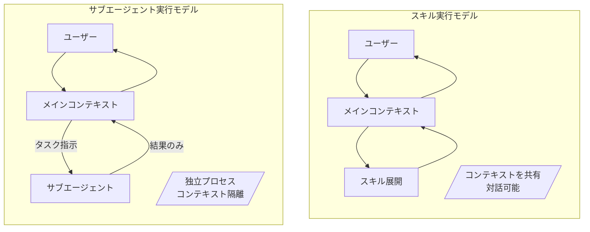

---

## 判断フローチャート

タスクを受けたときに、以下のフローチャートで最適なアプローチを判断できます。

### メイン判断フロー

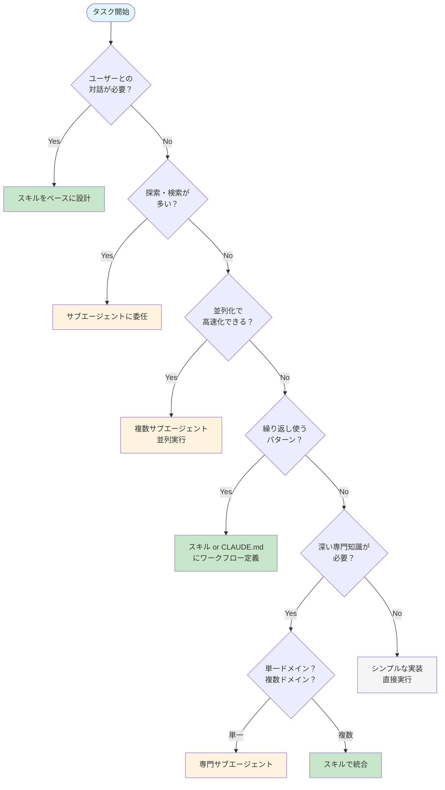

### サブ判断：スキルベース設計の詳細

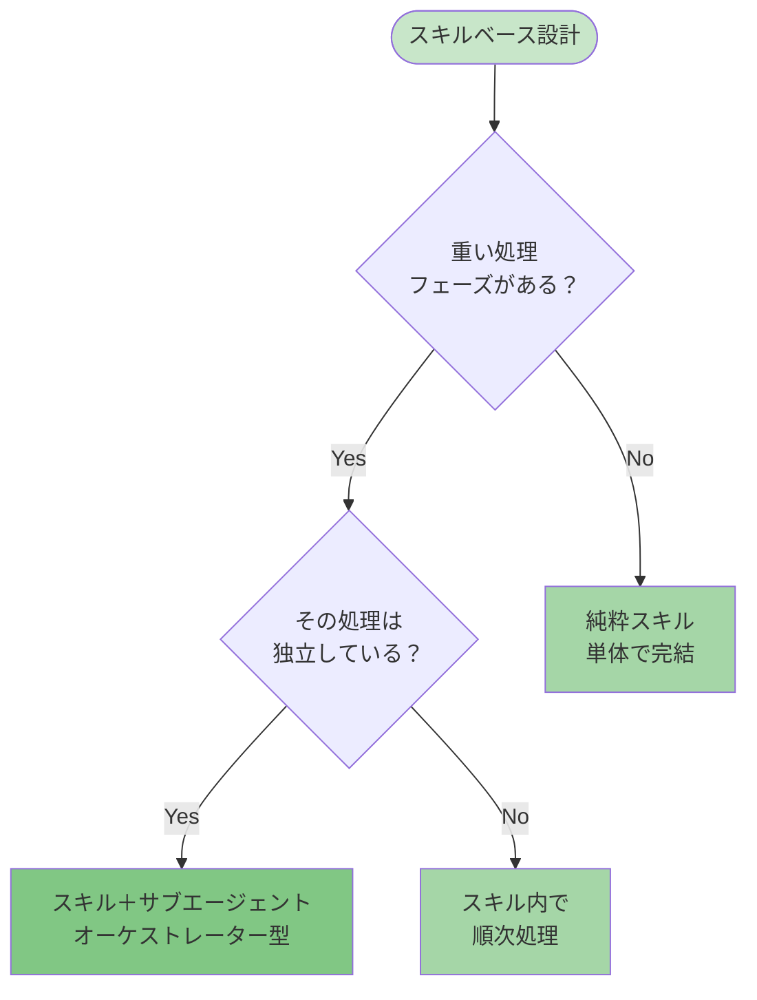

### サブ判断：ワークフロー定義の詳細

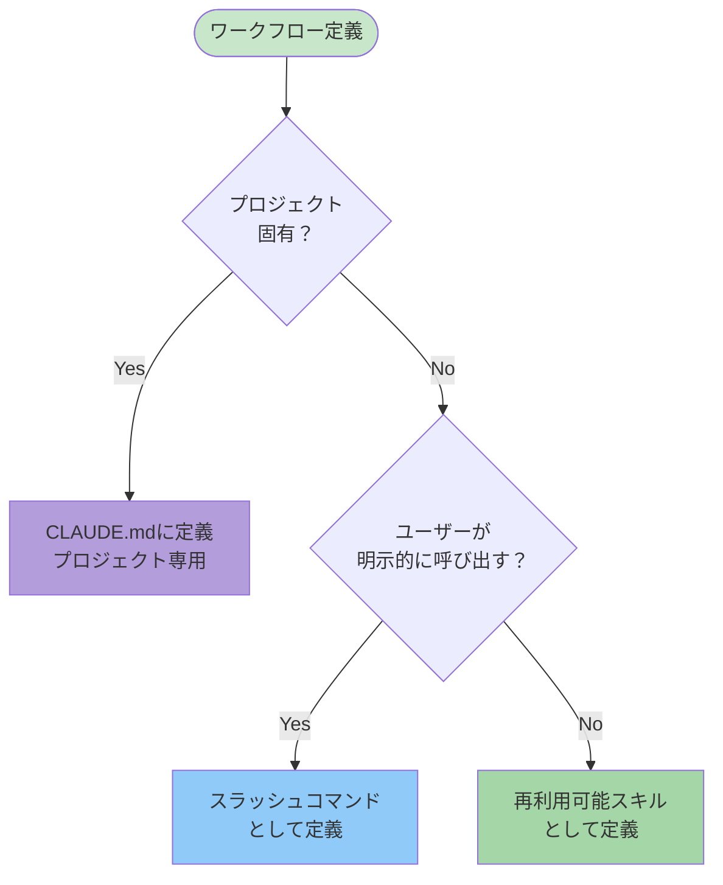

---

## 設計パターン

### パターンA: スキル → サブエージェント（オーケストレーター型）

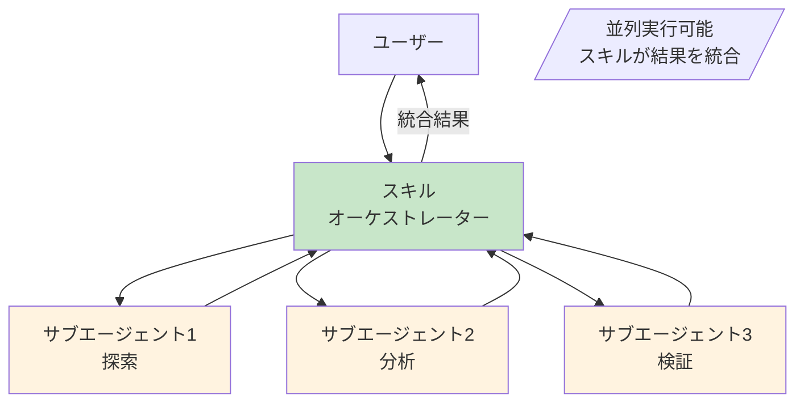

**適用場面**:
- 専門的なワークフロー + 重い処理の組み合わせ
- 結果の統合・解釈に専門知識が必要
- 例: `migration-validation-explorer`

**メリット**:
- スキルの専門知識でサブエージェントを適切に指示
- 結果の統合・解釈にスキルの知識を活用
- コンテキスト節約しつつ専門性を確保

### パターンB: サブエージェント → スキル（委任型）

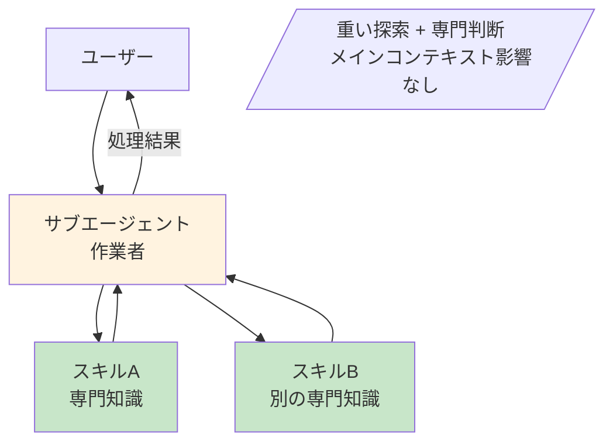

**適用場面**:
- 重い探索 + 途中で専門判断が必要
- コンテキストを消費せずに専門知識を活用したい

**注意点**:
- サブエージェント内でスキルを呼ぶとサブエージェントのコンテキストで展開
- メインコンテキストは影響を受けない

### パターンC: CLAUDE.md / スラッシュコマンド（ワークフロー型）

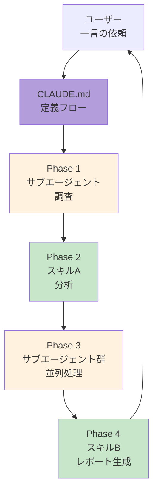

**適用場面**:
- プロジェクト固有の定型ワークフロー
- 繰り返し実行するパイプライン
- 複数ドメインを横断する複合タスク

**メリット**:
- 最も柔軟な組み合わせが可能
- プロジェクトコンテキストに最適化できる
- 一言で複雑なワークフローを起動

### パターンD: 階層的サブエージェント（分散型）

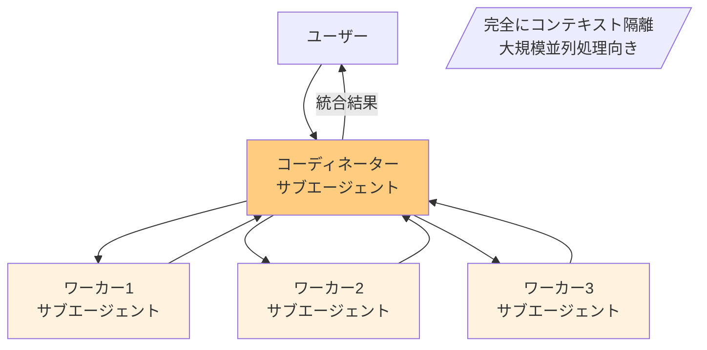

**適用場面**:
- 非常に大規模な処理
- 完全なコンテキスト隔離が必要
- メインコンテキストの汚染を完全に防ぎたい

---

## 判断軸の詳細

### 軸1: 「何を隠すか」の観点

| シナリオ | 推奨 | 理由 |
|---------|------|------|
| 探索の試行錯誤 | サブエージェント | ユーザーに見せる必要なし |
| 中間的な分析プロセス | サブエージェント | 結果だけが重要 |
| 意思決定の根拠説明 | スキル | 透明性が重要 |
| 教育的なプロセス | スキル | 過程を見せることに価値 |

### 軸2: 「コンテキストのコスト」の観点

| シナリオ | 推奨 | 理由 |
|---------|------|------|
| 100ファイル探索→3ファイル発見 | サブエージェント | 97ファイル分のコンテキスト節約 |
| 試行錯誤が多い調査 | サブエージェント | 失敗の履歴が不要 |
| 確定した手順の実行 | スキル | 手順自体に価値 |
| テンプレート展開 | スキル | テンプレートを共有 |

### 軸3: 「並列性」の観点

| シナリオ | 推奨 | 理由 |
|---------|------|------|
| 独立した複数タスク | 複数サブエージェント | 同時実行で高速化 |
| 異なる専門分野の同時分析 | 複数サブエージェント | 専門性の並列活用 |
| 順次依存のあるワークフロー | スキル | 前の結果が次に影響 |
| A/Bテスト的な比較 | 複数サブエージェント | 同条件で並列実行 |

### 軸4: 「専門性の粒度」の観点

| シナリオ | 推奨 | 理由 |
|---------|------|------|
| 深い単一ドメイン分析 | 専門サブエージェント | 集中した専門性 |
| 複数ドメインの統合判断 | スキル | 広い視野での統合 |
| 標準化されたフォーマット出力 | スキル | テンプレート活用 |
| 探索的な調査 | Explore サブエージェント | 汎用的な探索能力 |

---

## 具体例での比較

### 例1: コードレビュー

#### アプローチA（スキル主導）

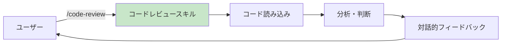

- **メリット**: 対話的、基準の説明が可能、追加質問に即座に対応
- **デメリット**: 大規模コードでコンテキスト消費

#### アプローチB（サブエージェント主導）

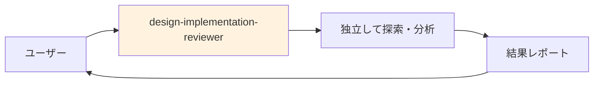

- **メリット**: コンテキスト節約、深い分析、大規模コードベース対応
- **デメリット**: 途中経過が見えない、追加質問は新規実行

### 例2: データ分析

#### アプローチA（スキル単体）

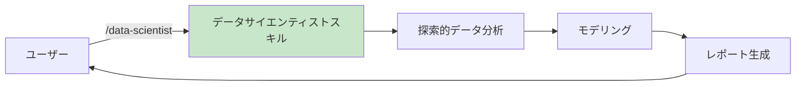

- **適用**: 中規模データ、対話的な分析

#### アプローチB（スキル + サブエージェント）

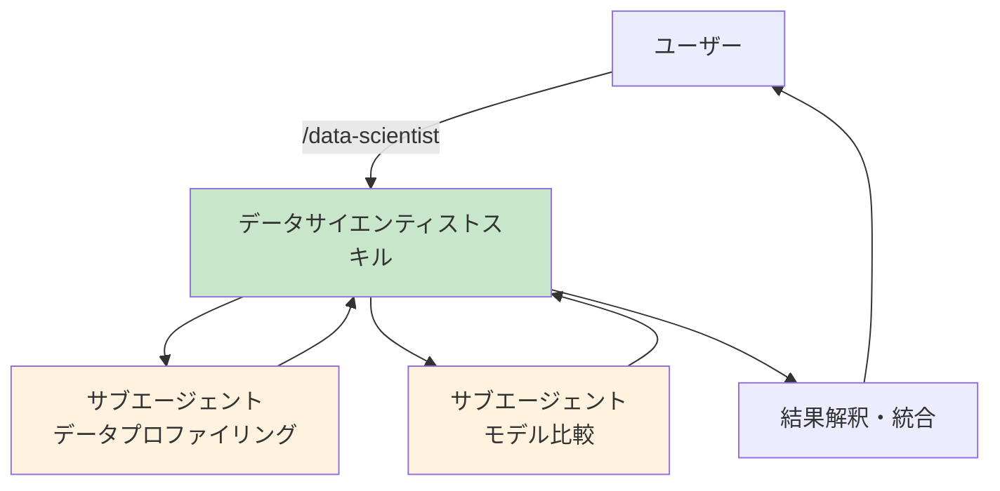

- **適用**: 大規模データ、複数モデルの並列比較

### 例3: マイグレーション検証

#### 現在の `migration-validation-explorer` 設計

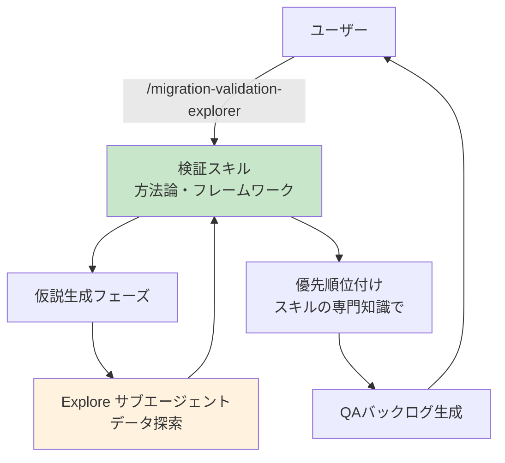

- **設計理由**:
  - スキルが検証方法論を提供
  - 重い探索はサブエージェントに委任
  - 結果の優先順位付けはスキルの専門知識で判断

---

## 実践的な設計指針

### スキル設計時のチェックリスト

```markdown
## スキル設計チェックリスト

### サブエージェント呼び出しを組み込むべきか？
- [ ] 探索フェーズがある → サブエージェントに
- [ ] 重い処理フェーズがある → サブエージェントに
- [ ] 並列化できる独立タスクがある → 複数サブエージェントに

### 純粋にスキルだけで完結させるべきか？
- [ ] 手順が明確で試行錯誤が少ない
- [ ] ユーザーとの対話が重要
- [ ] テンプレート展開が主目的
- [ ] プロセスの透明性が重要
```

### サブエージェント設計時のチェックリスト

```markdown
## サブエージェント設計チェックリスト

### スキルを使わせるべきか？
- [ ] 専門知識を注入したい
- [ ] 標準化されたフォーマットで出力させたい
- [ ] 特定のワークフローに従わせたい

### 純粋にサブエージェントだけにするか？
- [ ] 探索・検索が主目的
- [ ] 汎用的な分析で十分
- [ ] 結果の形式に柔軟性が必要
```

### ワークフロー定義の配置判断

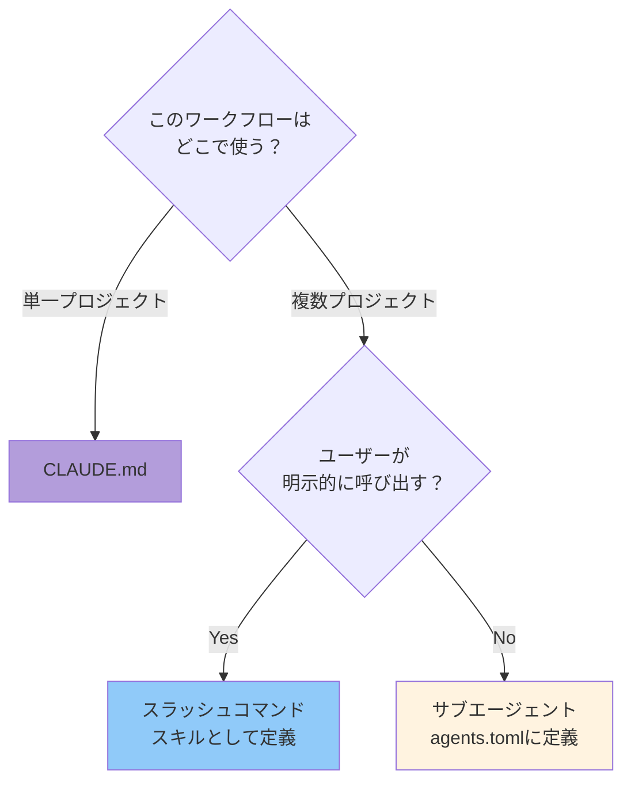

---

## クイックリファレンス

### 状況別推奨アプローチ

| 状況 | 推奨アプローチ | 理由 |
|------|--------------|------|
| 対話重視 | スキル | ユーザーとの双方向コミュニケーション |
| 探索重視 | サブエージェント | コンテキスト節約 |
| 並列化したい | 複数サブエージェント | 同時実行で高速化 |
| 専門知識の統合 | スキル→サブエージェント | オーケストレーター型 |
| 定型ワークフロー | CLAUDE.md/スラッシュコマンド | 再利用性 |
| コンテキスト節約 | サブエージェント | 隔離された実行 |
| 透明性重視 | スキル | プロセスの可視化 |
| 大規模処理 | 階層的サブエージェント | 完全な隔離 |

### 核心原則

> **「コンテキストのコスト」と「ユーザー可視性のニーズ」のバランスで決める。**
>
> 重い処理は隠し、重要な判断は見せる。

---

## 関連ドキュメント

- [CLAUDE.md](../CLAUDE.md) - プロジェクト全体の設計指針
- [README.md](../README.md) - スキルカタログと使用方法
- [agents/agents.toml](../agents/agents.toml) - サブエージェント定義

---

*Last updated: 2025-12-29*
