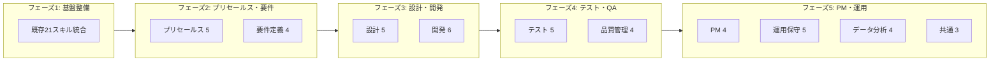
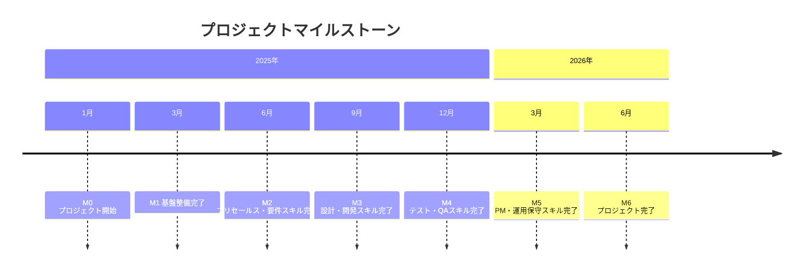
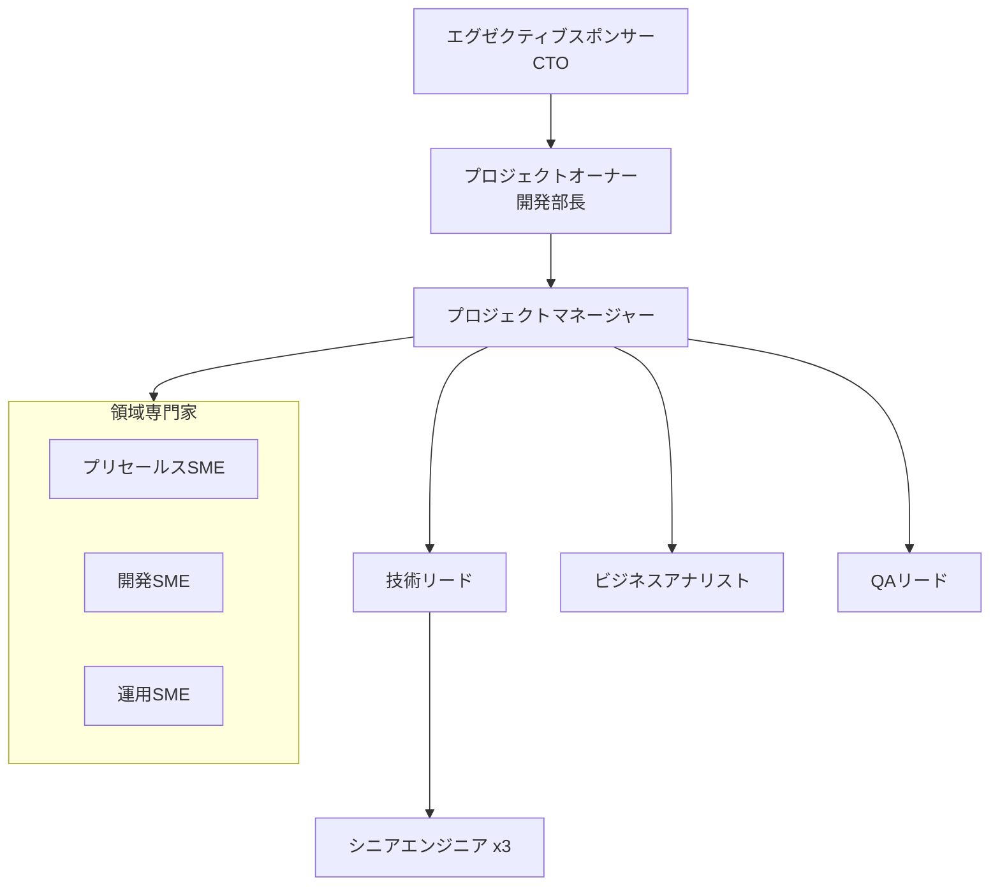

# プロジェクト計画サマリー
# Claude Code Skills 全自動化プロジェクト

**プロジェクトコード**: PRJ-2025-SKILLS
**作成日**: 2025年12月29日
**バージョン**: 1.0

---

## エグゼクティブサマリー

本プロジェクトは、ITシステム開発・構築サービスを提供する企業が持つべき全スキルをClaude Code Skillsとして体系化・自動化する取り組みです。

### プロジェクト概要

| 項目 | 内容 |
|------|------|
| **プロジェクト名** | Claude Code Skills 全自動化プロジェクト |
| **期間** | 18ヶ月（2025年1月〜2026年6月） |
| **総予算** | 180,000,000円 |
| **スキル数** | 45スキル（既存21 + 新規24） |
| **期待ROI** | 180%（5年間累計） |
| **投資回収期間** | 3.7年（標準シナリオ） |

### 期待効果サマリー

```
年間削減効果: 48,200,000円
├── 提案書作成      8,000,000円 (50%削減)
├── 見積もり作成    4,800,000円 (60%削減)
├── 要件定義書      6,400,000円 (40%削減)
├── 設計書作成      8,400,000円 (35%削減)
├── テストケース    6,600,000円 (55%削減)
├── コードレビュー   7,200,000円 (45%削減)
├── プロジェクト報告  4,800,000円 (60%削減)
└── バグ分析       2,000,000円 (50%削減)
```

---

## 成果物一覧

本プロジェクト計画は以下のドキュメントで構成されています：

| No. | ドキュメント名 | ファイル名 | 説明 |
|-----|--------------|-----------|------|
| 0 | プロジェクト計画サマリー | 00_project_summary.md | 本ドキュメント（全体概要） |
| 1 | プロジェクト憲章 | 01_project_charter.md | プロジェクト承認、目的、スコープ、ステークホルダー |
| 2 | スキル一覧表 | 02_skills_inventory.md | 全45スキルの詳細、既存/新規分類、期待効果 |
| 3 | WBS詳細 | 03_wbs_detailed.md | 作業分解構造、1,350人日の詳細タスク |
| 4 | Ganttチャート | 04_gantt_chart.md | Mermaid形式のスケジュール、クリティカルパス |
| 5 | RACIマトリックス | 05_raci_matrix.md | 役割と責任の明確化 |
| 6 | リスク管理計画 | 06_risk_management_plan.md | 40リスクの識別・分析・対応計画 |

---

## スキル領域と優先順位

### 全10領域・45スキル



### スキル優先順位ランキング（TOP 15）

| 順位 | スキルID | スキル名 | 状態 | 期待効果 | 優先度スコア |
|------|---------|---------|------|---------|-------------|
| 1 | PS-04 | proposal-creator | 新規 | 工数50%削減、標準化 | 95 |
| 2 | RD-02 | requirements-elicitor | 新規 | 漏れ50%削減 | 92 |
| 3 | DV-04 | code-generator | 新規 | 工数60%削減 | 90 |
| 4 | DS-01 | architecture-designer | 新規 | 品質向上、工数30%削減 | 88 |
| 5 | TS-04 | test-plan-creator | 新規 | 工数45%削減 | 85 |
| 6 | PM-03 | progress-reporter | 新規 | 工数60%削減 | 82 |
| 7 | RD-04 | brd-creator | 新規 | 工数45%削減 | 80 |
| 8 | DS-03 | api-designer | 新規 | 工数45%削減 | 78 |
| 9 | OM-03 | incident-manager | 新規 | 解決時間30%短縮 | 76 |
| 10 | DS-05 | security-architect | 新規 | セキュリティ品質向上 | 75 |
| 11 | TS-05 | test-automation-designer | 新規 | 自動化率向上 | 74 |
| 12 | DV-06 | documentation-generator | 新規 | 工数70%削減 | 72 |
| 13 | DS-02 | database-designer | 新規 | 工数40%削減 | 70 |
| 14 | PM-04 | meeting-facilitator | 新規 | 会議効率30%向上 | 68 |
| 15 | QA-03 | quality-audit-assistant | 新規 | 監査効率40%向上 | 66 |

### 既存スキル（活用可能な21スキル）

| 領域 | スキル名 | 現バージョン | 活用方針 |
|------|---------|-------------|---------|
| プリセールス | vendor-rfq-creator | 1.0 | そのまま活用 |
| プリセールス | vendor-estimate-creator | 1.0 | そのまま活用 |
| プリセールス | vendor-estimate-reviewer | 1.0 | そのまま活用 |
| 要件定義 | business-analyst | 1.0 | 拡張（BRD分離） |
| 開発 | tdd-developer | 1.0 | そのまま活用 |
| 開発 | design-implementation-reviewer | 1.0 | そのまま活用 |
| 開発 | codex-reviewer | 1.0 | そのまま活用 |
| テスト | uat-testcase-generator | 1.0 | テンプレート拡張 |
| テスト | bug-ticket-creator | 1.0 | そのまま活用 |
| テスト | qa-bug-analyzer | 1.0 | そのまま活用 |
| PM | project-manager | 1.0 | Agile対応強化 |
| PM | project-plan-creator | 1.0 | そのまま活用 |
| 品質管理 | migration-validation-explorer | 2.0 | そのまま活用 |
| 運用保守 | itil4-consultant | 1.0 | そのまま活用 |
| 運用保守 | helpdesk-responder | 1.0 | KB拡張 |
| データ分析 | data-scientist | 1.0 | そのまま活用 |
| データ分析 | data-visualization-expert | 1.0 | そのまま活用 |
| データ分析 | duckdb-expert | 1.0 | そのまま活用 |
| 共通 | mermaid-to-pdf | 1.0 | そのまま活用 |
| 共通 | ai-adoption-consultant | 1.0 | そのまま活用 |
| その他 | salesforce-expert | 1.0 | 特定領域向け |

---

## プロジェクトスケジュール概要

### マイルストーン



### フェーズ別サマリー

| フェーズ | 期間 | 主要成果物 | 工数 |
|---------|------|-----------|------|
| 1. 基盤整備 | 2025/01-03 | 標準・ガイドライン、開発環境、既存スキル分析 | 180人日 |
| 2. プリセールス・要件 | 2025/04-06 | proposal-creator, requirements-elicitor等9スキル | 250人日 |
| 3. 設計・開発 | 2025/07-09 | architecture-designer, code-generator等11スキル | 280人日 |
| 4. テスト・QA | 2025/10-12 | test-plan-creator, quality-audit等9スキル | 230人日 |
| 5. PM・運用保守 | 2026/01-03 | progress-reporter, incident-manager等16スキル | 250人日 |
| 6. 統合・最終検証 | 2026/04-06 | 全スキル統合、ドキュメント、リリース | 160人日 |

---

## チーム体制

### 組織図



### 役割別リソース

| 役割 | 人数 | 稼働率 | 主要責任 |
|------|------|--------|---------|
| PM | 1 | 100% | 計画・進捗・リスク管理 |
| TL | 1 | 100% | アーキテクチャ、技術判断 |
| SE | 3 | 100% | スキル設計・実装 |
| BA | 1 | 80% | 要件分析、ドキュメント |
| QA | 1 | 100% | テスト、品質保証 |
| SME | 3 | 20% | 専門知識提供 |

---

## リスクサマリー

### リスク分布

| レベル | 件数 | 主要リスク |
|--------|------|-----------|
| 高 | 2 | Claude API仕様変更、SME協力不足 |
| 中 | 12 | 要件変更頻発、品質ばらつき、見積もり精度 |
| 低 | 15 | キーメンバー離脱、予算削減 |
| 極低 | 11 | 法規制変更、組織再編 |

### コンティンジェンシー

| 項目 | 金額/バッファ |
|------|-------------|
| 技術リスク対応 | 5,000,000円 |
| リソースリスク対応 | 8,000,000円 |
| スケジュールバッファ | 15% |
| 品質対応工数 | 10%増 |

---

## 成功基準

### 定量的基準

| 基準 | 目標 | 測定方法 |
|------|------|---------|
| スケジュール | 18ヶ月以内完了 | マイルストーン達成状況 |
| 予算 | 180,000,000円以内 | 実績予算管理 |
| スキル数 | 45スキル完成 | リリース数 |
| 工数削減率 | 平均30%以上 | パイロット測定 |
| ユーザー満足度 | 8.0/10以上 | アンケート調査 |

### 定性的基準

- 全スキルがquick_validate.pyを通過
- PMBOK/BABOK等の国際標準に準拠
- 全社展開の準備が完了

---

## 次のステップ

1. **プロジェクト憲章の承認取得** - エグゼクティブスポンサー、PO
2. **チーム編成** - PM、TL、SE、BA、QA
3. **SMEエンゲージメント** - 各領域専門家との協力体制構築
4. **キックオフミーティング** - 2025年1月6日
5. **フェーズ1開始** - 基盤整備、既存スキル分析

---

## 添付資料

| 資料 | ファイル名 | 説明 |
|------|-----------|------|
| プロジェクト憲章 | [01_project_charter.md](./01_project_charter.md) | 詳細なプロジェクト承認文書 |
| スキル一覧表 | [02_skills_inventory.md](./02_skills_inventory.md) | 全45スキルの詳細情報 |
| WBS詳細 | [03_wbs_detailed.md](./03_wbs_detailed.md) | 作業分解構造（1,350人日） |
| Ganttチャート | [04_gantt_chart.md](./04_gantt_chart.md) | Mermaidスケジュール |
| RACIマトリックス | [05_raci_matrix.md](./05_raci_matrix.md) | 役割と責任 |
| リスク管理計画 | [06_risk_management_plan.md](./06_risk_management_plan.md) | 40リスクの管理計画 |

---

**文書管理**:
- 作成日: 2025年12月29日
- 最終更新日: 2025年12月29日
- バージョン: 1.0
- 作成者: プロジェクト計画作成スキル（project-plan-creator）
