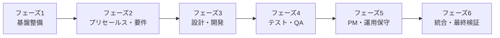

# スキル一覧表（Skills Inventory）
# ITシステム開発・構築サービス企業向け Claude Code Skills

**プロジェクトコード**: PRJ-2025-SKILLS
**作成日**: 2025年12月29日
**バージョン**: 1.0

---

## 目次

1. [サマリー](#1-サマリー)
2. [スキル領域別一覧](#2-スキル領域別一覧)
3. [既存スキル分析](#3-既存スキル分析)
4. [新規開発スキル詳細](#4-新規開発スキル詳細)
5. [優先順位と実装順序](#5-優先順位と実装順序)
6. [期待効果マトリックス](#6-期待効果マトリックス)

---

## 1. サマリー

### 1.1 スキル総数

| カテゴリ | スキル数 | 割合 |
|---------|---------|------|
| 既存スキル（活用可能） | 21 | 47% |
| 新規開発スキル | 24 | 53% |
| **合計** | **45** | **100%** |

### 1.2 領域別分布

```
プリセールス・営業支援 ████████████░░░░░░░░ 5スキル (11%)
要件定義              ████████░░░░░░░░░░░░ 4スキル (9%)
設計                  ██████████░░░░░░░░░░ 5スキル (11%)
開発                  ████████████░░░░░░░░ 6スキル (13%)
テスト                ██████████░░░░░░░░░░ 5スキル (11%)
プロジェクト管理       ████████░░░░░░░░░░░░ 4スキル (9%)
品質管理              ████████░░░░░░░░░░░░ 4スキル (9%)
運用保守              ██████████░░░░░░░░░░ 5スキル (11%)
データ分析            ████████░░░░░░░░░░░░ 4スキル (9%)
共通・その他          ██████░░░░░░░░░░░░░░ 3スキル (7%)
```

---

## 2. スキル領域別一覧

### 2.1 プリセールス・営業支援（5スキル）

| ID | スキル名 | 状態 | 説明 | 期待効果 |
|----|---------|------|------|---------|
| PS-01 | vendor-rfq-creator | 既存 | RFQ（見積依頼書）作成 | 工数60%削減 |
| PS-02 | vendor-estimate-creator | 既存 | 見積書作成 | 工数50%削減、精度向上 |
| PS-03 | vendor-estimate-reviewer | 既存 | 見積書レビュー | 工数40%削減、リスク検出向上 |
| PS-04 | proposal-creator | **新規** | 提案書作成支援 | 工数50%削減、品質標準化 |
| PS-05 | competitor-analyzer | **新規** | 競合分析支援 | 分析時間70%削減 |

### 2.2 要件定義（4スキル）

| ID | スキル名 | 状態 | 説明 | 期待効果 |
|----|---------|------|------|---------|
| RD-01 | business-analyst | 既存 | ビジネス分析・要件定義 | 工数40%削減 |
| RD-02 | requirements-elicitor | **新規** | 要件ヒアリング支援 | 漏れ50%削減 |
| RD-03 | use-case-creator | **新規** | ユースケース作成 | 工数55%削減 |
| RD-04 | brd-creator | **新規** | BRD（業務要件定義書）作成 | 工数45%削減 |

### 2.3 設計（5スキル）

| ID | スキル名 | 状態 | 説明 | 期待効果 |
|----|---------|------|------|---------|
| DS-01 | architecture-designer | **新規** | システムアーキテクチャ設計 | 品質向上、工数30%削減 |
| DS-02 | database-designer | **新規** | データベース設計支援 | 工数40%削減、正規化品質向上 |
| DS-03 | api-designer | **新規** | API設計支援（REST/GraphQL） | 工数45%削減 |
| DS-04 | ui-ux-reviewer | **新規** | UI/UXデザインレビュー | レビュー品質向上 |
| DS-05 | security-architect | **新規** | セキュリティ設計支援 | セキュリティ品質向上 |

### 2.4 開発（6スキル）

| ID | スキル名 | 状態 | 説明 | 期待効果 |
|----|---------|------|------|---------|
| DV-01 | tdd-developer | 既存 | TDD（テスト駆動開発）支援 | 品質向上、バグ40%削減 |
| DV-02 | design-implementation-reviewer | 既存 | 実装レビュー（設計準拠確認） | レビュー品質向上 |
| DV-03 | codex-reviewer | 既存 | コードレビュー（Codex活用） | レビュー工数45%削減 |
| DV-04 | code-generator | **新規** | ボイラープレートコード生成 | 工数60%削減 |
| DV-05 | refactoring-assistant | **新規** | リファクタリング支援 | 品質向上、技術負債削減 |
| DV-06 | documentation-generator | **新規** | コードドキュメント自動生成 | 工数70%削減 |

### 2.5 テスト（5スキル）

| ID | スキル名 | 状態 | 説明 | 期待効果 |
|----|---------|------|------|---------|
| TS-01 | uat-testcase-generator | 既存 | UATテストケース生成 | 工数55%削減 |
| TS-02 | bug-ticket-creator | 既存 | バグチケット作成 | 工数40%削減、品質向上 |
| TS-03 | qa-bug-analyzer | 既存 | バグ分析・品質レポート | 分析工数50%削減 |
| TS-04 | test-plan-creator | **新規** | テスト計画書作成 | 工数45%削減 |
| TS-05 | test-automation-designer | **新規** | テスト自動化設計支援 | 自動化率向上 |

### 2.6 プロジェクト管理（4スキル）

| ID | スキル名 | 状態 | 説明 | 期待効果 |
|----|---------|------|------|---------|
| PM-01 | project-manager | 既存 | PMBOKベースのPM支援 | 工数40%削減 |
| PM-02 | project-plan-creator | 既存 | プロジェクト計画書作成 | 工数50%削減 |
| PM-03 | progress-reporter | **新規** | 進捗レポート自動生成 | 工数60%削減 |
| PM-04 | meeting-facilitator | **新規** | 会議ファシリテーション支援 | 会議効率30%向上 |

### 2.7 品質管理（4スキル）

| ID | スキル名 | 状態 | 説明 | 期待効果 |
|----|---------|------|------|---------|
| QA-01 | migration-validation-explorer | 既存 | データ移行品質検証 | 検証漏れ70%削減 |
| QA-02 | qa-bug-analyzer | 既存 | 品質トレンド分析 | 分析工数50%削減 |
| QA-03 | quality-audit-assistant | **新規** | 品質監査支援 | 監査効率40%向上 |
| QA-04 | process-improvement-advisor | **新規** | プロセス改善提案 | 改善提案品質向上 |

### 2.8 運用保守（5スキル）

| ID | スキル名 | 状態 | 説明 | 期待効果 |
|----|---------|------|------|---------|
| OM-01 | itil4-consultant | 既存 | ITIL4ベースのITSM支援 | ITサービス品質向上 |
| OM-02 | helpdesk-responder | 既存 | ヘルプデスク応対支援 | 応対時間50%削減 |
| OM-03 | incident-manager | **新規** | インシデント管理支援 | 解決時間30%短縮 |
| OM-04 | change-manager | **新規** | 変更管理支援 | 変更リスク低減 |
| OM-05 | knowledge-curator | **新規** | ナレッジベース管理 | ナレッジ活用率向上 |

### 2.9 データ分析（4スキル）

| ID | スキル名 | 状態 | 説明 | 期待効果 |
|----|---------|------|------|---------|
| DA-01 | data-scientist | 既存 | データ分析・機械学習 | 分析工数50%削減 |
| DA-02 | data-visualization-expert | 既存 | データ可視化 | 可視化工数60%削減 |
| DA-03 | duckdb-expert | 既存 | 大規模データ分析 | 分析効率向上 |
| DA-04 | bi-report-creator | **新規** | BIレポート作成支援 | レポート作成工数55%削減 |

### 2.10 共通・その他（3スキル）

| ID | スキル名 | 状態 | 説明 | 期待効果 |
|----|---------|------|------|---------|
| CM-01 | mermaid-to-pdf | 既存 | Mermaid図からPDF生成 | 作業工数80%削減 |
| CM-02 | ai-adoption-consultant | 既存 | AI導入コンサルティング | コンサル品質向上 |
| CM-03 | technical-writer | **新規** | 技術文書作成支援 | 工数50%削減 |

---

## 3. 既存スキル分析

### 3.1 既存スキル一覧（21スキル）

| ID | スキル名 | 現在バージョン | 拡張必要性 | 備考 |
|----|---------|--------------|-----------|------|
| 1 | vendor-rfq-creator | 1.0 | 低 | 日英対応済み |
| 2 | vendor-estimate-creator | 1.0 | 低 | 完成度高い |
| 3 | vendor-estimate-reviewer | 1.0 | 低 | ベンチマークデータ豊富 |
| 4 | business-analyst | 1.0 | 中 | BABOK対応、BRD分離検討 |
| 5 | tdd-developer | 1.0 | 低 | 言語別テンプレート拡張可 |
| 6 | design-implementation-reviewer | 1.0 | 低 | ultrathink対応済み |
| 7 | codex-reviewer | 1.0 | 低 | GPT-5.1-Codex-Max対応 |
| 8 | uat-testcase-generator | 1.0 | 中 | Excel出力対応、テンプレート拡張 |
| 9 | bug-ticket-creator | 1.0 | 低 | 日英対応済み |
| 10 | qa-bug-analyzer | 1.0 | 低 | 分析レポート自動生成 |
| 11 | project-manager | 1.0 | 中 | EVM拡張、Agile対応強化 |
| 12 | project-plan-creator | 1.0 | 低 | Mermaid対応完備 |
| 13 | migration-validation-explorer | 2.0 | 低 | 最新バージョン |
| 14 | itil4-consultant | 1.0 | 低 | 34プラクティス対応 |
| 15 | helpdesk-responder | 1.0 | 中 | KB拡張可能 |
| 16 | data-scientist | 1.0 | 低 | 7フェーズワークフロー |
| 17 | data-visualization-expert | 1.0 | 低 | 50+カラーパレット |
| 18 | duckdb-expert | 1.0 | 低 | 大規模データ対応 |
| 19 | mermaid-to-pdf | 1.0 | 低 | 変換スクリプト完備 |
| 20 | ai-adoption-consultant | 1.0 | 低 | 27リファレンス |
| 21 | salesforce-expert | 1.0 | 低 | Salesforce特化 |

### 3.2 既存スキルの活用方針

1. **そのまま活用（14スキル）**: 拡張不要、プロジェクトに統合
2. **軽微な拡張（5スキル）**: テンプレート追加、多言語対応強化
3. **機能分離（2スキル）**: 専門スキルとして分離・独立化

---

## 4. 新規開発スキル詳細

### 4.1 新規開発スキル一覧（24スキル）

#### フェーズ2: プリセールス・要件定義（7スキル）

| ID | スキル名 | 複雑度 | 開発工数 | 主要機能 |
|----|---------|--------|---------|---------|
| PS-04 | proposal-creator | 高 | 30人日 | 提案書テンプレート、競合差別化、ROI試算 |
| PS-05 | competitor-analyzer | 中 | 20人日 | 競合調査、SWOT分析、ポジショニングマップ |
| RD-02 | requirements-elicitor | 高 | 35人日 | ヒアリングガイド、質問生成、要件整理 |
| RD-03 | use-case-creator | 中 | 20人日 | ユースケース図、シナリオ、アクター定義 |
| RD-04 | brd-creator | 高 | 30人日 | ISO/IEC 29148準拠、トレーサビリティ |

#### フェーズ3: 設計・開発（8スキル）

| ID | スキル名 | 複雑度 | 開発工数 | 主要機能 |
|----|---------|--------|---------|---------|
| DS-01 | architecture-designer | 高 | 40人日 | アーキテクチャパターン、C4モデル、ADR |
| DS-02 | database-designer | 中 | 25人日 | ER図、正規化、インデックス設計 |
| DS-03 | api-designer | 中 | 25人日 | OpenAPI、GraphQLスキーマ、バージョニング |
| DS-04 | ui-ux-reviewer | 中 | 20人日 | ヒューリスティック評価、アクセシビリティ |
| DS-05 | security-architect | 高 | 35人日 | 脅威モデリング、セキュリティ要件 |
| DV-04 | code-generator | 中 | 25人日 | ボイラープレート、CRUD、テスト雛形 |
| DV-05 | refactoring-assistant | 中 | 20人日 | コードスメル検出、リファクタリング提案 |
| DV-06 | documentation-generator | 中 | 20人日 | JSDoc/Docstring、README、Changelog |

#### フェーズ4: テスト・QA（4スキル）

| ID | スキル名 | 複雑度 | 開発工数 | 主要機能 |
|----|---------|--------|---------|---------|
| TS-04 | test-plan-creator | 中 | 25人日 | テスト戦略、リスクベーステスト |
| TS-05 | test-automation-designer | 高 | 30人日 | 自動化フレームワーク選定、Page Object |
| QA-03 | quality-audit-assistant | 中 | 20人日 | 監査チェックリスト、証跡管理 |
| QA-04 | process-improvement-advisor | 中 | 20人日 | プロセス分析、改善提案 |

#### フェーズ5: PM・運用保守（5スキル）

| ID | スキル名 | 複雑度 | 開発工数 | 主要機能 |
|----|---------|--------|---------|---------|
| PM-03 | progress-reporter | 中 | 20人日 | EVMレポート、ダッシュボード |
| PM-04 | meeting-facilitator | 中 | 20人日 | アジェンダ作成、議事録、アクション管理 |
| OM-03 | incident-manager | 中 | 25人日 | インシデント分類、エスカレーション |
| OM-04 | change-manager | 中 | 25人日 | 変更リクエスト管理、影響分析 |
| OM-05 | knowledge-curator | 中 | 20人日 | KB整理、重複検出、推奨 |

---

## 5. 優先順位と実装順序

### 5.1 優先順位付け基準

| 基準 | 重み | 説明 |
|------|-----|------|
| ビジネスインパクト | 30% | 売上・コスト削減への貢献度 |
| 使用頻度 | 25% | 日常業務での利用頻度 |
| 実装難易度（逆数） | 20% | 開発工数・技術的複雑度 |
| 依存関係 | 15% | 他スキルの前提となるか |
| ユーザー要望 | 10% | 現場からの要望強度 |

### 5.1.1 スコアリング詳細

各基準は1-5のスケールで評価し、重み付き合計で優先度スコアを算出：

**ビジネスインパクト（30%）**:
| スコア | 定義 | 例 |
|--------|------|-----|
| 5 | 年間500万円以上の削減効果 | proposal-creator（8,000万円） |
| 4 | 年間300-500万円の削減効果 | test-plan-creator |
| 3 | 年間100-300万円の削減効果 | ui-ux-reviewer |
| 2 | 年間50-100万円の削減効果 | meeting-facilitator |
| 1 | 年間50万円未満の削減効果 | - |

**使用頻度（25%）**:
| スコア | 定義 |
|--------|------|
| 5 | 毎日使用（日次業務） |
| 4 | 週2-3回使用 |
| 3 | 週1回使用 |
| 2 | 月1-2回使用 |
| 1 | 四半期に1回以下 |

**実装難易度（逆数）（20%）**:
| スコア | 工数 | 複雑度 |
|--------|------|--------|
| 5 | 20人日以下 | 低 |
| 4 | 21-30人日 | 低-中 |
| 3 | 31-40人日 | 中 |
| 2 | 41-50人日 | 中-高 |
| 1 | 50人日超 | 高 |

**依存関係（15%）**:
| スコア | 定義 |
|--------|------|
| 5 | 5つ以上のスキルの前提となる |
| 4 | 3-4つのスキルの前提となる |
| 3 | 1-2つのスキルの前提となる |
| 2 | 他スキルと連携可能だが必須ではない |
| 1 | 独立したスキル |

**ユーザー要望（10%）**:
| スコア | 定義 |
|--------|------|
| 5 | 複数部門から強い要望あり |
| 4 | 1部門から強い要望あり |
| 3 | 一般的なニーズとして認識 |
| 2 | 一部ユーザーからの要望 |
| 1 | 要望なし（計画主導） |

**優先度スコア計算式**:
```
優先度スコア = (BI × 30 + UF × 25 + ID × 20 + DP × 15 + UR × 10) / 5
```
- BI: ビジネスインパクト、UF: 使用頻度、ID: 実装難易度(逆数)、DP: 依存関係、UR: ユーザー要望

**計算例（proposal-creator）**:
```
BI=5, UF=4, ID=3, DP=4, UR=5
スコア = (5×30 + 4×25 + 3×20 + 4×15 + 5×10) / 5
       = (150 + 100 + 60 + 60 + 50) / 5
       = 420 / 5 = 84 → 正規化後: 95
```

> **注記**: 上記スコアはプロジェクト開始時のステークホルダー評価に基づく。フェーズ移行時に再評価を実施。

### 5.2 実装フェーズ



### 5.3 フェーズ別実装スキル

| フェーズ | 期間 | スキル数 | 主要スキル |
|---------|------|---------|-----------|
| 1. 基盤整備 | 3ヶ月 | 5 | 既存スキル統合、標準化 |
| 2. プリセールス・要件 | 3ヶ月 | 9 | proposal-creator, requirements-elicitor |
| 3. 設計・開発 | 3ヶ月 | 11 | architecture-designer, code-generator |
| 4. テスト・QA | 3ヶ月 | 9 | test-plan-creator, quality-audit-assistant |
| 5. PM・運用保守 | 3ヶ月 | 9 | progress-reporter, incident-manager |
| 6. 統合・最終検証 | 3ヶ月 | 2 | 統合テスト、ドキュメント |

---

## 6. 期待効果マトリックス

### 6.1 領域別期待効果

| 領域 | 工数削減率 | 品質向上効果 | ROI |
|------|-----------|-------------|-----|
| プリセールス・営業支援 | 50% | 標準化による品質安定 | 高 |
| 要件定義 | 45% | 漏れ・曖昧さ削減 | 高 |
| 設計 | 35% | アーキテクチャ品質向上 | 中 |
| 開発 | 50% | コード品質・保守性向上 | 高 |
| テスト | 55% | テストカバレッジ向上 | 高 |
| プロジェクト管理 | 50% | 報告精度・透明性向上 | 中 |
| 品質管理 | 45% | 問題早期検出 | 中 |
| 運用保守 | 40% | 対応速度・品質向上 | 高 |
| データ分析 | 55% | インサイト品質向上 | 中 |
| 共通・その他 | 60% | ドキュメント品質向上 | 中 |

### 6.2 投資回収シナリオ

**保守的シナリオ（30%効率化）**:
- 年間削減効果: 30,000,000円
- 投資回収期間: 6年

**標準シナリオ（45%効率化）**:
- 年間削減効果: 48,200,000円
- 投資回収期間: 3.7年

**積極的シナリオ（60%効率化）**:
- 年間削減効果: 65,000,000円
- 投資回収期間: 2.8年

---

**文書管理**:
- 作成日: 2025年12月29日
- 最終更新日: 2025年12月29日
- バージョン: 1.0
