# WBS（Work Breakdown Structure）詳細
# Claude Code Skills 全自動化プロジェクト

**プロジェクトコード**: PRJ-2025-SKILLS
**作成日**: 2025年12月29日
**バージョン**: 1.0

---

## 目次

1. [WBS概要](#1-wbs概要)
2. [WBS階層図](#2-wbs階層図)
3. [WBS詳細テーブル](#3-wbs詳細テーブル)
4. [フェーズ別詳細](#4-フェーズ別詳細)
5. [成果物マトリックス](#5-成果物マトリックス)

---

## 1. WBS概要

### 1.1 WBS構造

本プロジェクトのWBSは以下の階層構造で構成されます：

- **Level 1**: プロジェクト全体
- **Level 2**: フェーズ（6フェーズ）
- **Level 3**: カテゴリ/領域
- **Level 4**: ワークパッケージ（具体的な作業単位）

### 1.2 WBS識別子体系

```
X.Y.Z.W
│ │ │ └── ワークパッケージ番号
│ │ └──── カテゴリ番号
│ └────── フェーズ番号
└──────── プロジェクト識別子（常に1）
```

例: `1.3.2.1` = プロジェクト.フェーズ3.カテゴリ2.ワークパッケージ1

---

## 2. WBS階層図

```mermaid
graph TD
    A[1.0 Claude Code Skills<br/>全自動化プロジェクト] --> B[1.1 フェーズ1<br/>基盤整備]
    A --> C[1.2 フェーズ2<br/>プリセールス・要件定義]
    A --> D[1.3 フェーズ3<br/>設計・開発]
    A --> E[1.4 フェーズ4<br/>テスト・QA]
    A --> F[1.5 フェーズ5<br/>PM・運用保守]
    A --> G[1.6 フェーズ6<br/>統合・最終検証]

    B --> B1[1.1.1 プロジェクト立上げ]
    B --> B2[1.1.2 既存スキル分析]
    B --> B3[1.1.3 標準・ガイドライン策定]
    B --> B4[1.1.4 開発環境整備]

    C --> C1[1.2.1 プリセールススキル開発]
    C --> C2[1.2.2 要件定義スキル開発]
    C --> C3[1.2.3 フェーズ2検証]

    D --> D1[1.3.1 設計スキル開発]
    D --> D2[1.3.2 開発スキル開発]
    D --> D3[1.3.3 フェーズ3検証]

    E --> E1[1.4.1 テストスキル開発]
    E --> E2[1.4.2 品質管理スキル開発]
    E --> E3[1.4.3 フェーズ4検証]

    F --> F1[1.5.1 PMスキル開発]
    F --> F2[1.5.2 運用保守スキル開発]
    F --> F3[1.5.3 データ分析・共通スキル]
    F --> F4[1.5.4 フェーズ5検証]

    G --> G1[1.6.1 統合テスト]
    G --> G2[1.6.2 ドキュメント整備]
    G --> G3[1.6.3 リリース準備]
    G --> G4[1.6.4 プロジェクト完了]
```



---

## 3. WBS詳細テーブル

### 3.1 全体サマリー

| フェーズ | 開始日 | 終了日 | 工数（人日） | 成果物数 |
|---------|--------|--------|------------|---------|
| 1. 基盤整備 | 2025/01/06 | 2025/03/31 | 180 | 8 |
| 2. プリセールス・要件定義 | 2025/04/01 | 2025/06/30 | 250 | 9 |
| 3. 設計・開発 | 2025/07/01 | 2025/09/30 | 280 | 11 |
| 4. テスト・QA | 2025/10/01 | 2025/12/31 | 230 | 9 |
| 5. PM・運用保守 | 2026/01/05 | 2026/03/31 | 250 | 9 |
| 6. 統合・最終検証 | 2026/04/01 | 2026/06/30 | 160 | 5 |
| **合計** | - | - | **1,350** | **51** |

### 3.2 詳細WBSテーブル

| WBS ID | タスク名 | 説明 | 工数 | 担当 | 先行タスク | 成果物 |
|--------|---------|------|------|------|-----------|--------|
| **1.1** | **フェーズ1: 基盤整備** | | **180** | | | |
| 1.1.1 | プロジェクト立上げ | | 30 | | | |
| 1.1.1.1 | キックオフ会議 | チーム編成、目標共有 | 2 | PM | - | 議事録 |
| 1.1.1.2 | 詳細計画策定 | WBS、スケジュール詳細化 | 10 | PM | 1.1.1.1 | プロジェクト計画書 |
| 1.1.1.3 | ステークホルダー分析 | 関係者の期待・影響分析 | 5 | PM | 1.1.1.1 | ステークホルダー登録簿 |
| 1.1.1.4 | リスク初期評価 | 主要リスクの識別・評価 | 8 | PM | 1.1.1.2 | リスク登録簿 |
| 1.1.1.5 | コミュニケーション計画 | 報告体制・頻度の確定 | 5 | PM | 1.1.1.3 | コミュニケーション計画 |
| 1.1.2 | 既存スキル分析 | | 40 | | | |
| 1.1.2.1 | 既存スキル棚卸し | 21スキルの機能・品質評価 | 15 | TL | 1.1.1.1 | スキル棚卸しレポート |
| 1.1.2.2 | ギャップ分析 | 必要スキルと既存の差分 | 10 | TL | 1.1.2.1 | ギャップ分析レポート |
| 1.1.2.3 | 統合・拡張計画 | 既存スキルの改修計画 | 10 | TL | 1.1.2.2 | 統合計画書 |
| 1.1.2.4 | 依存関係マッピング | スキル間の依存関係整理 | 5 | TL | 1.1.2.2 | 依存関係図 |
| 1.1.3 | 標準・ガイドライン策定 | | 50 | | | |
| 1.1.3.1 | スキル設計標準 | SKILL.md構成ルール | 15 | TL | 1.1.2.1 | スキル設計標準書 |
| 1.1.3.2 | コーディング規約 | Python/Bashスクリプト標準 | 10 | SE | 1.1.3.1 | コーディング規約 |
| 1.1.3.3 | テスト基準 | スキル検証方法・基準 | 10 | QA | 1.1.3.1 | テスト基準書 |
| 1.1.3.4 | ドキュメント標準 | リファレンス/アセット書式 | 10 | SE | 1.1.3.1 | ドキュメント標準書 |
| 1.1.3.5 | レビュープロセス | スキルレビューフロー | 5 | TL | 1.1.3.3 | レビュープロセス |
| 1.1.4 | 開発環境整備 | | 60 | | | |
| 1.1.4.1 | リポジトリ構成整備 | Git構成、ブランチ戦略 | 10 | SE | 1.1.3.1 | リポジトリガイド |
| 1.1.4.2 | CI/CDパイプライン | 自動検証・パッケージング | 20 | SE | 1.1.4.1 | CI/CD設定 |
| 1.1.4.3 | テスト環境構築 | スキル検証環境 | 15 | SE | 1.1.4.1 | テスト環境 |
| 1.1.4.4 | ドキュメント基盤 | ドキュメント生成・公開 | 10 | SE | 1.1.4.1 | ドキュメントサイト |
| 1.1.4.5 | パイロット検証 | 基盤の動作確認 | 5 | TL | 1.1.4.3 | 検証レポート |
| **1.2** | **フェーズ2: プリセールス・要件定義** | | **250** | | | |
| 1.2.1 | プリセールススキル開発 | | 90 | | | |
| 1.2.1.1 | proposal-creator設計 | 提案書作成スキル設計 | 8 | BA | 1.1.3.1 | 設計書 |
| 1.2.1.2 | proposal-creator実装 | 提案書作成スキル実装 | 22 | SE | 1.2.1.1 | スキルパッケージ |
| 1.2.1.3 | competitor-analyzer設計 | 競合分析スキル設計 | 5 | BA | 1.1.3.1 | 設計書 |
| 1.2.1.4 | competitor-analyzer実装 | 競合分析スキル実装 | 15 | SE | 1.2.1.3 | スキルパッケージ |
| 1.2.1.5 | 既存スキル統合（RFQ/見積） | vendor-rfq/estimate統合 | 20 | SE | 1.1.2.3 | 統合スキル |
| 1.2.1.6 | プリセールススキルテスト | 単体テスト・統合テスト | 20 | QA | 1.2.1.2,1.2.1.4 | テストレポート |
| 1.2.2 | 要件定義スキル開発 | | 130 | | | |
| 1.2.2.1 | requirements-elicitor設計 | 要件ヒアリングスキル設計 | 10 | BA | 1.1.3.1 | 設計書 |
| 1.2.2.2 | requirements-elicitor実装 | 要件ヒアリングスキル実装 | 25 | SE | 1.2.2.1 | スキルパッケージ |
| 1.2.2.3 | use-case-creator設計 | ユースケース作成スキル設計 | 5 | BA | 1.1.3.1 | 設計書 |
| 1.2.2.4 | use-case-creator実装 | ユースケース作成スキル実装 | 15 | SE | 1.2.2.3 | スキルパッケージ |
| 1.2.2.5 | brd-creator設計 | BRD作成スキル設計 | 8 | BA | 1.1.3.1 | 設計書 |
| 1.2.2.6 | brd-creator実装 | BRD作成スキル実装 | 22 | SE | 1.2.2.5 | スキルパッケージ |
| 1.2.2.7 | business-analyst拡張 | 既存スキルの機能拡張 | 15 | SE | 1.1.2.3 | 拡張スキル |
| 1.2.2.8 | 要件定義スキルテスト | 単体テスト・統合テスト | 30 | QA | 1.2.2.2,1.2.2.4,1.2.2.6 | テストレポート |
| 1.2.3 | フェーズ2検証 | | 30 | | | |
| 1.2.3.1 | 統合テスト | フェーズ2スキル統合確認 | 15 | QA | 1.2.1.6,1.2.2.8 | 統合テストレポート |
| 1.2.3.2 | パイロット適用 | 実プロジェクトでの検証 | 10 | TL | 1.2.3.1 | パイロットレポート |
| 1.2.3.3 | フェーズ2完了レビュー | 成果確認、次フェーズ準備 | 5 | PM | 1.2.3.2 | 完了レポート |
| **1.3** | **フェーズ3: 設計・開発** | | **280** | | | |
| 1.3.1 | 設計スキル開発 | | 145 | | | |
| 1.3.1.1 | architecture-designer設計 | アーキテクチャ設計スキル設計 | 12 | TL | 1.2.3.3 | 設計書 |
| 1.3.1.2 | architecture-designer実装 | アーキテクチャ設計スキル実装 | 28 | SE | 1.3.1.1 | スキルパッケージ |
| 1.3.1.3 | database-designer設計 | DB設計スキル設計 | 8 | BA | 1.2.3.3 | 設計書 |
| 1.3.1.4 | database-designer実装 | DB設計スキル実装 | 17 | SE | 1.3.1.3 | スキルパッケージ |
| 1.3.1.5 | api-designer設計 | API設計スキル設計 | 8 | BA | 1.2.3.3 | 設計書 |
| 1.3.1.6 | api-designer実装 | API設計スキル実装 | 17 | SE | 1.3.1.5 | スキルパッケージ |
| 1.3.1.7 | ui-ux-reviewer設計 | UI/UXレビュースキル設計 | 5 | BA | 1.2.3.3 | 設計書 |
| 1.3.1.8 | ui-ux-reviewer実装 | UI/UXレビュースキル実装 | 15 | SE | 1.3.1.7 | スキルパッケージ |
| 1.3.1.9 | security-architect設計 | セキュリティ設計スキル設計 | 10 | TL | 1.2.3.3 | 設計書 |
| 1.3.1.10 | security-architect実装 | セキュリティ設計スキル実装 | 25 | SE | 1.3.1.9 | スキルパッケージ |
| 1.3.2 | 開発スキル開発 | | 95 | | | |
| 1.3.2.1 | code-generator設計 | コード生成スキル設計 | 8 | TL | 1.2.3.3 | 設計書 |
| 1.3.2.2 | code-generator実装 | コード生成スキル実装 | 17 | SE | 1.3.2.1 | スキルパッケージ |
| 1.3.2.3 | refactoring-assistant設計 | リファクタリングスキル設計 | 5 | TL | 1.2.3.3 | 設計書 |
| 1.3.2.4 | refactoring-assistant実装 | リファクタリングスキル実装 | 15 | SE | 1.3.2.3 | スキルパッケージ |
| 1.3.2.5 | documentation-generator設計 | ドキュメント生成スキル設計 | 5 | BA | 1.2.3.3 | 設計書 |
| 1.3.2.6 | documentation-generator実装 | ドキュメント生成スキル実装 | 15 | SE | 1.3.2.5 | スキルパッケージ |
| 1.3.2.7 | 既存開発スキル統合 | TDD/レビュースキル統合 | 15 | SE | 1.1.2.3 | 統合スキル |
| 1.3.2.8 | 開発スキルテスト | 単体テスト・統合テスト | 15 | QA | 1.3.2.2,1.3.2.4,1.3.2.6 | テストレポート |
| 1.3.3 | フェーズ3検証 | | 40 | | | |
| 1.3.3.1 | 設計スキルテスト | 設計スキル統合確認 | 15 | QA | 1.3.1.2,1.3.1.4,1.3.1.6,1.3.1.8,1.3.1.10 | テストレポート |
| 1.3.3.2 | 統合テスト | フェーズ3スキル統合確認 | 15 | QA | 1.3.3.1,1.3.2.8 | 統合テストレポート |
| 1.3.3.3 | パイロット適用 | 実プロジェクトでの検証 | 5 | TL | 1.3.3.2 | パイロットレポート |
| 1.3.3.4 | フェーズ3完了レビュー | 成果確認、次フェーズ準備 | 5 | PM | 1.3.3.3 | 完了レポート |
| **1.4** | **フェーズ4: テスト・QA** | | **230** | | | |
| 1.4.1 | テストスキル開発 | | 110 | | | |
| 1.4.1.1 | test-plan-creator設計 | テスト計画スキル設計 | 8 | QA | 1.3.3.4 | 設計書 |
| 1.4.1.2 | test-plan-creator実装 | テスト計画スキル実装 | 17 | SE | 1.4.1.1 | スキルパッケージ |
| 1.4.1.3 | test-automation-designer設計 | テスト自動化スキル設計 | 10 | QA | 1.3.3.4 | 設計書 |
| 1.4.1.4 | test-automation-designer実装 | テスト自動化スキル実装 | 20 | SE | 1.4.1.3 | スキルパッケージ |
| 1.4.1.5 | 既存テストスキル統合 | UAT/バグ管理スキル統合 | 25 | SE | 1.1.2.3 | 統合スキル |
| 1.4.1.6 | テストスキルテスト | 単体テスト・統合テスト | 30 | QA | 1.4.1.2,1.4.1.4,1.4.1.5 | テストレポート |
| 1.4.2 | 品質管理スキル開発 | | 80 | | | |
| 1.4.2.1 | quality-audit-assistant設計 | 品質監査スキル設計 | 5 | QA | 1.3.3.4 | 設計書 |
| 1.4.2.2 | quality-audit-assistant実装 | 品質監査スキル実装 | 15 | SE | 1.4.2.1 | スキルパッケージ |
| 1.4.2.3 | process-improvement-advisor設計 | プロセス改善スキル設計 | 5 | QA | 1.3.3.4 | 設計書 |
| 1.4.2.4 | process-improvement-advisor実装 | プロセス改善スキル実装 | 15 | SE | 1.4.2.3 | スキルパッケージ |
| 1.4.2.5 | 既存QAスキル統合 | migration-validation等統合 | 20 | SE | 1.1.2.3 | 統合スキル |
| 1.4.2.6 | 品質管理スキルテスト | 単体テスト・統合テスト | 20 | QA | 1.4.2.2,1.4.2.4,1.4.2.5 | テストレポート |
| 1.4.3 | フェーズ4検証 | | 40 | | | |
| 1.4.3.1 | 統合テスト | フェーズ4スキル統合確認 | 20 | QA | 1.4.1.6,1.4.2.6 | 統合テストレポート |
| 1.4.3.2 | パイロット適用 | 実プロジェクトでの検証 | 15 | TL | 1.4.3.1 | パイロットレポート |
| 1.4.3.3 | フェーズ4完了レビュー | 成果確認、次フェーズ準備 | 5 | PM | 1.4.3.2 | 完了レポート |
| **1.5** | **フェーズ5: PM・運用保守** | | **250** | | | |
| 1.5.1 | PMスキル開発 | | 80 | | | |
| 1.5.1.1 | progress-reporter設計 | 進捗レポートスキル設計 | 5 | PM | 1.4.3.3 | 設計書 |
| 1.5.1.2 | progress-reporter実装 | 進捗レポートスキル実装 | 15 | SE | 1.5.1.1 | スキルパッケージ |
| 1.5.1.3 | meeting-facilitator設計 | 会議支援スキル設計 | 5 | PM | 1.4.3.3 | 設計書 |
| 1.5.1.4 | meeting-facilitator実装 | 会議支援スキル実装 | 15 | SE | 1.5.1.3 | スキルパッケージ |
| 1.5.1.5 | 既存PMスキル統合 | project-manager等統合 | 20 | SE | 1.1.2.3 | 統合スキル |
| 1.5.1.6 | PMスキルテスト | 単体テスト・統合テスト | 20 | QA | 1.5.1.2,1.5.1.4,1.5.1.5 | テストレポート |
| 1.5.2 | 運用保守スキル開発 | | 95 | | | |
| 1.5.2.1 | incident-manager設計 | インシデント管理スキル設計 | 8 | TL | 1.4.3.3 | 設計書 |
| 1.5.2.2 | incident-manager実装 | インシデント管理スキル実装 | 17 | SE | 1.5.2.1 | スキルパッケージ |
| 1.5.2.3 | change-manager設計 | 変更管理スキル設計 | 8 | TL | 1.4.3.3 | 設計書 |
| 1.5.2.4 | change-manager実装 | 変更管理スキル実装 | 17 | SE | 1.5.2.3 | スキルパッケージ |
| 1.5.2.5 | knowledge-curator設計 | ナレッジ管理スキル設計 | 5 | BA | 1.4.3.3 | 設計書 |
| 1.5.2.6 | knowledge-curator実装 | ナレッジ管理スキル実装 | 15 | SE | 1.5.2.5 | スキルパッケージ |
| 1.5.2.7 | 既存運用スキル統合 | ITIL/Helpdesk統合 | 10 | SE | 1.1.2.3 | 統合スキル |
| 1.5.2.8 | 運用保守スキルテスト | 単体テスト・統合テスト | 15 | QA | 1.5.2.2,1.5.2.4,1.5.2.6 | テストレポート |
| 1.5.3 | データ分析・共通スキル | | 45 | | | |
| 1.5.3.1 | bi-report-creator設計 | BIレポートスキル設計 | 5 | BA | 1.4.3.3 | 設計書 |
| 1.5.3.2 | bi-report-creator実装 | BIレポートスキル実装 | 15 | SE | 1.5.3.1 | スキルパッケージ |
| 1.5.3.3 | technical-writer設計 | 技術文書スキル設計 | 5 | BA | 1.4.3.3 | 設計書 |
| 1.5.3.4 | technical-writer実装 | 技術文書スキル実装 | 10 | SE | 1.5.3.3 | スキルパッケージ |
| 1.5.3.5 | 既存分析スキル統合 | data-scientist等統合 | 10 | SE | 1.1.2.3 | 統合スキル |
| 1.5.4 | フェーズ5検証 | | 30 | | | |
| 1.5.4.1 | 統合テスト | フェーズ5スキル統合確認 | 15 | QA | 1.5.1.6,1.5.2.8 | 統合テストレポート |
| 1.5.4.2 | パイロット適用 | 実プロジェクトでの検証 | 10 | TL | 1.5.4.1 | パイロットレポート |
| 1.5.4.3 | フェーズ5完了レビュー | 成果確認、次フェーズ準備 | 5 | PM | 1.5.4.2 | 完了レポート |
| **1.6** | **フェーズ6: 統合・最終検証** | | **160** | | | |
| 1.6.1 | 統合テスト | | 60 | | | |
| 1.6.1.1 | 全スキル統合テスト | 45スキルの相互運用確認 | 30 | QA | 1.5.4.3 | 統合テストレポート |
| 1.6.1.2 | E2Eシナリオテスト | 業務フロー通しテスト | 20 | QA | 1.6.1.1 | E2Eテストレポート |
| 1.6.1.3 | パフォーマンステスト | 性能・応答時間検証 | 10 | SE | 1.6.1.1 | 性能テストレポート |
| 1.6.2 | ドキュメント整備 | | 50 | | | |
| 1.6.2.1 | スキルカタログ作成 | 全スキル一覧・使用ガイド | 15 | BA | 1.6.1.1 | スキルカタログ |
| 1.6.2.2 | 開発者ドキュメント | 拡張・カスタマイズ方法 | 15 | TL | 1.6.1.1 | 開発者ガイド |
| 1.6.2.3 | ベストプラクティス集 | 活用パターン集 | 10 | BA | 1.6.1.2 | ベストプラクティス |
| 1.6.2.4 | READMEアップデート | リポジトリドキュメント更新 | 10 | SE | 1.6.2.1 | README |
| 1.6.3 | リリース準備 | | 35 | | | |
| 1.6.3.1 | パッケージング | 全スキルのZIPパッケージ化 | 10 | SE | 1.6.1.3 | スキルパッケージ群 |
| 1.6.3.2 | リリースノート作成 | バージョン情報・変更点 | 5 | PM | 1.6.3.1 | リリースノート |
| 1.6.3.3 | 本番環境デプロイ | 本番リポジトリへの適用 | 10 | SE | 1.6.3.1 | デプロイ完了 |
| 1.6.3.4 | ユーザートレーニング準備 | トレーニング資料作成 | 10 | BA | 1.6.2.1 | トレーニング資料 |
| 1.6.4 | プロジェクト完了 | | 15 | | | |
| 1.6.4.1 | 最終レビュー | 成果物・成功基準確認 | 5 | PM | 1.6.3.3 | 最終レビュー記録 |
| 1.6.4.2 | 教訓収集 | Lessons Learned文書化 | 5 | PM | 1.6.4.1 | 教訓ドキュメント |
| 1.6.4.3 | プロジェクト完了報告 | ステークホルダー報告 | 5 | PM | 1.6.4.2 | 完了報告書 |

---

## 4. フェーズ別詳細

### 4.1 フェーズ1: 基盤整備（2025年1月〜3月）


**主要成果物**:
1. プロジェクト計画書
2. スキル棚卸しレポート
3. スキル設計標準書
4. 開発環境（CI/CD）
5. テスト基準書

### 4.2 フェーズ2: プリセールス・要件定義（2025年4月〜6月）


**開発スキル**:
- proposal-creator（新規）
- competitor-analyzer（新規）
- requirements-elicitor（新規）
- use-case-creator（新規）
- brd-creator（新規）
- business-analyst（拡張）
- vendor-rfq-creator（統合）
- vendor-estimate-creator（統合）
- vendor-estimate-reviewer（統合）

### 4.3 フェーズ3: 設計・開発（2025年7月〜9月）


**開発スキル**:
- architecture-designer（新規）
- database-designer（新規）
- api-designer（新規）
- ui-ux-reviewer（新規）
- security-architect（新規）
- code-generator（新規）
- refactoring-assistant（新規）
- documentation-generator（新規）
- tdd-developer（統合）
- design-implementation-reviewer（統合）
- codex-reviewer（統合）

### 4.4 フェーズ4: テスト・QA（2025年10月〜12月）


**開発スキル**:
- test-plan-creator（新規）
- test-automation-designer（新規）
- quality-audit-assistant（新規）
- process-improvement-advisor（新規）
- uat-testcase-generator（統合）
- bug-ticket-creator（統合）
- qa-bug-analyzer（統合）
- migration-validation-explorer（統合）

### 4.5 フェーズ5: PM・運用保守（2026年1月〜3月）


**開発スキル**:
- progress-reporter（新規）
- meeting-facilitator（新規）
- incident-manager（新規）
- change-manager（新規）
- knowledge-curator（新規）
- bi-report-creator（新規）
- technical-writer（新規）
- project-manager（統合）
- project-plan-creator（統合）
- itil4-consultant（統合）
- helpdesk-responder（統合）
- data-scientist（統合）
- data-visualization-expert（統合）
- duckdb-expert（統合）
- mermaid-to-pdf（統合）
- ai-adoption-consultant（統合）

### 4.6 フェーズ6: 統合・最終検証（2026年4月〜6月）


**主要成果物**:
1. 45スキルパッケージ
2. スキルカタログ
3. 開発者ドキュメント
4. ベストプラクティス集
5. トレーニング資料
6. 完了報告書

---

## 5. 成果物マトリックス

| 成果物カテゴリ | 成果物名 | フェーズ | 責任者 | 承認者 |
|--------------|---------|---------|--------|--------|
| **計画** | プロジェクト計画書 | 1 | PM | スポンサー |
| | リスク登録簿 | 1 | PM | PO |
| | コミュニケーション計画 | 1 | PM | PO |
| **標準** | スキル設計標準書 | 1 | TL | PM |
| | コーディング規約 | 1 | SE | TL |
| | テスト基準書 | 1 | QA | TL |
| **スキル** | 新規スキル（24個） | 2-5 | SE | TL |
| | 統合スキル（21個） | 2-5 | SE | TL |
| **テスト** | 単体テストレポート | 2-5 | QA | TL |
| | 統合テストレポート | 2-6 | QA | PM |
| | パイロットレポート | 2-5 | TL | PM |
| **ドキュメント** | スキルカタログ | 6 | BA | PM |
| | 開発者ガイド | 6 | TL | PM |
| | ベストプラクティス | 6 | BA | TL |
| **リリース** | スキルパッケージ群 | 6 | SE | TL |
| | リリースノート | 6 | PM | PO |
| | 完了報告書 | 6 | PM | スポンサー |

---

## 6. 既存スキル統合の定義

### 6.1 「統合」作業の定義

WBS内で「既存スキル統合」と記載されている作業は、以下の具体的なタスクを含みます：

| タスクカテゴリ | 説明 | 工数目安 |
|--------------|------|---------|
| **バージョン確認・更新** | 既存スキルの最新バージョンを確認し、必要に応じてアップデート | 10% |
| **ディレクトリ構造標準化** | 標準ディレクトリ構造（scripts/, references/, assets/）への適合 | 15% |
| **SKILL.md標準化** | フロントマター形式、セクション構成の標準化 | 20% |
| **相互参照設定** | 関連スキルへの参照、依存関係の明示化 | 15% |
| **テンプレート統一** | 出力テンプレートのフォーマット・命名規則統一 | 15% |
| **quick_validate対応** | validation スクリプトのパス対応 | 10% |
| **動作確認テスト** | 統合後の動作確認、回帰テスト | 15% |

### 6.2 統合作業の成果物

各統合作業完了時に以下を成果物として提出：

1. **統合チェックリスト**: 標準化項目の確認記録
2. **変更履歴**: 既存スキルへの変更点一覧
3. **動作確認レポート**: 基本機能の確認結果
4. **マイグレーションガイド**: 旧バージョンからの移行手順（該当する場合）

---

## 7. 工数見積もり根拠

### 7.1 見積もり手法

本プロジェクトの工数見積もりは以下の手法を併用して算出：

| 手法 | 適用範囲 | 説明 |
|------|---------|------|
| **類推見積もり** | 既存スキルベース | 既存21スキルの開発実績（平均15人日/スキル）を基準 |
| **パラメトリック見積もり** | 新規スキル | 複雑度×基本工数で算出 |
| **ボトムアップ見積もり** | WBS Level 4 | 各ワークパッケージを積み上げ |

### 7.2 スキル開発の基準工数

| スキル複雑度 | 設計工数 | 実装工数 | テスト工数 | 合計 |
|------------|---------|---------|----------|------|
| 低 | 3人日 | 10人日 | 5人日 | 18人日 |
| 中 | 5人日 | 15人日 | 8人日 | 28人日 |
| 高 | 10人日 | 25人日 | 12人日 | 47人日 |

### 7.3 工数係数

| 係数 | 値 | 適用条件 |
|------|-----|---------|
| **新規スキル係数** | 1.0 | ゼロから開発するスキル |
| **拡張係数** | 0.5 | 既存スキルの機能追加・改修 |
| **統合係数** | 0.3 | 既存スキルの標準化・統合のみ |
| **リスクバッファ** | +15% | 全タスクに適用 |

### 7.4 見積もり検証

| 検証方法 | 結果 |
|---------|------|
| **3点見積もり** | 楽観1,150人日、最頻1,350人日、悲観1,620人日 |
| **PERT期待値** | (1,150 + 4×1,350 + 1,620) ÷ 6 = 1,362人日 |
| **採用値** | 1,350人日（最頻値を採用、リスク対応は別途コンティンジェンシーで管理） |

> **注記**: 上記見積もりは類似プロジェクト実績および業界ベンチマーク（スキル開発工数）に基づく。フェーズ1完了時に実績との乖離を分析し、必要に応じて後続フェーズの見積もりを調整する。

---

**文書管理**:
- 作成日: 2025年12月29日
- 最終更新日: 2025年12月29日
- バージョン: 1.0
