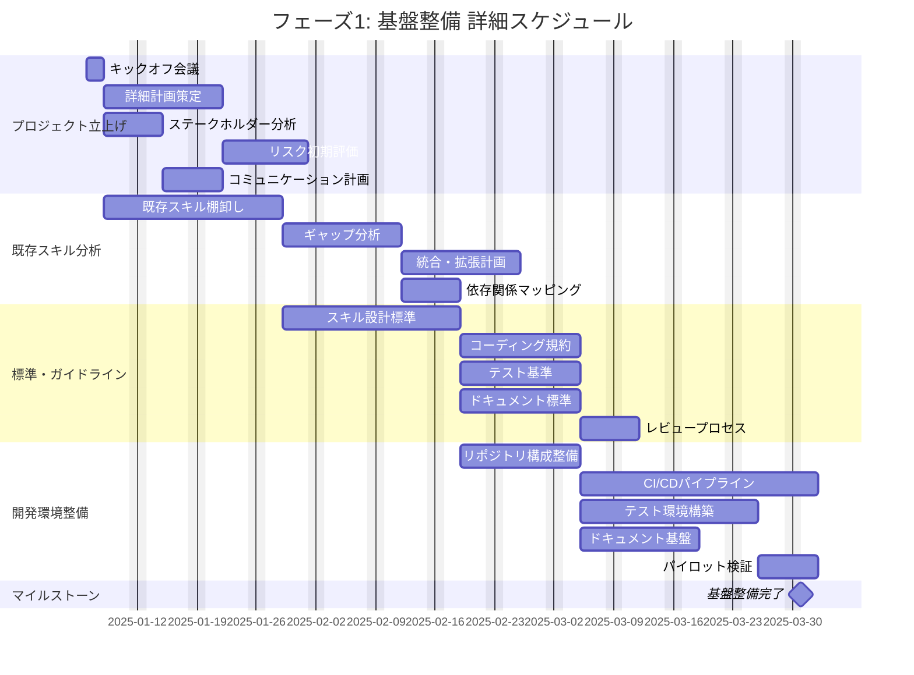
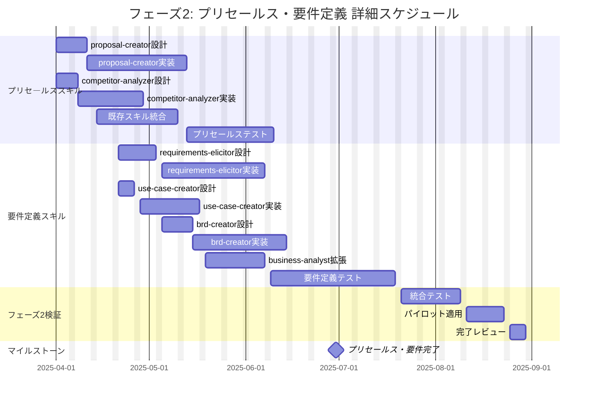
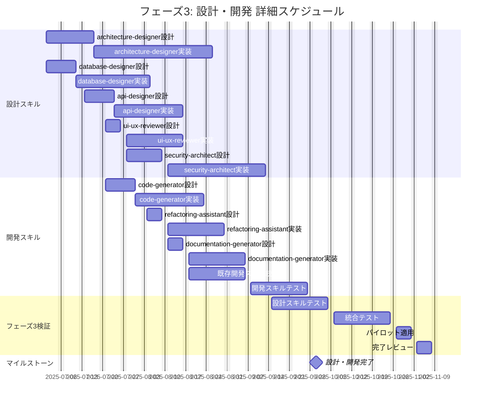
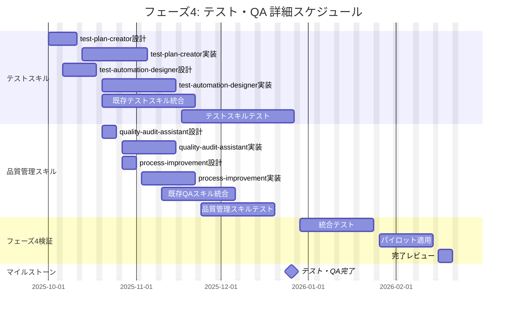
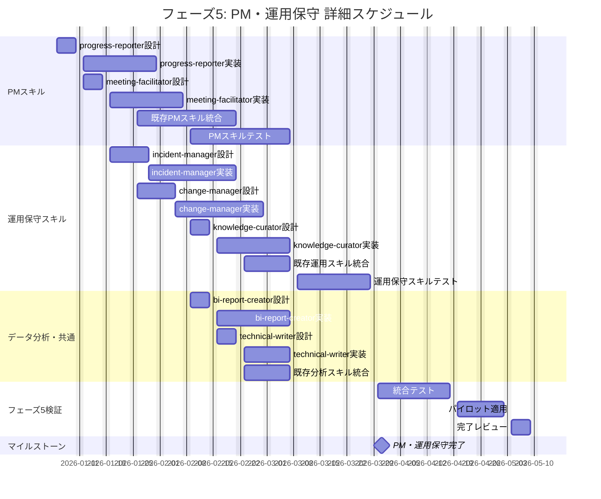
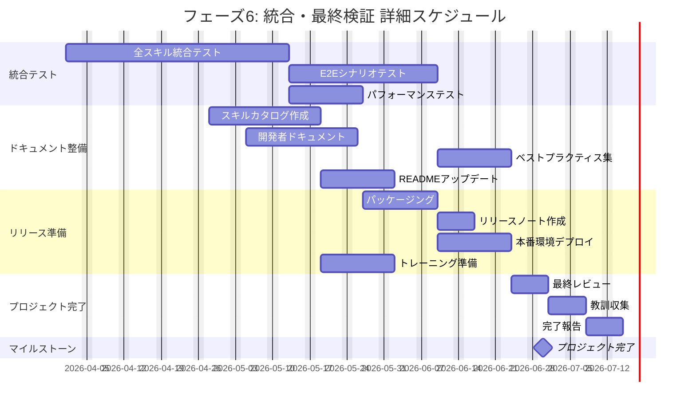
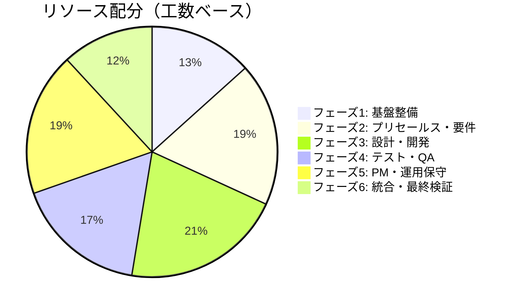

# プロジェクトスケジュール（Gantt Chart）
# Claude Code Skills 全自動化プロジェクト

**プロジェクトコード**: PRJ-2025-SKILLS
**作成日**: 2025年12月29日
**バージョン**: 1.0

---

## 目次

1. [スケジュール概要](#1-スケジュール概要)
2. [マイルストーン一覧](#2-マイルストーン一覧)
3. [全体Ganttチャート](#3-全体ganttチャート)
4. [フェーズ別詳細Ganttチャート](#4-フェーズ別詳細ganttチャート)
5. [クリティカルパス](#5-クリティカルパス)
6. [リソース配分](#6-リソース配分)

---

## 1. スケジュール概要

### 1.1 プロジェクト期間

| 項目 | 内容 |
|------|------|
| **開始日** | 2025年1月6日（月） |
| **完了予定日** | 2026年6月30日（火） |
| **総期間** | 18ヶ月（約78週） |
| **総工数** | 1,350人日 |

### 1.2 フェーズ別期間

| フェーズ | 開始日 | 終了日 | 期間 | 工数 |
|---------|--------|--------|------|------|
| 1. 基盤整備 | 2025/01/06 | 2025/03/31 | 12週 | 180人日 |
| 2. プリセールス・要件定義 | 2025/04/01 | 2025/06/30 | 13週 | 250人日 |
| 3. 設計・開発 | 2025/07/01 | 2025/09/30 | 13週 | 280人日 |
| 4. テスト・QA | 2025/10/01 | 2025/12/26 | 13週 | 230人日 |
| 5. PM・運用保守 | 2026/01/05 | 2026/03/31 | 12週 | 250人日 |
| 6. 統合・最終検証 | 2026/04/01 | 2026/06/30 | 13週 | 160人日 |

---

## 2. マイルストーン一覧

| ID | マイルストーン名 | 予定日 | 達成基準 |
|----|-----------------|--------|---------|
| M0 | プロジェクト開始 | 2025/01/06 | キックオフ完了 |
| M1 | 基盤整備完了 | 2025/03/31 | 標準・環境整備完了、21既存スキル分析完了 |
| M2 | プリセールス・要件スキル完了 | 2025/06/30 | 9スキル開発・検証完了 |
| M3 | 設計・開発スキル完了 | 2025/09/30 | 11スキル開発・検証完了 |
| M4 | テスト・QAスキル完了 | 2025/12/26 | 9スキル開発・検証完了 |
| M5 | PM・運用保守スキル完了 | 2026/03/31 | 16スキル開発・検証完了 |
| M6 | プロジェクト完了 | 2026/06/30 | 全45スキル統合・リリース完了 |

---

## 3. 全体Ganttチャート

### 3.1 プロジェクト全体スケジュール

```mermaid
gantt
    title Claude Code Skills 全自動化プロジェクト - マスタースケジュール
    dateFormat YYYY-MM-DD
    excludes weekends

    section マイルストーン
    M0: プロジェクト開始          :milestone, m0, 2025-01-06, 0d
    M1: 基盤整備完了              :milestone, m1, 2025-03-31, 0d
    M2: プリセールス・要件完了     :milestone, m2, 2025-06-30, 0d
    M3: 設計・開発完了            :milestone, m3, 2025-09-30, 0d
    M4: テスト・QA完了            :milestone, m4, 2025-12-26, 0d
    M5: PM・運用保守完了          :milestone, m5, 2026-03-31, 0d
    M6: プロジェクト完了          :milestone, m6, 2026-06-30, 0d

    section フェーズ1: 基盤整備
    プロジェクト立上げ            :p1a, 2025-01-06, 3w
    既存スキル分析               :p1b, after p1a, 4w
    標準・ガイドライン策定        :p1c, after p1b, 4w
    開発環境整備                 :p1d, after p1b, 5w

    section フェーズ2: プリセールス・要件定義
    プリセールススキル開発        :p2a, 2025-04-01, 7w
    要件定義スキル開発           :p2b, 2025-04-21, 9w
    フェーズ2検証               :p2c, after p2b, 3w

    section フェーズ3: 設計・開発
    設計スキル開発               :p3a, 2025-07-01, 10w
    開発スキル開発               :p3b, 2025-07-21, 7w
    フェーズ3検証               :p3c, after p3a, 3w

    section フェーズ4: テスト・QA
    テストスキル開発             :p4a, 2025-10-01, 8w
    品質管理スキル開発           :p4b, 2025-10-20, 6w
    フェーズ4検証               :p4c, after p4a, 3w

    section フェーズ5: PM・運用保守
    PMスキル開発                 :p5a, 2026-01-05, 6w
    運用保守スキル開発           :p5b, 2026-01-19, 7w
    データ分析・共通スキル       :p5c, 2026-02-09, 4w
    フェーズ5検証               :p5d, after p5b, 3w

    section フェーズ6: 統合・最終検証
    統合テスト                   :p6a, 2026-04-01, 5w
    ドキュメント整備             :p6b, 2026-04-28, 4w
    リリース準備                 :p6c, after p6b, 3w
    プロジェクト完了             :p6d, after p6c, 1w
```

---

## 4. フェーズ別詳細Ganttチャート

### 4.1 フェーズ1: 基盤整備（2025年1月〜3月）



### 4.2 フェーズ2: プリセールス・要件定義（2025年4月〜6月）



### 4.3 フェーズ3: 設計・開発（2025年7月〜9月）



### 4.4 フェーズ4: テスト・QA（2025年10月〜12月）



### 4.5 フェーズ5: PM・運用保守（2026年1月〜3月）



### 4.6 フェーズ6: 統合・最終検証（2026年4月〜6月）



---

## 5. クリティカルパス

### 5.1 クリティカルパス分析

プロジェクトのクリティカルパス（最長経路）は以下の通りです：


### 5.2 クリティカルパス詳細

| 順序 | タスク | 工数 | 開始日 | 終了日 |
|-----|--------|------|--------|--------|
| 1 | キックオフ | 2d | 2025/01/06 | 2025/01/07 |
| 2 | 既存スキル分析 | 40d | 2025/01/08 | 2025/02/28 |
| 3 | スキル設計標準 | 15d | 2025/02/10 | 2025/02/28 |
| 4 | architecture-designer | 40d | 2025/07/01 | 2025/08/22 |
| 5 | security-architect | 35d | 2025/07/28 | 2025/09/12 |
| 6 | test-automation-designer | 30d | 2025/10/06 | 2025/11/14 |
| 7 | incident-manager | 25d | 2026/01/19 | 2026/02/20 |
| 8 | 全スキル統合テスト | 30d | 2026/04/01 | 2026/05/08 |
| 9 | E2Eテスト | 20d | 2026/05/11 | 2026/06/05 |
| 10 | リリース | 25d | 2026/06/02 | 2026/06/30 |

### 5.3 フロート（余裕）分析

| カテゴリ | スキル/タスク | フロート |
|---------|-------------|---------|
| クリティカル | architecture-designer | 0日 |
| クリティカル | security-architect | 0日 |
| 準クリティカル | database-designer | 5日 |
| 準クリティカル | api-designer | 7日 |
| 余裕あり | ui-ux-reviewer | 15日 |
| 余裕あり | mermaid-to-pdf統合 | 20日 |

---

## 6. リソース配分

### 6.1 フェーズ別リソース配分



### 6.2 役割別リソース配分

| 役割 | 人数 | 稼働率 | フェーズ1 | フェーズ2 | フェーズ3 | フェーズ4 | フェーズ5 | フェーズ6 |
|------|------|--------|----------|----------|----------|----------|----------|----------|
| PM | 1 | 100% | 40% | 20% | 15% | 15% | 20% | 30% |
| TL | 1 | 100% | 30% | 25% | 35% | 25% | 25% | 25% |
| SE | 3 | 100% | 25% | 35% | 40% | 35% | 35% | 30% |
| BA | 1 | 80% | 5% | 30% | 20% | 15% | 25% | 30% |
| QA | 1 | 100% | 10% | 25% | 25% | 40% | 25% | 40% |

### 6.3 月別工数推移

> **注記**: 本表はWBS詳細（03_wbs_detailed.md）の総工数1,350人日と整合しています。

| 月 | PM | TL | SE(3名) | BA | QA | 合計 |
|----|----|----|---------|----|----|------|
| 2025/01 | 18 | 13 | 27 | 4 | 4 | 66 |
| 2025/02 | 13 | 18 | 27 | 4 | 9 | 71 |
| 2025/03 | 9 | 13 | 18 | 4 | 9 | 53 |
| 2025/04 | 13 | 18 | 35 | 13 | 13 | 92 |
| 2025/05 | 9 | 13 | 31 | 13 | 18 | 84 |
| 2025/06 | 9 | 9 | 18 | 9 | 13 | 58 |
| 2025/07 | 9 | 22 | 40 | 13 | 13 | 97 |
| 2025/08 | 9 | 18 | 35 | 9 | 13 | 84 |
| 2025/09 | 9 | 18 | 27 | 9 | 18 | 81 |
| 2025/10 | 9 | 18 | 31 | 9 | 22 | 89 |
| 2025/11 | 9 | 13 | 27 | 9 | 22 | 80 |
| 2025/12 | 9 | 9 | 18 | 4 | 18 | 58 |
| 2026/01 | 13 | 18 | 31 | 13 | 13 | 88 |
| 2026/02 | 9 | 13 | 27 | 13 | 13 | 75 |
| 2026/03 | 9 | 13 | 22 | 9 | 18 | 71 |
| 2026/04 | 13 | 13 | 22 | 13 | 22 | 83 |
| 2026/05 | 13 | 13 | 18 | 13 | 18 | 75 |
| 2026/06 | 18 | 9 | 13 | 9 | 13 | 62 |
| **合計** | **190** | **261** | **467** | **160** | **269** | **1,347** |

> **差分調整**: WBS合計1,350人日との差分3人日はコンティンジェンシーとして管理予備に含む。

---

**文書管理**:
- 作成日: 2025年12月29日
- 最終更新日: 2025年12月29日
- バージョン: 1.0
