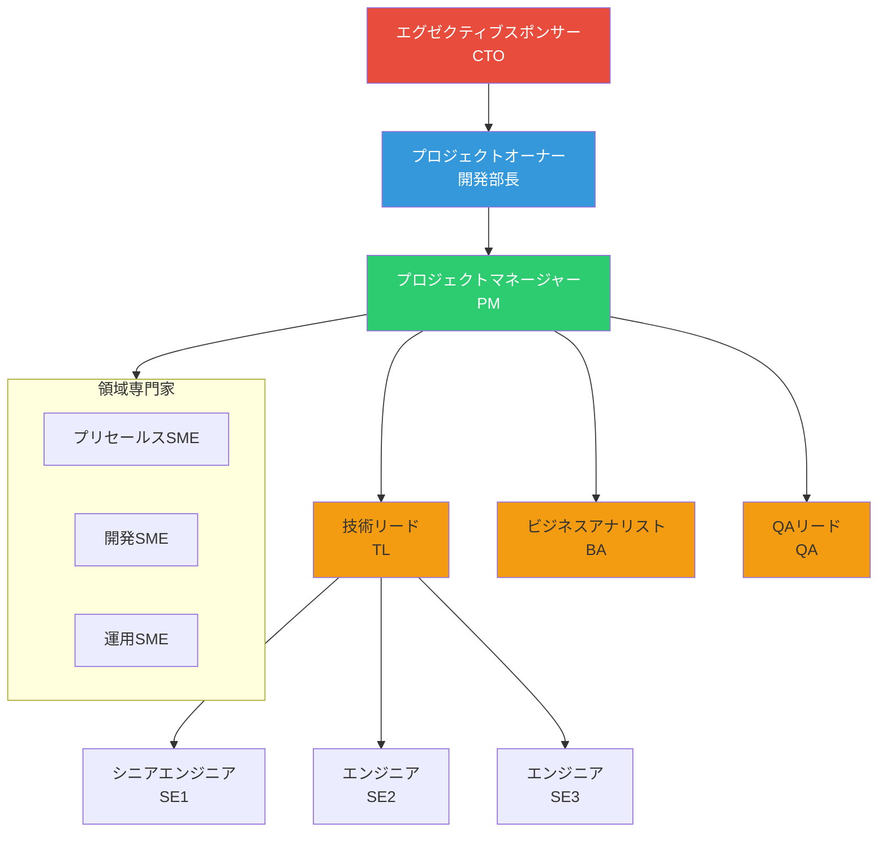

# RACI マトリックス
# Claude Code Skills 全自動化プロジェクト

**プロジェクトコード**: PRJ-2025-SKILLS
**作成日**: 2025年12月29日
**バージョン**: 1.0

---

## 目次

1. [RACI概要](#1-raci概要)
2. [プロジェクト組織体制](#2-プロジェクト組織体制)
3. [プロジェクト管理RACI](#3-プロジェクト管理raci)
4. [スキル開発RACI](#4-スキル開発raci)
5. [品質管理RACI](#5-品質管理raci)
6. [コミュニケーションRACI](#6-コミュニケーションraci)

---

## 1. RACI概要

### 1.1 RACIとは

RACI（Responsible, Accountable, Consulted, Informed）は、プロジェクトにおける役割と責任を明確にするためのマトリックスです。

| 略称 | 英語 | 日本語 | 説明 |
|------|------|--------|------|
| **R** | Responsible | 実行責任者 | 作業を実行する担当者。複数名可能。 |
| **A** | Accountable | 説明責任者 | 成果物の最終承認権限を持つ。1名のみ。 |
| **C** | Consulted | 相談先 | 作業前に意見・助言を求める。双方向コミュニケーション。 |
| **I** | Informed | 報告先 | 作業結果を報告する。一方向コミュニケーション。 |

### 1.2 RACIルール

1. 各タスクには必ず1名の**A**（Accountable）が必要
2. **A**は意思決定の最終責任を負う
3. **R**（Responsible）がいない行があってはならない
4. **C**と**I**は必要に応じて設定

---

## 2. プロジェクト組織体制

### 2.1 組織図

### 2.2 役割定義

| 役割 | 略称 | 責任範囲 | 意思決定権限 |
|------|------|---------|-------------|
| **エグゼクティブスポンサー** | Sponsor | 予算承認、戦略方針、エスカレーション先 | プロジェクト継続/中止 |
| **プロジェクトオーナー** | PO | ビジネス要件、優先順位、UAT承認 | スコープ変更承認 |
| **プロジェクトマネージャー** | PM | 計画・進捗・リスク・品質管理 | 日常運営、リソース配分 |
| **技術リード** | TL | アーキテクチャ、技術判断、コードレビュー | 技術選定、設計承認 |
| **ビジネスアナリスト** | BA | 要件分析、ドキュメント作成 | なし（助言のみ） |
| **QAリード** | QA | テスト計画、品質保証、検証 | テスト完了判定 |
| **シニアエンジニア** | SE | スキル設計・実装 | なし（実装判断） |
| **領域専門家** | SME | 専門知識提供、レビュー | なし（助言のみ） |

---

## 3. プロジェクト管理RACI

### 3.1 プロジェクト立上げ・計画

| タスク/成果物 | Sponsor | PO | PM | TL | BA | QA | SE | SME |
|--------------|---------|----|----|----|----|----|----|-----|
| プロジェクト憲章承認 | **A** | C | R | C | I | I | I | I |
| プロジェクト計画策定 | I | **A** | R | C | C | C | I | I |
| WBS作成 | I | C | **A**/R | C | C | C | I | I |
| スケジュール作成 | I | C | **A**/R | C | I | I | I | I |
| リソース計画 | I | **A** | R | C | I | I | I | I |
| 予算計画 | **A** | C | R | C | I | I | I | I |
| リスク計画 | I | C | **A**/R | C | I | C | I | I |
| コミュニケーション計画 | I | **A** | R | I | I | I | I | I |
| 品質計画 | I | C | **A** | C | I | R | I | I |
| ステークホルダー登録簿 | I | C | **A**/R | I | I | I | I | I |

### 3.2 プロジェクト監視・制御

| タスク/成果物 | Sponsor | PO | PM | TL | BA | QA | SE | SME |
|--------------|---------|----|----|----|----|----|----|-----|
| 進捗報告（週次） | I | I | **A**/R | C | I | I | I | I |
| ステータスレポート（月次） | I | **A** | R | C | I | C | I | I |
| リスクレビュー | I | C | **A**/R | C | I | C | I | I |
| 課題管理 | I | C | **A**/R | R | I | I | I | I |
| 変更要求管理 | C | **A** | R | C | C | C | I | I |
| スコープ変更承認 | C | **A** | R | C | C | I | I | I |
| 予算管理 | C | **A** | R | I | I | I | I | I |
| マイルストーンレビュー | I | **A** | R | C | C | C | I | C |
| 品質レビュー | I | C | **A** | C | I | R | I | I |
| ステアリングコミッティ報告 | **A** | C | R | I | I | I | I | I |

### 3.3 プロジェクト完了

| タスク/成果物 | Sponsor | PO | PM | TL | BA | QA | SE | SME |
|--------------|---------|----|----|----|----|----|----|-----|
| 成果物引き渡し | I | **A** | R | C | I | C | I | I |
| 最終報告書 | I | C | **A**/R | C | I | I | I | I |
| 教訓収集 | I | C | **A**/R | R | R | R | R | C |
| プロジェクト完了承認 | **A** | C | R | I | I | I | I | I |
| リソース解放 | I | **A** | R | I | I | I | I | I |

---

## 4. スキル開発RACI

### 4.1 スキル設計

| タスク/成果物 | Sponsor | PO | PM | TL | BA | QA | SE | SME |
|--------------|---------|----|----|----|----|----|----|-----|
| スキル要件定義 | I | C | C | **A** | R | I | C | C |
| スキル設計書作成 | I | I | I | **A** | R | C | R | C |
| SKILL.md構成設計 | I | I | I | **A**/R | C | I | R | I |
| references設計 | I | I | I | C | **A**/R | I | C | C |
| assets設計 | I | I | I | C | **A**/R | I | R | C |
| scripts設計 | I | I | I | **A**/R | I | C | R | I |
| 設計レビュー | I | I | C | **A** | R | C | C | C |
| 設計承認 | I | I | **A** | R | I | I | I | I |

### 4.2 スキル実装

| タスク/成果物 | Sponsor | PO | PM | TL | BA | QA | SE | SME |
|--------------|---------|----|----|----|----|----|----|-----|
| SKILL.md実装 | I | I | I | C | C | I | **A**/R | I |
| references作成 | I | I | I | C | R | I | C | **A** |
| assets作成 | I | I | I | C | R | I | **A**/R | C |
| scripts開発 | I | I | I | **A** | I | I | R | I |
| 単体テスト実施 | I | I | I | C | I | C | **A**/R | I |
| コードレビュー | I | I | I | **A**/R | I | I | R | I |
| quick_validate実行 | I | I | I | C | I | **A**/R | R | I |
| 実装完了判定 | I | I | C | **A** | I | C | I | I |

### 4.3 スキル検証

| タスク/成果物 | Sponsor | PO | PM | TL | BA | QA | SE | SME |
|--------------|---------|----|----|----|----|----|----|-----|
| テスト計画作成 | I | I | C | C | I | **A**/R | I | I |
| 統合テスト実施 | I | I | I | C | I | **A**/R | C | I |
| パイロット計画 | I | C | **A**/R | C | C | C | I | C |
| パイロット実施 | I | C | R | C | C | **A**/R | I | C |
| ユーザーフィードバック収集 | I | C | R | I | **A**/R | I | I | C |
| 改善点特定・対応 | I | I | C | **A** | C | R | R | C |
| スキルリリース判定 | I | **A** | R | C | I | C | I | I |
| パッケージング | I | I | I | C | I | I | **A**/R | I |

### 4.4 フェーズ別スキル開発RACI

#### フェーズ2: プリセールス・要件定義スキル

| スキル | PM | TL | BA | QA | SE | SME(プリセールス) |
|--------|----|----|----|----|----|--------------------|
| proposal-creator | C | **A** | R | C | R | C |
| competitor-analyzer | C | C | **A**/R | C | R | C |
| requirements-elicitor | C | C | **A**/R | C | R | C |
| use-case-creator | C | C | **A**/R | C | R | I |
| brd-creator | C | C | **A**/R | C | R | I |
| business-analyst拡張 | C | **A** | R | C | R | I |

#### フェーズ3: 設計・開発スキル

| スキル | PM | TL | BA | QA | SE | SME(開発) |
|--------|----|----|----|----|----|--------------------|
| architecture-designer | C | **A**/R | C | C | R | C |
| database-designer | C | **A** | C | C | R | C |
| api-designer | C | **A** | C | C | R | C |
| ui-ux-reviewer | C | C | **A**/R | C | R | C |
| security-architect | C | **A**/R | I | C | R | C |
| code-generator | C | **A** | I | C | R | C |
| refactoring-assistant | C | **A** | I | C | R | C |
| documentation-generator | C | C | **A**/R | C | R | I |

#### フェーズ4: テスト・QAスキル

| スキル | PM | TL | BA | QA | SE | SME(QA) |
|--------|----|----|----|----|----|--------------------|
| test-plan-creator | C | C | C | **A**/R | R | C |
| test-automation-designer | C | C | I | **A**/R | R | C |
| quality-audit-assistant | C | C | C | **A**/R | R | C |
| process-improvement-advisor | C | C | **A**/R | C | R | C |

#### フェーズ5: PM・運用保守スキル

| スキル | PM | TL | BA | QA | SE | SME(運用) |
|--------|----|----|----|----|----|--------------------|
| progress-reporter | **A**/R | C | C | C | R | I |
| meeting-facilitator | **A**/R | C | C | I | R | I |
| incident-manager | C | C | C | C | **A**/R | C |
| change-manager | C | C | C | C | **A**/R | C |
| knowledge-curator | C | C | **A**/R | I | R | C |
| bi-report-creator | C | C | **A**/R | I | R | I |
| technical-writer | C | C | **A**/R | I | R | I |

---

## 5. 品質管理RACI

### 5.1 品質計画・保証

| タスク/成果物 | Sponsor | PO | PM | TL | BA | QA | SE | SME |
|--------------|---------|----|----|----|----|----|----|-----|
| 品質基準策定 | I | C | **A** | C | I | R | I | I |
| 品質計画書作成 | I | I | **A** | C | I | R | I | I |
| テスト基準策定 | I | I | C | C | I | **A**/R | I | I |
| コーディング規約策定 | I | I | C | **A**/R | I | C | C | I |
| レビュープロセス定義 | I | I | C | **A**/R | I | C | I | I |
| 品質メトリクス定義 | I | I | **A** | C | I | R | I | I |

### 5.2 品質管理・改善

| タスク/成果物 | Sponsor | PO | PM | TL | BA | QA | SE | SME |
|--------------|---------|----|----|----|----|----|----|-----|
| 品質監視 | I | I | C | C | I | **A**/R | I | I |
| 品質レポート作成 | I | I | C | C | I | **A**/R | I | I |
| 欠陥分析 | I | I | C | C | I | **A**/R | C | I |
| 是正措置提案 | I | I | C | C | I | **A**/R | C | I |
| 是正措置実施 | I | I | **A** | R | I | C | R | I |
| プロセス改善 | I | C | **A** | C | I | R | I | I |

---

## 6. コミュニケーションRACI

### 6.1 内部コミュニケーション

| 活動 | Sponsor | PO | PM | TL | BA | QA | SE | SME |
|------|---------|----|----|----|----|----|----|-----|
| デイリースタンドアップ | I | I | I | **A**/R | R | R | R | I |
| 週次進捗会議 | I | I | **A**/R | R | R | R | I | I |
| 技術レビュー会議 | I | I | I | **A**/R | C | C | R | C |
| スプリントレトロスペクティブ | I | C | **A**/R | R | R | R | R | I |
| ナレッジ共有会 | I | I | C | **A**/R | R | R | R | C |

### 6.2 ステークホルダーコミュニケーション

| 活動 | Sponsor | PO | PM | TL | BA | QA | SE | SME |
|------|---------|----|----|----|----|----|----|-----|
| ステアリングコミッティ | **A** | R | R | C | I | I | I | I |
| マイルストーンレビュー | I | **A** | R | R | C | C | I | C |
| デモ会議 | I | **A** | R | R | C | C | R | C |
| パイロットフィードバック会議 | I | C | **A**/R | C | R | C | I | R |
| 変更管理会議 | C | **A** | R | C | C | C | I | I |

### 6.3 報告・ドキュメント

| 成果物 | Sponsor | PO | PM | TL | BA | QA | SE | SME |
|--------|---------|----|----|----|----|----|----|-----|
| 週次進捗レポート | I | I | **A**/R | C | I | C | I | I |
| 月次ステータスレポート | I | **A** | R | C | I | C | I | I |
| リスクレポート | I | C | **A**/R | C | I | C | I | I |
| 品質レポート | I | I | C | C | I | **A**/R | I | I |
| マイルストーンレポート | I | **A** | R | C | C | C | I | I |
| 最終プロジェクト報告 | **A** | C | R | C | I | I | I | I |
| 教訓ドキュメント | I | C | **A**/R | R | R | R | R | C |

---

## 7. RACI検証チェックリスト

### 7.1 検証項目

- [x] すべてのタスクに1名のAccountable（A）が割り当てられている
- [x] すべてのタスクに少なくとも1名のResponsible（R）が割り当てられている
- [x] 同一行にA/Rが過度に集中していない
- [x] 意思決定者（A）に適切な権限がある
- [x] SMEが必要なタスクでConsulted（C）として参加している
- [x] ステークホルダーが適切にInformed（I）されている

### 7.2 責任の分布

| 役割 | R（実行責任）| A（説明責任）| C（相談先）| I（報告先）|
|------|-------------|-------------|-----------|-----------|
| Sponsor | 0 | 8 | 12 | 多数 |
| PO | 3 | 18 | 25 | 多数 |
| PM | 32 | 35 | 15 | 多数 |
| TL | 28 | 32 | 30 | 多数 |
| BA | 18 | 12 | 20 | 多数 |
| QA | 22 | 18 | 25 | 多数 |
| SE | 35 | 8 | 12 | 多数 |
| SME | 3 | 2 | 35 | 多数 |

---

**文書管理**:
- 作成日: 2025年12月29日
- 最終更新日: 2025年12月29日
- バージョン: 1.0
