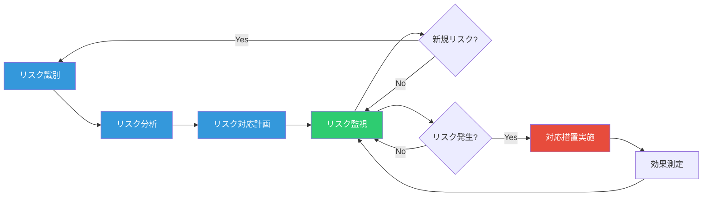
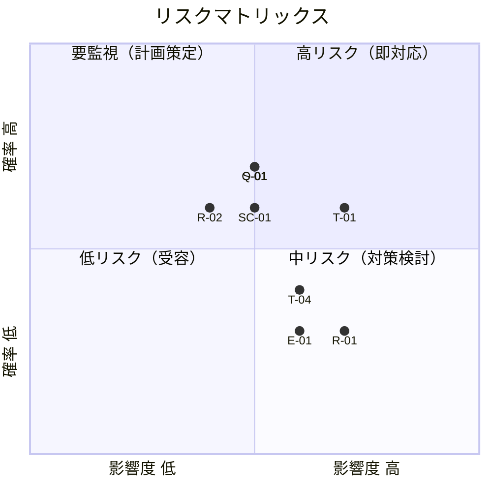
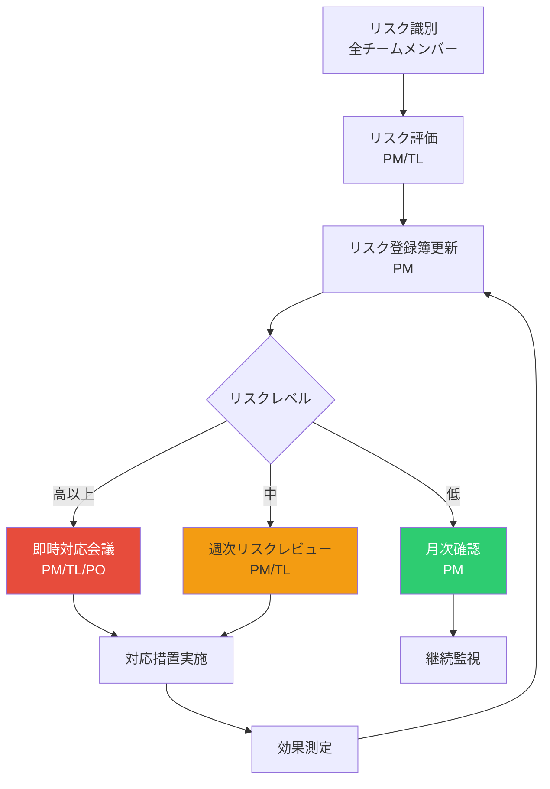
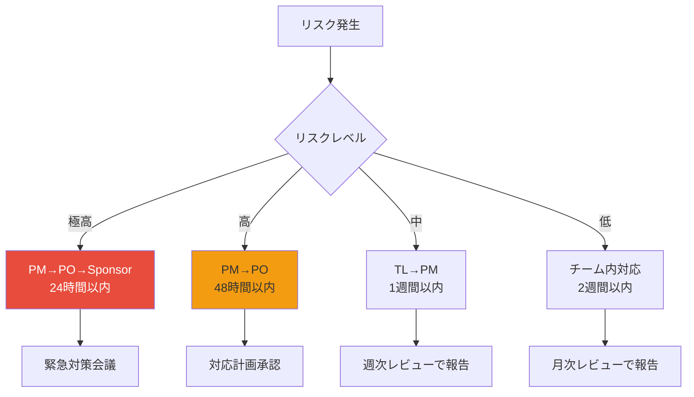

# リスク管理計画
# Claude Code Skills 全自動化プロジェクト

**プロジェクトコード**: PRJ-2025-SKILLS
**作成日**: 2025年12月29日
**バージョン**: 1.0

---

## 目次

1. [リスク管理概要](#1-リスク管理概要)
2. [リスク識別](#2-リスク識別)
3. [リスク分析](#3-リスク分析)
4. [リスク対応計画](#4-リスク対応計画)
5. [リスク監視プロセス](#5-リスク監視プロセス)
6. [リスク登録簿](#6-リスク登録簿)

---

## 1. リスク管理概要

### 1.1 リスク管理の目的

本リスク管理計画は、Claude Code Skills全自動化プロジェクトにおけるリスクを体系的に識別、分析、対応、監視するためのフレームワークを提供します。

**目的**:
1. プロジェクト目標達成を脅かすリスクの早期識別
2. リスクの影響を最小化するための予防措置
3. リスク発生時の迅速な対応
4. 継続的なリスク監視と改善

### 1.2 リスク管理プロセス



### 1.3 リスク分類カテゴリ

| カテゴリ | 説明 | 例 |
|---------|------|-----|
| **技術** | 技術的な課題、新技術導入、互換性 | Claude API仕様変更、性能問題 |
| **スコープ** | 要件変更、スコープクリープ | スキル要件の追加、機能拡張要求 |
| **リソース** | 人材、スキル、稼働率 | キーメンバー離脱、スキル不足 |
| **スケジュール** | 遅延、依存関係、見積もり精度 | 開発遅延、テスト長期化 |
| **品質** | 欠陥、テスト漏れ、ユーザー満足度 | スキル品質のばらつき |
| **外部** | ベンダー、市場、法規制 | Anthropicのポリシー変更 |
| **コミュニケーション** | ステークホルダー、情報共有 | SME協力不足、期待値のずれ |
| **組織** | 優先順位変更、体制変更 | 経営方針変更、予算削減 |

---

## 2. リスク識別

### 2.1 リスク識別方法

1. **ブレインストーミング**: チームメンバーによるリスク洗い出し
2. **チェックリスト**: 過去プロジェクトの教訓に基づくチェック
3. **専門家判断**: SMEからの技術・業務リスク情報収集
4. **SWOT分析**: 弱み・脅威の分析
5. **前提条件分析**: 前提条件が満たされない場合のリスク

### 2.2 識別されたリスク一覧

#### 2.2.1 技術リスク（T）

| ID | リスク名 | 説明 |
|----|---------|------|
| T-01 | Claude API仕様変更 | AnthropicがClaude APIを変更し、既存スキルが動作しなくなる |
| T-02 | パフォーマンス問題 | スキル実行時の応答遅延やタイムアウト発生 |
| T-03 | Claude Code互換性 | Claude Code本体のアップデートでスキル構造が非互換に |
| T-04 | 複雑スキルの技術的困難 | architecture-designer等の高度なスキル開発で技術的課題 |
| T-05 | スクリプト互換性 | Python/Bashスクリプトの環境依存問題 |

#### 2.2.2 スコープリスク（S）

| ID | リスク名 | 説明 |
|----|---------|------|
| S-01 | 要件変更頻発 | ステークホルダーからのスキル要件追加・変更 |
| S-02 | スコープクリープ | 当初計画にない機能の追加要求 |
| S-03 | スキル複雑化 | 単一スキルの機能肥大化 |
| S-04 | 優先順位変更 | ビジネス環境変化による優先順位の入れ替え |
| S-05 | 統合複雑化 | 45スキル間の依存関係が複雑化 |

#### 2.2.3 リソースリスク（R）

| ID | リスク名 | 説明 |
|----|---------|------|
| R-01 | キーメンバー離脱 | TLやシニアエンジニアの退職・異動 |
| R-02 | SME協力不足 | 領域専門家の時間確保が困難 |
| R-03 | スキル不足 | Claude Code Skill開発経験者不足 |
| R-04 | リソース競合 | 他プロジェクトとのリソース取り合い |
| R-05 | 採用難 | 追加リソース確保が困難 |

#### 2.2.4 スケジュールリスク（SC）

| ID | リスク名 | 説明 |
|----|---------|------|
| SC-01 | 見積もり精度低下 | 新規スキル開発の工数見積もりが不正確 |
| SC-02 | 依存関係の遅延 | 先行タスクの遅延による後続への影響 |
| SC-03 | テスト長期化 | 統合テスト・パイロットでの問題多発 |
| SC-04 | レビュー遅延 | 承認・レビューの遅延 |
| SC-05 | 環境準備遅延 | 開発・テスト環境構築の遅れ |

#### 2.2.5 品質リスク（Q）

| ID | リスク名 | 説明 |
|----|---------|------|
| Q-01 | スキル品質ばらつき | 開発者間でスキル品質に差がある |
| Q-02 | テスト漏れ | エッジケースや統合テストの漏れ |
| Q-03 | ドキュメント不備 | リファレンス・アセットの品質不足 |
| Q-04 | ユーザビリティ問題 | スキルの使いにくさ、学習コストの高さ |
| Q-05 | パイロット品質問題 | 実プロジェクトでの品質問題発覚 |

#### 2.2.6 外部リスク（E）

| ID | リスク名 | 説明 |
|----|---------|------|
| E-01 | Anthropicポリシー変更 | 利用規約や料金体系の変更 |
| E-02 | 競合技術の台頭 | 他社AIツールの優位性確立 |
| E-03 | 法規制変更 | AI規制強化による制約 |
| E-04 | 市場環境変化 | IT投資縮小によるプロジェクト優先度低下 |
| E-05 | サードパーティ依存 | 外部ライブラリ・サービスの問題 |

#### 2.2.7 コミュニケーションリスク（C）

| ID | リスク名 | 説明 |
|----|---------|------|
| C-01 | ステークホルダー期待値ずれ | 成果物への期待と実際の乖離 |
| C-02 | チーム間連携不足 | フェーズ間・スキル間の情報共有不足 |
| C-03 | SMEとの認識齟齬 | 専門知識の誤解・誤伝達 |
| C-04 | 報告遅延 | 問題の報告・エスカレーション遅れ |
| C-05 | ドキュメント伝達不足 | 標準・ガイドラインの周知不足 |

#### 2.2.8 組織リスク（O）

| ID | リスク名 | 説明 |
|----|---------|------|
| O-01 | 経営方針変更 | AI戦略の方向転換 |
| O-02 | 予算削減 | 経費削減によるプロジェクト予算縮小 |
| O-03 | 組織再編 | チーム体制・報告ラインの変更 |
| O-04 | 優先順位低下 | 他プロジェクトへのリソース優先 |
| O-05 | スポンサー交代 | エグゼクティブスポンサーの異動 |

---

## 3. リスク分析

### 3.1 リスク評価基準

#### 確率（Probability）

| レベル | 数値 | 説明 |
|--------|------|------|
| 高 | 0.7 | 発生確率70%以上、ほぼ確実に発生 |
| 中 | 0.4 | 発生確率40-69%、発生可能性あり |
| 低 | 0.1 | 発生確率10-39%、発生可能性は低い |
| 極低 | 0.05 | 発生確率10%未満、まれに発生 |

#### 影響度（Impact）

| レベル | 数値 | スケジュール | コスト | スコープ | 品質 |
|--------|------|-------------|--------|---------|------|
| 極高 | 0.8 | 3ヶ月以上遅延 | 50%以上超過 | 重大スコープ削減 | 致命的品質問題 |
| 高 | 0.4 | 1-3ヶ月遅延 | 20-50%超過 | 主要機能削減 | 重大品質問題 |
| 中 | 0.2 | 2週-1ヶ月遅延 | 10-20%超過 | 一部機能削減 | 品質低下 |
| 低 | 0.1 | 2週未満遅延 | 10%未満超過 | 軽微な機能削減 | 軽微な品質問題 |
| 極低 | 0.05 | 影響なし | 影響なし | 影響なし | 影響なし |

#### リスクスコア

```
リスクスコア = 確率 × 影響度
```

| スコア範囲 | リスクレベル | 対応方針 |
|-----------|-------------|---------|
| 0.25以上 | 極高 | 即座に対応計画策定・実施 |
| 0.15-0.24 | 高 | 優先的に対応計画策定 |
| 0.08-0.14 | 中 | 対応計画策定・監視強化 |
| 0.04-0.07 | 低 | 定期監視 |
| 0.04未満 | 極低 | 受容・定期確認 |

### 3.2 リスクマトリックス



### 3.3 リスク優先順位

| 順位 | リスクID | リスク名 | 確率 | 影響 | スコア | レベル |
|------|---------|---------|------|------|--------|--------|
| 1 | T-01 | Claude API仕様変更 | 0.4 | 0.4 | 0.16 | 高 |
| 2 | S-01 | 要件変更頻発 | 0.7 | 0.2 | 0.14 | 中 |
| 3 | Q-01 | スキル品質ばらつき | 0.7 | 0.2 | 0.14 | 中 |
| 4 | R-02 | SME協力不足 | 0.4 | 0.4 | 0.16 | 高 |
| 5 | SC-01 | 見積もり精度低下 | 0.4 | 0.2 | 0.08 | 中 |
| 6 | R-01 | キーメンバー離脱 | 0.1 | 0.4 | 0.04 | 低 |
| 7 | T-04 | 複雑スキルの技術的困難 | 0.4 | 0.2 | 0.08 | 中 |
| 8 | E-01 | Anthropicポリシー変更 | 0.1 | 0.4 | 0.04 | 低 |
| 9 | C-01 | ステークホルダー期待値ずれ | 0.4 | 0.2 | 0.08 | 中 |
| 10 | O-02 | 予算削減 | 0.1 | 0.4 | 0.04 | 低 |

---

## 4. リスク対応計画

### 4.1 リスク対応戦略

| 戦略 | 英語 | 説明 | 適用場面 |
|------|------|------|---------|
| **回避** | Avoid | リスクを完全に排除する | 高リスク、回避可能な場合 |
| **軽減** | Mitigate | 確率または影響を低減する | 中-高リスク、対策可能な場合 |
| **転嫁** | Transfer | 第三者にリスクを移す | 外部委託、保険適用可能な場合 |
| **受容** | Accept | リスクを認識し対処しない | 低リスク、対策コストが高い場合 |
| **活用** | Exploit | 機会リスクを最大化する | ポジティブリスクの場合 |

### 4.2 主要リスク対応計画

#### T-01: Claude API仕様変更

| 項目 | 内容 |
|------|------|
| **リスク** | AnthropicがClaude APIを変更し、既存スキルが動作しなくなる |
| **対応戦略** | 軽減（Mitigate） |
| **予防措置** | - 抽象化レイヤーの導入でAPI直接依存を最小化<br>- Anthropic公式ドキュメント・リリースノートの定期監視<br>- スキル構造の標準化で変更対応を容易に |
| **発生時対応** | - 影響範囲の迅速な特定<br>- 優先順位に基づく修正計画策定<br>- ホットフィックス体制の発動 |
| **担当者** | TL |
| **監視頻度** | 週次（Anthropic更新情報チェック） |
| **コンティンジェンシー予算** | 5,000,000円（全体の3%） |

#### S-01: 要件変更頻発

| 項目 | 内容 |
|------|------|
| **リスク** | ステークホルダーからのスキル要件追加・変更が頻発 |
| **対応戦略** | 軽減（Mitigate） |
| **予防措置** | - フェーズごとの要件フリーズ<br>- 変更管理プロセスの厳格化<br>- スコープベースライン承認後の変更は影響分析必須 |
| **発生時対応** | - CCB（Change Control Board）での審議<br>- 影響分析（スコープ・スケジュール・コスト）<br>- 優先順位調整または次フェーズへの延期 |
| **担当者** | PM |
| **監視頻度** | 週次 |
| **コンティンジェンシー予算** | スケジュールバッファ15%、予算10% |

#### Q-01: スキル品質ばらつき

| 項目 | 内容 |
|------|------|
| **リスク** | 開発者間でスキル品質に差がある |
| **対応戦略** | 軽減（Mitigate） |
| **予防措置** | - スキル設計標準・テンプレートの整備<br>- ペアプログラミング・コードレビュー必須化<br>- quick_validate.pyによる自動品質チェック<br>- 品質チェックリストの適用 |
| **発生時対応** | - 品質問題の根本原因分析<br>- 追加レビュー・修正<br>- 標準・ガイドラインの改善 |
| **担当者** | TL, QA |
| **監視頻度** | 各スキル開発時 |
| **コンティンジェンシー予算** | 工数10%増（品質改善用） |

#### R-02: SME協力不足

| 項目 | 内容 |
|------|------|
| **リスク** | 領域専門家の時間確保が困難 |
| **対応戦略** | 軽減（Mitigate） |
| **予防措置** | - 早期のSMEエンゲージメント<br>- SME稼働計画の事前合意<br>- 各部門長へのコミットメント確認<br>- バックアップSMEの確保 |
| **発生時対応** | - 代替SMEの調整<br>- 外部コンサルタントの活用<br>- ドキュメント・資料ベースでの知識収集 |
| **担当者** | PM, PO |
| **監視頻度** | 週次 |
| **コンティンジェンシー予算** | 外部コンサル費用 3,000,000円 |

#### R-01: キーメンバー離脱

| 項目 | 内容 |
|------|------|
| **リスク** | TLやシニアエンジニアの退職・異動 |
| **対応戦略** | 軽減（Mitigate） |
| **予防措置** | - ナレッジドキュメント化の徹底<br>- ペアワーク・知識移転の実施<br>- クロストレーニングによるスキル分散<br>- チームメンバーのモチベーション管理 |
| **発生時対応** | - 引き継ぎ期間の確保交渉<br>- 残存メンバーへの知識移転加速<br>- 外部リソースの調達 |
| **担当者** | PM |
| **監視頻度** | 月次（1on1でのサイン検知） |
| **コンティンジェンシー予算** | 追加採用・外注費 5,000,000円 |

#### SC-01: 見積もり精度低下

| 項目 | 内容 |
|------|------|
| **リスク** | 新規スキル開発の工数見積もりが不正確 |
| **対応戦略** | 軽減（Mitigate） |
| **予防措置** | - 3点見積もり（PERT）の適用<br>- 過去スキル開発実績の分析<br>- スパイク（技術検証）による不確実性低減<br>- フェーズごとの見積もり精度向上 |
| **発生時対応** | - 見積もり乖離の根本原因分析<br>- 残タスクの再見積もり<br>- スケジュール調整・優先順位変更 |
| **担当者** | PM, TL |
| **監視頻度** | 週次（実績との比較） |
| **コンティンジェンシー予算** | スケジュールバッファ15% |

---

## 5. リスク監視プロセス

### 5.1 リスク監視体制



### 5.2 リスクレビュー頻度

| リスクレベル | レビュー頻度 | 参加者 | アクション |
|-------------|-------------|--------|-----------|
| 極高 | 毎日 | PM, TL, PO, Sponsor | 即時対応、日次進捗確認 |
| 高 | 週2回 | PM, TL, PO | 対応状況確認、必要に応じて調整 |
| 中 | 週次 | PM, TL | 進捗確認、トリガー監視 |
| 低 | 隔週 | PM | ステータス確認 |
| 極低 | 月次 | PM | 変化の有無確認 |

### 5.3 リスクトリガー（早期警告サイン）

| リスク | トリガー | 検知方法 |
|--------|---------|---------|
| T-01 Claude API変更 | Anthropicからの更新通知、APIエラー増加 | RSS/メール監視、エラーログ |
| S-01 要件変更頻発 | 週に2件以上の変更要求 | 変更要求ログ |
| Q-01 品質ばらつき | レビュー指摘事項の増加、テスト不合格率上昇 | レビュー記録、テスト結果 |
| R-02 SME協力不足 | 予定したミーティングのキャンセル増加 | カレンダー、出席記録 |
| R-01 キーメンバー離脱 | モチベーション低下、欠勤増加 | 1on1、勤怠記録 |
| SC-01 見積もり乖離 | 実績が見積もりの120%を超過 | 工数実績レポート |

### 5.4 エスカレーションプロセス



---

## 6. リスク登録簿

### 6.1 リスク登録簿テンプレート

| 項目 | 説明 |
|------|------|
| リスクID | 一意識別子（カテゴリ-連番） |
| リスク名 | 簡潔なリスク名称 |
| 説明 | リスクの詳細説明 |
| カテゴリ | 技術/スコープ/リソース/等 |
| 確率 | 高/中/低（数値） |
| 影響度 | 極高/高/中/低（数値） |
| リスクスコア | 確率 × 影響度 |
| リスクレベル | 極高/高/中/低/極低 |
| 対応戦略 | 回避/軽減/転嫁/受容 |
| 予防措置 | リスク発生を防ぐ措置 |
| 発生時対応 | リスク発生時の対応 |
| トリガー | 早期警告サイン |
| 担当者 | リスクオーナー |
| ステータス | オープン/監視中/クローズ |
| 更新日 | 最終更新日 |

### 6.2 現在のリスク登録簿

| ID | リスク名 | カテゴリ | 確率 | 影響 | スコア | レベル | 戦略 | 担当 | ステータス |
|----|---------|---------|------|------|--------|--------|------|------|-----------|
| T-01 | Claude API仕様変更 | 技術 | 0.4 | 0.4 | 0.16 | 高 | 軽減 | TL | オープン |
| T-02 | パフォーマンス問題 | 技術 | 0.2 | 0.2 | 0.04 | 低 | 軽減 | TL | オープン |
| T-03 | Claude Code互換性 | 技術 | 0.2 | 0.4 | 0.08 | 中 | 軽減 | TL | オープン |
| T-04 | 複雑スキル技術困難 | 技術 | 0.4 | 0.2 | 0.08 | 中 | 軽減 | TL | オープン |
| T-05 | スクリプト互換性 | 技術 | 0.2 | 0.1 | 0.02 | 極低 | 受容 | SE | オープン |
| S-01 | 要件変更頻発 | スコープ | 0.7 | 0.2 | 0.14 | 中 | 軽減 | PM | オープン |
| S-02 | スコープクリープ | スコープ | 0.4 | 0.2 | 0.08 | 中 | 軽減 | PM | オープン |
| S-03 | スキル複雑化 | スコープ | 0.4 | 0.1 | 0.04 | 低 | 軽減 | TL | オープン |
| S-04 | 優先順位変更 | スコープ | 0.2 | 0.2 | 0.04 | 低 | 受容 | PM | オープン |
| S-05 | 統合複雑化 | スコープ | 0.4 | 0.2 | 0.08 | 中 | 軽減 | TL | オープン |
| R-01 | キーメンバー離脱 | リソース | 0.1 | 0.4 | 0.04 | 低 | 軽減 | PM | オープン |
| R-02 | SME協力不足 | リソース | 0.4 | 0.4 | 0.16 | 高 | 軽減 | PM | オープン |
| R-03 | スキル不足 | リソース | 0.2 | 0.2 | 0.04 | 低 | 軽減 | TL | オープン |
| R-04 | リソース競合 | リソース | 0.4 | 0.2 | 0.08 | 中 | 軽減 | PM | オープン |
| R-05 | 採用難 | リソース | 0.2 | 0.2 | 0.04 | 低 | 軽減 | PM | オープン |
| SC-01 | 見積もり精度低下 | スケジュール | 0.4 | 0.2 | 0.08 | 中 | 軽減 | PM | オープン |
| SC-02 | 依存関係遅延 | スケジュール | 0.2 | 0.2 | 0.04 | 低 | 軽減 | PM | オープン |
| SC-03 | テスト長期化 | スケジュール | 0.4 | 0.2 | 0.08 | 中 | 軽減 | QA | オープン |
| SC-04 | レビュー遅延 | スケジュール | 0.2 | 0.1 | 0.02 | 極低 | 受容 | PM | オープン |
| SC-05 | 環境準備遅延 | スケジュール | 0.2 | 0.2 | 0.04 | 低 | 軽減 | SE | オープン |
| Q-01 | スキル品質ばらつき | 品質 | 0.7 | 0.2 | 0.14 | 中 | 軽減 | TL | オープン |
| Q-02 | テスト漏れ | 品質 | 0.2 | 0.2 | 0.04 | 低 | 軽減 | QA | オープン |
| Q-03 | ドキュメント不備 | 品質 | 0.4 | 0.1 | 0.04 | 低 | 軽減 | BA | オープン |
| Q-04 | ユーザビリティ問題 | 品質 | 0.2 | 0.2 | 0.04 | 低 | 軽減 | BA | オープン |
| Q-05 | パイロット品質問題 | 品質 | 0.2 | 0.2 | 0.04 | 低 | 軽減 | TL | オープン |
| E-01 | Anthropicポリシー変更 | 外部 | 0.1 | 0.4 | 0.04 | 低 | 受容 | PM | オープン |
| E-02 | 競合技術の台頭 | 外部 | 0.2 | 0.2 | 0.04 | 低 | 受容 | PM | オープン |
| E-03 | 法規制変更 | 外部 | 0.1 | 0.2 | 0.02 | 極低 | 受容 | PM | オープン |
| E-04 | 市場環境変化 | 外部 | 0.1 | 0.4 | 0.04 | 低 | 受容 | PM | オープン |
| E-05 | サードパーティ依存 | 外部 | 0.2 | 0.1 | 0.02 | 極低 | 受容 | TL | オープン |
| C-01 | 期待値ずれ | コミュニケーション | 0.4 | 0.2 | 0.08 | 中 | 軽減 | PM | オープン |
| C-02 | チーム間連携不足 | コミュニケーション | 0.2 | 0.1 | 0.02 | 極低 | 軽減 | PM | オープン |
| C-03 | SMEとの認識齟齬 | コミュニケーション | 0.2 | 0.2 | 0.04 | 低 | 軽減 | BA | オープン |
| C-04 | 報告遅延 | コミュニケーション | 0.1 | 0.2 | 0.02 | 極低 | 軽減 | PM | オープン |
| C-05 | ドキュメント伝達不足 | コミュニケーション | 0.2 | 0.1 | 0.02 | 極低 | 軽減 | PM | オープン |
| O-01 | 経営方針変更 | 組織 | 0.1 | 0.4 | 0.04 | 低 | 受容 | PM | オープン |
| O-02 | 予算削減 | 組織 | 0.1 | 0.4 | 0.04 | 低 | 受容 | PM | オープン |
| O-03 | 組織再編 | 組織 | 0.1 | 0.2 | 0.02 | 極低 | 受容 | PM | オープン |
| O-04 | 優先順位低下 | 組織 | 0.1 | 0.2 | 0.02 | 極低 | 受容 | PM | オープン |
| O-05 | スポンサー交代 | 組織 | 0.1 | 0.2 | 0.02 | 極低 | 受容 | PM | オープン |

### 6.3 リスクサマリー

| リスクレベル | 件数 | 割合 |
|-------------|------|------|
| 極高 | 0 | 0% |
| 高 | 2 | 5% |
| 中 | 12 | 30% |
| 低 | 15 | 37.5% |
| 極低 | 11 | 27.5% |
| **合計** | **40** | **100%** |

### 6.4 コンティンジェンシー予算サマリー

| 項目 | 金額 | 用途 |
|------|------|------|
| 技術リスク対応 | 5,000,000円 | API変更対応、技術的課題解決 |
| リソースリスク対応 | 8,000,000円 | 外部コンサル、追加採用 |
| スケジュールリスク対応 | スケジュールバッファ15% | 遅延対応 |
| 品質リスク対応 | 工数10%増 | 追加テスト、修正 |
| **合計** | **約18,000,000円** | プロジェクト予算の10% |

---

**文書管理**:
- 作成日: 2025年12月29日
- 最終更新日: 2025年12月29日
- バージョン: 1.0
