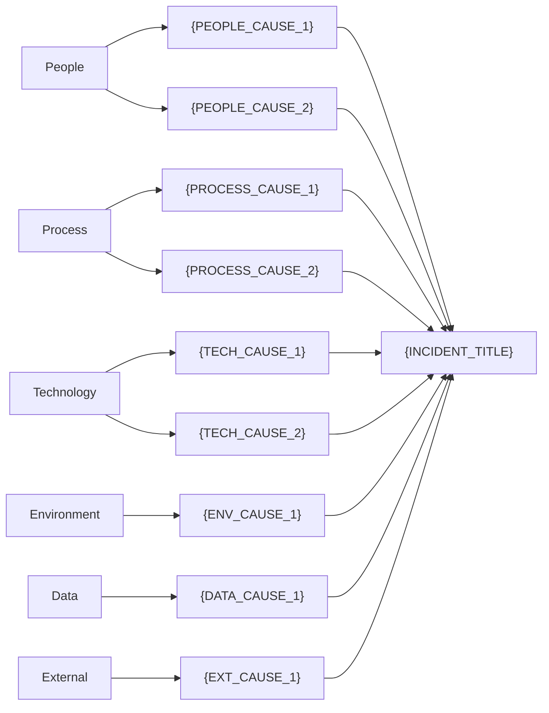

# Incident RCA Report

---

## 1. Report Header

| Field | Value |
|-------|-------|
| **Incident ID** | {INCIDENT_ID} |
| **Incident Title** | {INCIDENT_TITLE} |
| **Report Date** | {REPORT_DATE} |
| **Author** | {AUTHOR} |
| **Reviewer** | {REVIEWER} |
| **Status** | {STATUS: Draft / In Review / Approved / Closed} |
| **Severity** | {SEVERITY: P0 / P1 / P2 / P3 / P4} |
| **Last Updated** | {LAST_UPDATED} |

---

## 2. Executive Summary

### Overview

{EXECUTIVE_SUMMARY: Provide a concise 3-5 sentence overview of the incident. Include what happened, the scope of impact, root cause, and key corrective actions.}

### Key Metrics

| Metric | Value |
|--------|-------|
| **Affected Users** | {AFFECTED_USERS} |
| **Affected Services** | {AFFECTED_SERVICES} |
| **Total Downtime** | {DOWNTIME_DURATION} |
| **Time to Detect (TTD)** | {TTD} |
| **Time to Respond (TTR)** | {TTR} |
| **Time to Mitigate (TTM)** | {TTM} |
| **Time to Resolve (TTRe)** | {TTRE} |
| **Business Impact Score** | {BUSINESS_IMPACT_SCORE} |
| **SLA Violation** | {SLA_VIOLATION: Yes / No / At Risk} |

---

## 3. Incident Overview

### Basic Information

| Field | Value |
|-------|-------|
| **Start Time (UTC)** | {INCIDENT_START_UTC} |
| **Start Time (Local)** | {INCIDENT_START_LOCAL} |
| **Detection Time** | {DETECTION_TIME} |
| **Detection Method** | {DETECTION_METHOD: Monitoring Alert / User Report / Internal Discovery} |
| **Impact Scope** | {IMPACT_SCOPE} |
| **Resolution Time** | {RESOLUTION_TIME} |
| **Incident Commander** | {INCIDENT_COMMANDER} |

### Response Summary

{RESPONSE_SUMMARY: Briefly describe the chronological flow of the incident response.}

### Participants

| Role | Name | Team |
|------|------|------|
| Incident Commander | {NAME} | {TEAM} |
| Technical Lead | {NAME} | {TEAM} |
| Communications Lead | {NAME} | {TEAM} |
| Responder | {NAME} | {TEAM} |
| {ROLE} | {NAME} | {TEAM} |

---

## 4. Timeline

### Incident Timeline Diagram

```mermaid
gantt
    title Incident Timeline: {INCIDENT_ID}
    dateFormat HH:mm
    axisFormat %H:%M

    section Phases
    Incident Start to Detection (TTD)     :crit, ttd, {START_TIME}, {DETECTION_DURATION}
    Detection to Response (TTR)           :active, ttr, after ttd, {RESPONSE_DURATION}
    Response to Mitigation (TTM)          :ttm, after ttr, {MITIGATION_DURATION}
    Mitigation to Resolution (TTRe)       :ttre, after ttm, {RESOLUTION_DURATION}

    section Key Events
    {EVENT_1_DESCRIPTION}                 :milestone, {EVENT_1_TIME}, 0min
    {EVENT_2_DESCRIPTION}                 :milestone, {EVENT_2_TIME}, 0min
    {EVENT_3_DESCRIPTION}                 :milestone, {EVENT_3_TIME}, 0min
```

### Detailed Timeline

| Time (UTC) | Time (Local) | Event | Actor | Phase |
|------------|-------------|-------|-------|-------|
| {TIME_UTC} | {TIME_LOCAL} | {EVENT_DESCRIPTION} | {PERSON} | {PHASE: Detection/Response/Mitigation/Resolution} |
| {TIME_UTC} | {TIME_LOCAL} | {EVENT_DESCRIPTION} | {PERSON} | {PHASE} |
| {TIME_UTC} | {TIME_LOCAL} | {EVENT_DESCRIPTION} | {PERSON} | {PHASE} |
| {TIME_UTC} | {TIME_LOCAL} | {EVENT_DESCRIPTION} | {PERSON} | {PHASE} |
| {TIME_UTC} | {TIME_LOCAL} | {EVENT_DESCRIPTION} | {PERSON} | {PHASE} |

### Time Metrics Assessment

| Metric | Actual | Target | Assessment |
|--------|--------|--------|------------|
| TTD (Time to Detect) | {TTD_ACTUAL} | {TTD_TARGET} | {TTD_ASSESSMENT: Met / Not Met} |
| TTR (Time to Respond) | {TTR_ACTUAL} | {TTR_TARGET} | {TTR_ASSESSMENT} |
| TTM (Time to Mitigate) | {TTM_ACTUAL} | {TTM_TARGET} | {TTM_ASSESSMENT} |
| TTRe (Time to Resolve) | {TTRE_ACTUAL} | {TTRE_TARGET} | {TTRE_ASSESSMENT} |

---

## 5. Impact Assessment

### 4-Axis Evaluation

| Axis | Dimension | Assessment | Score (1-5) | Evidence |
|------|-----------|------------|-------------|----------|
| **User Impact** | Affected user count | {AFFECTED_USER_COUNT} | {SCORE} | {EVIDENCE} |
| **User Impact** | UX degradation | {UX_DEGRADATION} | {SCORE} | {EVIDENCE} |
| **User Impact** | User segment criticality | {USER_SEGMENT} | {SCORE} | {EVIDENCE} |
| **Service Impact** | Availability | {AVAILABILITY} | {SCORE} | {EVIDENCE} |
| **Service Impact** | Feature impact | {FEATURE_IMPACT} | {SCORE} | {EVIDENCE} |
| **Service Impact** | Performance | {PERFORMANCE} | {SCORE} | {EVIDENCE} |
| **Business Impact** | Revenue impact | {REVENUE_IMPACT} | {SCORE} | {EVIDENCE} |
| **Business Impact** | SLA violation | {SLA_STATUS} | {SCORE} | {EVIDENCE} |
| **Business Impact** | Legal/contractual risk | {LEGAL_RISK} | {SCORE} | {EVIDENCE} |
| **Business Impact** | Brand/reputation risk | {BRAND_RISK} | {SCORE} | {EVIDENCE} |
| **Operational Impact** | Operational overhead | {OPS_OVERHEAD} | {SCORE} | {EVIDENCE} |
| **Operational Impact** | Team disruption | {TEAM_DISRUPTION} | {SCORE} | {EVIDENCE} |
| **Operational Impact** | Cascading effects | {CASCADE_EFFECTS} | {SCORE} | {EVIDENCE} |

### Aggregate Impact Score

```
User Impact Average:       {USER_AVG} x 0.30 = {USER_WEIGHTED}
Service Impact Average:    {SERVICE_AVG} x 0.25 = {SERVICE_WEIGHTED}
Business Impact Average:   {BUSINESS_AVG} x 0.30 = {BUSINESS_WEIGHTED}
Operational Impact Average:{OPS_AVG} x 0.15 = {OPS_WEIGHTED}
───────────────────────────────────────────────
Aggregate Score: {AGGREGATE_SCORE} → {CLASSIFICATION: Critical / High / Medium / Low}
```

### SLA Evaluation

| Service | SLA Target | Actual During Incident | Monthly Budget Remaining | Verdict |
|---------|-----------|----------------------|------------------------|---------|
| {SERVICE_NAME} | {SLA_TARGET}% | {ACTUAL_AVAILABILITY}% | {REMAINING_BUDGET} | {VERDICT: Violated/At Risk/Compliant} |

---

## 6. Root Cause Analysis

### Analysis Methods Used

- [ ] 5 Whys (with branching)
- [ ] Fishbone Diagram (IT 6-category)
- [ ] Fault Tree Analysis

### 6.1 5 Whys Analysis

**Problem Statement**: {PROBLEM_STATEMENT}

| Level | Question | Answer | Evidence | Confidence |
|-------|----------|--------|----------|------------|
| Why 1 | Why did {SYMPTOM} occur? | {ANSWER_1} | {EVIDENCE_1} | {CONFIDENCE: High/Medium/Low} |
| Why 2 | Why did {ANSWER_1} occur? | {ANSWER_2} | {EVIDENCE_2} | {CONFIDENCE} |
| Why 3 | Why did {ANSWER_2} occur? | {ANSWER_3} | {EVIDENCE_3} | {CONFIDENCE} |
| Why 4 | Why did {ANSWER_3} occur? | {ANSWER_4} | {EVIDENCE_4} | {CONFIDENCE} |
| Why 5 | Why did {ANSWER_4} occur? | {ANSWER_5} (Root Cause) | {EVIDENCE_5} | {CONFIDENCE} |

**Branching (if applicable):**

```
Why 1: {SYMPTOM}
├── Branch A: {CAUSE_A}
│   └── Why 2A: {CAUSE_A_DETAIL}
│       └── Why 3A: {ROOT_CAUSE_A}
└── Branch B: {CAUSE_B}
    └── Why 2B: {CAUSE_B_DETAIL}
        └── Why 3B: {ROOT_CAUSE_B}
```

### 6.2 Fishbone Diagram



### 6.3 Fault Tree Analysis

```mermaid
graph TD
    TOP["🔴 {TOP_EVENT}"]

    {FTA_GATE_AND_EVENT_DEFINITIONS}

    style TOP fill:#ff6b6b,color:#fff
```

**Minimal Cut Sets:**

| MCS # | Basic Events | Size | Risk Level |
|-------|-------------|------|------------|
| MCS-1 | {BASIC_EVENTS} | {SIZE} | {RISK: Critical/Moderate/Low} |

**Single Points of Failure (SPOF):**

| SPOF | Component | Remediation |
|------|-----------|-------------|
| SPOF-1 | {COMPONENT} | {REMEDIATION} |

### Identified Root Causes (Summary)

| # | Root Cause | Category | Method | Confidence |
|---|-----------|----------|--------|------------|
| RC-1 | {ROOT_CAUSE_1} | {CATEGORY: Process/System/Training/Design} | {METHOD: 5 Whys/Fishbone/FTA} | {CONFIDENCE} |
| RC-2 | {ROOT_CAUSE_2} | {CATEGORY} | {METHOD} | {CONFIDENCE} |
| RC-3 | {ROOT_CAUSE_3} | {CATEGORY} | {METHOD} | {CONFIDENCE} |

---

## 7. Corrective Action Plan

### Immediate Actions (24-48 hours)

| # | Corrective Action | Root Cause | 3D Type | Owner | Due Date | Status |
|---|-------------------|-----------|---------|-------|----------|--------|
| IM-1 | {ACTION_DESCRIPTION} | RC-{N} | {3D: Detect/Defend/Degrade} | {OWNER} | {DUE_DATE} | {STATUS} |
| IM-2 | {ACTION_DESCRIPTION} | RC-{N} | {3D} | {OWNER} | {DUE_DATE} | {STATUS} |

### Short-Term Actions (1-4 weeks)

| # | Corrective Action | Root Cause | 3D Type | Owner | Due Date | Status |
|---|-------------------|-----------|---------|-------|----------|--------|
| ST-1 | {ACTION_DESCRIPTION} | RC-{N} | {3D} | {OWNER} | {DUE_DATE} | {STATUS} |
| ST-2 | {ACTION_DESCRIPTION} | RC-{N} | {3D} | {OWNER} | {DUE_DATE} | {STATUS} |

### Long-Term Actions (1-3 months)

| # | Corrective Action | Root Cause | 3D Type | Owner | Due Date | Status |
|---|-------------------|-----------|---------|-------|----------|--------|
| LT-1 | {ACTION_DESCRIPTION} | RC-{N} | {3D} | {OWNER} | {DUE_DATE} | {STATUS} |
| LT-2 | {ACTION_DESCRIPTION} | RC-{N} | {3D} | {OWNER} | {DUE_DATE} | {STATUS} |

---

## 8. Prevention Strategy (3D Prevention)

| Root Cause | Detect (Earlier Detection) | Defend (Prevent Occurrence) | Degrade (Limit Blast Radius) |
|-----------|---------------------------|----------------------------|------------------------------|
| RC-1: {ROOT_CAUSE} | {DETECT_ACTION} | {DEFEND_ACTION} | {DEGRADE_ACTION} |
| RC-2: {ROOT_CAUSE} | {DETECT_ACTION} | {DEFEND_ACTION} | {DEGRADE_ACTION} |
| RC-3: {ROOT_CAUSE} | {DETECT_ACTION} | {DEFEND_ACTION} | {DEGRADE_ACTION} |

### SMART Criteria Verification

| Action ID | Specific | Measurable | Achievable | Relevant | Time-bound | Pass |
|-----------|----------|------------|------------|----------|------------|------|
| IM-1 | {Y/N} | {Y/N} | {Y/N} | {Y/N} | {Y/N} | {Y/N} |
| ST-1 | {Y/N} | {Y/N} | {Y/N} | {Y/N} | {Y/N} | {Y/N} |
| LT-1 | {Y/N} | {Y/N} | {Y/N} | {Y/N} | {Y/N} | {Y/N} |

---

## 9. Lessons Learned

### What Went Well

1. {WHAT_WENT_WELL_1}
2. {WHAT_WENT_WELL_2}
3. {WHAT_WENT_WELL_3}

### What Needs Improvement

1. {WHAT_TO_IMPROVE_1}
2. {WHAT_TO_IMPROVE_2}
3. {WHAT_TO_IMPROVE_3}

### Process Improvement Proposals

| # | Proposal | Target Process | Expected Outcome | Priority |
|---|----------|---------------|-----------------|----------|
| 1 | {PROPOSAL} | {TARGET_PROCESS} | {EXPECTED_OUTCOME} | {PRIORITY: High/Medium/Low} |
| 2 | {PROPOSAL} | {TARGET_PROCESS} | {EXPECTED_OUTCOME} | {PRIORITY} |

### Organizational Sharing

{ORGANIZATIONAL_SHARING: Key findings and recommendations to share with other teams or the broader organization.}

---

## 10. Approval and Review

| Role | Name | Date | Status | Comments |
|------|------|------|--------|----------|
| Report Author | {AUTHOR} | {DATE} | {STATUS: Completed} | |
| Technical Reviewer | {TECH_REVIEWER} | {DATE} | {STATUS: Approved/Returned} | {COMMENT} |
| Manager | {MANAGER} | {DATE} | {STATUS} | {COMMENT} |
| Quality Assurance | {QA_REVIEWER} | {DATE} | {STATUS} | {COMMENT} |

### Revision History

| Version | Date | Editor | Changes |
|---------|------|--------|---------|
| 1.0 | {DATE} | {AUTHOR} | Initial version |
| {VERSION} | {DATE} | {EDITOR} | {CHANGE_DESCRIPTION} |

---

*This report was generated using the `incident-rca-specialist` skill.*
