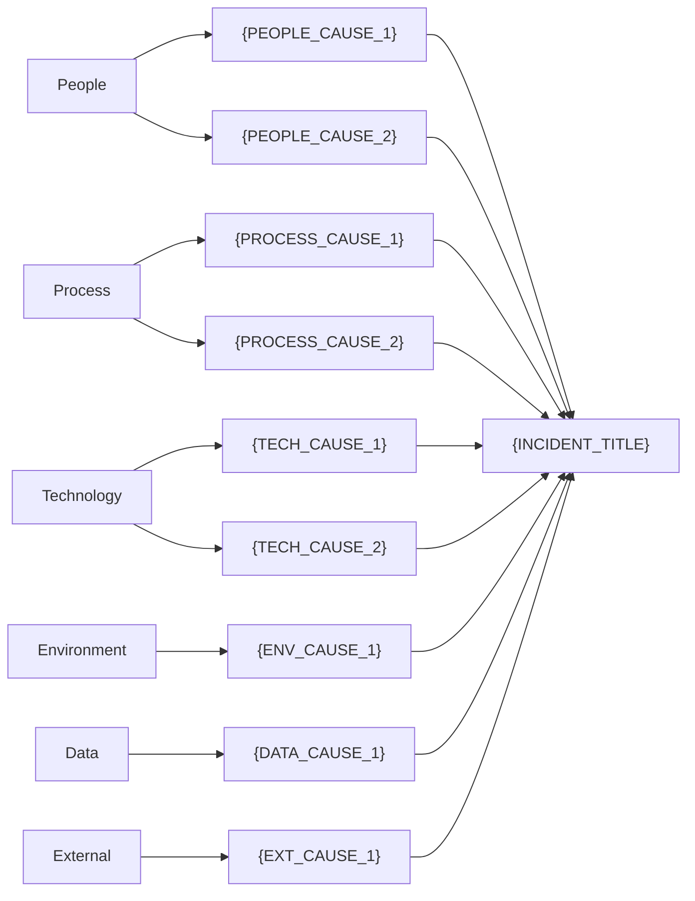

# インシデントRCAレポート

---

## 1. レポートヘッダー

| 項目 | 内容 |
|------|------|
| **インシデントID** | {INCIDENT_ID} |
| **インシデントタイトル** | {INCIDENT_TITLE} |
| **レポート作成日** | {REPORT_DATE} |
| **作成者** | {AUTHOR} |
| **レビュアー** | {REVIEWER} |
| **ステータス** | {STATUS: ドラフト / レビュー中 / 承認済み / 完了} |
| **重要度** | {SEVERITY: P0 / P1 / P2 / P3 / P4} |
| **最終更新日** | {LAST_UPDATED} |

---

## 2. エグゼクティブサマリー

### 概要

{EXECUTIVE_SUMMARY: インシデントの全体像を3-5文で簡潔に記述。何が起きたか、影響範囲、根本原因、主要な是正措置を含める。}

### 主要メトリクス

| メトリクス | 値 |
|-----------|-----|
| **影響ユーザー数** | {AFFECTED_USERS} |
| **影響サービス** | {AFFECTED_SERVICES} |
| **ダウンタイム** | {DOWNTIME_DURATION} |
| **検知時間 (TTD)** | {TTD} |
| **対応開始時間 (TTR)** | {TTR} |
| **軽減完了時間 (TTM)** | {TTM} |
| **完全復旧時間 (TTRe)** | {TTRE} |
| **ビジネス影響スコア** | {BUSINESS_IMPACT_SCORE} |
| **SLA違反** | {SLA_VIOLATION: あり / なし / リスクあり} |

---

## 3. インシデント概要

### 基本情報

| 項目 | 内容 |
|------|------|
| **発生日時 (UTC)** | {INCIDENT_START_UTC} |
| **発生日時 (JST)** | {INCIDENT_START_JST} |
| **検知日時** | {DETECTION_TIME} |
| **検知方法** | {DETECTION_METHOD: 監視アラート / ユーザー報告 / 内部発見} |
| **影響範囲** | {IMPACT_SCOPE} |
| **復旧日時** | {RESOLUTION_TIME} |
| **インシデントコマンダー** | {INCIDENT_COMMANDER} |

### 対応経緯（概要）

{RESPONSE_SUMMARY: 対応の流れを時系列で簡潔に記述。}

### 関係者

| 役割 | 担当者 | 所属チーム |
|------|--------|-----------|
| インシデントコマンダー | {NAME} | {TEAM} |
| 技術リード | {NAME} | {TEAM} |
| コミュニケーションリード | {NAME} | {TEAM} |
| 対応メンバー | {NAME} | {TEAM} |
| {ROLE} | {NAME} | {TEAM} |

---

## 4. タイムライン

### インシデントタイムライン図

```mermaid
gantt
    title インシデントタイムライン: {INCIDENT_ID}
    dateFormat HH:mm
    axisFormat %H:%M

    section フェーズ
    インシデント発生～検知 (TTD)     :crit, ttd, {START_TIME}, {DETECTION_DURATION}
    検知～対応開始 (TTR)             :active, ttr, after ttd, {RESPONSE_DURATION}
    対応開始～軽減完了 (TTM)         :ttm, after ttr, {MITIGATION_DURATION}
    軽減完了～完全復旧 (TTRe)        :ttre, after ttm, {RESOLUTION_DURATION}

    section 主要イベント
    {EVENT_1_DESCRIPTION}            :milestone, {EVENT_1_TIME}, 0min
    {EVENT_2_DESCRIPTION}            :milestone, {EVENT_2_TIME}, 0min
    {EVENT_3_DESCRIPTION}            :milestone, {EVENT_3_TIME}, 0min
```

### 詳細タイムライン

| 時刻 (UTC) | 時刻 (JST) | イベント | 実施者 | フェーズ |
|------------|------------|---------|--------|---------|
| {TIME_UTC} | {TIME_JST} | {EVENT_DESCRIPTION} | {PERSON} | {PHASE: 検知/対応/軽減/復旧} |
| {TIME_UTC} | {TIME_JST} | {EVENT_DESCRIPTION} | {PERSON} | {PHASE} |
| {TIME_UTC} | {TIME_JST} | {EVENT_DESCRIPTION} | {PERSON} | {PHASE} |
| {TIME_UTC} | {TIME_JST} | {EVENT_DESCRIPTION} | {PERSON} | {PHASE} |
| {TIME_UTC} | {TIME_JST} | {EVENT_DESCRIPTION} | {PERSON} | {PHASE} |

### タイムメトリクス

| メトリクス | 実績 | 目標 | 評価 |
|-----------|------|------|------|
| TTD (検知時間) | {TTD_ACTUAL} | {TTD_TARGET} | {TTD_EVALUATION: 達成 / 未達成} |
| TTR (対応開始時間) | {TTR_ACTUAL} | {TTR_TARGET} | {TTR_EVALUATION} |
| TTM (軽減時間) | {TTM_ACTUAL} | {TTM_TARGET} | {TTM_EVALUATION} |
| TTRe (復旧時間) | {TTRE_ACTUAL} | {TTRE_TARGET} | {TTRE_EVALUATION} |

---

## 5. 影響評価

### 4軸評価

| 評価軸 | 評価項目 | 評価内容 | スコア (1-5) | エビデンス |
|--------|---------|---------|-------------|----------|
| **ユーザー影響** | 影響ユーザー数 | {AFFECTED_USER_COUNT} | {SCORE} | {EVIDENCE} |
| **ユーザー影響** | UX劣化度 | {UX_DEGRADATION} | {SCORE} | {EVIDENCE} |
| **ユーザー影響** | ユーザーセグメント | {USER_SEGMENT} | {SCORE} | {EVIDENCE} |
| **サービス影響** | 可用性 | {AVAILABILITY} | {SCORE} | {EVIDENCE} |
| **サービス影響** | 機能影響 | {FEATURE_IMPACT} | {SCORE} | {EVIDENCE} |
| **サービス影響** | パフォーマンス | {PERFORMANCE} | {SCORE} | {EVIDENCE} |
| **ビジネス影響** | 売上影響 | {REVENUE_IMPACT} | {SCORE} | {EVIDENCE} |
| **ビジネス影響** | SLA違反 | {SLA_STATUS} | {SCORE} | {EVIDENCE} |
| **ビジネス影響** | 法的/契約リスク | {LEGAL_RISK} | {SCORE} | {EVIDENCE} |
| **ビジネス影響** | ブランドリスク | {BRAND_RISK} | {SCORE} | {EVIDENCE} |
| **運用影響** | 運用負荷 | {OPS_OVERHEAD} | {SCORE} | {EVIDENCE} |
| **運用影響** | チーム影響 | {TEAM_DISRUPTION} | {SCORE} | {EVIDENCE} |
| **運用影響** | 波及影響 | {CASCADE_EFFECTS} | {SCORE} | {EVIDENCE} |

### 総合影響スコア

```
ユーザー影響平均: {USER_AVG} x 0.30 = {USER_WEIGHTED}
サービス影響平均: {SERVICE_AVG} x 0.25 = {SERVICE_WEIGHTED}
ビジネス影響平均: {BUSINESS_AVG} x 0.30 = {BUSINESS_WEIGHTED}
運用影響平均: {OPS_AVG} x 0.15 = {OPS_WEIGHTED}
─────────────────────────────────────
総合スコア: {AGGREGATE_SCORE} → {CLASSIFICATION: Critical / High / Medium / Low}
```

### SLA評価

| サービス | SLA目標 | インシデント中の実績 | 月間残ダウンタイム予算 | 判定 |
|---------|---------|-------------------|---------------------|------|
| {SERVICE_NAME} | {SLA_TARGET}% | {ACTUAL_AVAILABILITY}% | {REMAINING_BUDGET} | {VERDICT: 違反/リスク/遵守} |

---

## 6. 根本原因分析

### 使用した分析手法

- [ ] 5 Whys（分岐対応版）
- [ ] Fishbone Diagram（IT向け6カテゴリ）
- [ ] Fault Tree Analysis

### 6.1 5 Whys 分析

**問題文**: {PROBLEM_STATEMENT}

| レベル | 質問 | 回答 | エビデンス | 確信度 |
|--------|------|------|----------|--------|
| Why 1 | なぜ{SYMPTOM}が発生したか？ | {ANSWER_1} | {EVIDENCE_1} | {CONFIDENCE: High/Medium/Low} |
| Why 2 | なぜ{ANSWER_1}が発生したか？ | {ANSWER_2} | {EVIDENCE_2} | {CONFIDENCE} |
| Why 3 | なぜ{ANSWER_2}が発生したか？ | {ANSWER_3} | {EVIDENCE_3} | {CONFIDENCE} |
| Why 4 | なぜ{ANSWER_3}が発生したか？ | {ANSWER_4} | {EVIDENCE_4} | {CONFIDENCE} |
| Why 5 | なぜ{ANSWER_4}が発生したか？ | {ANSWER_5} (根本原因) | {EVIDENCE_5} | {CONFIDENCE} |

**分岐がある場合:**

```
Why 1: {SYMPTOM}
├── 分岐A: {CAUSE_A}
│   └── Why 2A: {CAUSE_A_DETAIL}
│       └── Why 3A: {ROOT_CAUSE_A}
└── 分岐B: {CAUSE_B}
    └── Why 2B: {CAUSE_B_DETAIL}
        └── Why 3B: {ROOT_CAUSE_B}
```

### 6.2 Fishbone Diagram



### 6.3 Fault Tree Analysis

```mermaid
graph TD
    TOP["🔴 {TOP_EVENT}"]

    {FTA_GATE_AND_EVENT_DEFINITIONS}

    style TOP fill:#ff6b6b,color:#fff
```

**最小カットセット:**

| MCS # | 基本イベント | サイズ | リスクレベル |
|-------|------------|--------|------------|
| MCS-1 | {BASIC_EVENTS} | {SIZE} | {RISK: Critical/Moderate/Low} |

**単一障害点 (SPOF):**

| SPOF | コンポーネント | 是正措置 |
|------|-------------|---------|
| SPOF-1 | {COMPONENT} | {REMEDIATION} |

### 特定された根本原因（まとめ）

| # | 根本原因 | カテゴリ | 分析手法 | 確信度 |
|---|---------|---------|---------|--------|
| RC-1 | {ROOT_CAUSE_1} | {CATEGORY: Process/System/Training/Design} | {METHOD: 5 Whys/Fishbone/FTA} | {CONFIDENCE} |
| RC-2 | {ROOT_CAUSE_2} | {CATEGORY} | {METHOD} | {CONFIDENCE} |
| RC-3 | {ROOT_CAUSE_3} | {CATEGORY} | {METHOD} | {CONFIDENCE} |

---

## 7. 是正措置計画

### 即時対応（24-48時間以内）

| # | 是正措置 | 対象根本原因 | 3D分類 | 担当者 | 期限 | ステータス |
|---|---------|------------|--------|--------|------|----------|
| IM-1 | {ACTION_DESCRIPTION} | RC-{N} | {3D: Detect/Defend/Degrade} | {OWNER} | {DUE_DATE} | {STATUS} |
| IM-2 | {ACTION_DESCRIPTION} | RC-{N} | {3D} | {OWNER} | {DUE_DATE} | {STATUS} |

### 短期対策（1-4週間以内）

| # | 是正措置 | 対象根本原因 | 3D分類 | 担当者 | 期限 | ステータス |
|---|---------|------------|--------|--------|------|----------|
| ST-1 | {ACTION_DESCRIPTION} | RC-{N} | {3D} | {OWNER} | {DUE_DATE} | {STATUS} |
| ST-2 | {ACTION_DESCRIPTION} | RC-{N} | {3D} | {OWNER} | {DUE_DATE} | {STATUS} |

### 長期対策（1-3ヶ月以内）

| # | 是正措置 | 対象根本原因 | 3D分類 | 担当者 | 期限 | ステータス |
|---|---------|------------|--------|--------|------|----------|
| LT-1 | {ACTION_DESCRIPTION} | RC-{N} | {3D} | {OWNER} | {DUE_DATE} | {STATUS} |
| LT-2 | {ACTION_DESCRIPTION} | RC-{N} | {3D} | {OWNER} | {DUE_DATE} | {STATUS} |

---

## 8. 再発防止策（3D Prevention）

| 根本原因 | Detect（早期検知） | Defend（発生防止） | Degrade（影響軽減） |
|---------|-------------------|-------------------|-------------------|
| RC-1: {ROOT_CAUSE} | {DETECT_ACTION} | {DEFEND_ACTION} | {DEGRADE_ACTION} |
| RC-2: {ROOT_CAUSE} | {DETECT_ACTION} | {DEFEND_ACTION} | {DEGRADE_ACTION} |
| RC-3: {ROOT_CAUSE} | {DETECT_ACTION} | {DEFEND_ACTION} | {DEGRADE_ACTION} |

### SMART基準チェック

| 措置ID | Specific | Measurable | Achievable | Relevant | Time-bound | 合格 |
|--------|----------|------------|------------|----------|------------|------|
| IM-1 | {Y/N} | {Y/N} | {Y/N} | {Y/N} | {Y/N} | {Y/N} |
| ST-1 | {Y/N} | {Y/N} | {Y/N} | {Y/N} | {Y/N} | {Y/N} |
| LT-1 | {Y/N} | {Y/N} | {Y/N} | {Y/N} | {Y/N} | {Y/N} |

---

## 9. 教訓（Lessons Learned）

### うまくいった点

1. {WHAT_WENT_WELL_1}
2. {WHAT_WENT_WELL_2}
3. {WHAT_WENT_WELL_3}

### 改善すべき点

1. {WHAT_TO_IMPROVE_1}
2. {WHAT_TO_IMPROVE_2}
3. {WHAT_TO_IMPROVE_3}

### プロセス改善提案

| # | 改善提案 | 対象プロセス | 期待効果 | 優先度 |
|---|---------|------------|---------|--------|
| 1 | {PROPOSAL} | {TARGET_PROCESS} | {EXPECTED_EFFECT} | {PRIORITY: High/Medium/Low} |
| 2 | {PROPOSAL} | {TARGET_PROCESS} | {EXPECTED_EFFECT} | {PRIORITY} |

### 組織への共有事項

{ORGANIZATIONAL_SHARING: 他チームや組織全体に共有すべき知見・注意事項。}

---

## 10. 承認・レビュー

| 役割 | 氏名 | 承認日 | ステータス | コメント |
|------|------|--------|----------|---------|
| レポート作成者 | {AUTHOR} | {DATE} | {STATUS: 作成完了} | |
| 技術レビュアー | {TECH_REVIEWER} | {DATE} | {STATUS: 承認/差戻し} | {COMMENT} |
| マネージャー | {MANAGER} | {DATE} | {STATUS} | {COMMENT} |
| 品質保証 | {QA_REVIEWER} | {DATE} | {STATUS} | {COMMENT} |

### レビュー履歴

| 版 | 日付 | 変更者 | 変更内容 |
|----|------|--------|---------|
| 1.0 | {DATE} | {AUTHOR} | 初版作成 |
| {VERSION} | {DATE} | {EDITOR} | {CHANGE_DESCRIPTION} |

---

*本レポートは `incident-rca-specialist` スキルにより生成されました。*
