# Fault Tree Analysis (FTA) Guide

## Overview

Fault Tree Analysis (FTA) is a top-down, deductive analysis method used to identify the combinations of basic events (root causes) that can lead to an undesired top event (incident). FTA is particularly effective for complex system failures where multiple interacting components contribute to the incident.

**When to Use FTA:**
- P0/P1 incidents involving complex system interactions
- Incidents where multiple components failed simultaneously
- When you need to identify Single Points of Failure (SPOF)
- When understanding the logical relationship between failure modes is critical
- When 5 Whys or Fishbone alone cannot capture the structural complexity

---

## 1. FTA Fundamentals

### Key Concepts

| Concept | Definition | Notation |
|---------|-----------|----------|
| **Top Event** | The undesired event being analyzed (the incident) | Rectangle at top of tree |
| **Intermediate Event** | A failure event caused by combinations of lower events | Rectangle in tree body |
| **Basic Event** | An undividable root cause (leaf node) | Circle at tree bottom |
| **Undeveloped Event** | An event not further analyzed (out of scope) | Diamond |
| **AND Gate** | ALL child events must occur for parent event | Flat-bottom gate symbol |
| **OR Gate** | ANY child event is sufficient for parent event | Curved-bottom gate symbol |

### Tree Construction Principles

1. **Top-down approach**: Start from the top event (incident) and decompose downward
2. **Binary logic**: Each gate is either AND or OR (no mixed gates)
3. **Mutual exclusivity**: Child events under a gate should be logically distinct
4. **Sufficient depth**: Continue decomposition until reaching actionable basic events
5. **No loops**: The tree must be acyclic (no circular dependencies)

---

## 2. Gate Types in Detail

### AND Gate

**Meaning**: The parent event occurs ONLY when ALL child events occur simultaneously.

**Characteristics:**
- Represents redundancy: if any child event is prevented, the parent event is prevented
- Higher system reliability (multiple failures needed)
- Each child event alone is insufficient to cause the parent

**Example:**
```
Service outage (AND)
├── Primary database fails
└── Failover database fails
```
Both the primary AND failover must fail for the service to go down.

**Significance for Prevention:**
- AND gates represent existing defenses
- Breaking any one path under an AND gate prevents the parent event
- Strengthening the weakest link under an AND gate is the most cost-effective action

### OR Gate

**Meaning**: The parent event occurs when ANY child event occurs.

**Characteristics:**
- Represents vulnerability: any single child event causes the parent
- Lower system reliability (single failure sufficient)
- Each child event independently can cause the parent

**Example:**
```
Data loss (OR)
├── Accidental deletion by user
├── Database corruption
└── Backup restoration failure
```
ANY one of these events alone causes data loss.

**Significance for Prevention:**
- OR gates represent vulnerabilities
- ALL paths under an OR gate must be addressed to prevent the parent
- Converting OR gates to AND gates (adding redundancy) improves resilience

---

## 3. Step-by-Step FTA Construction

### Step 1: Define the Top Event

Write a clear, specific description of the incident as the top event.

**Good Top Event**: "Payment processing service returned HTTP 503 for all requests from 14:22 to 15:09 UTC on 2025-03-15"
**Bad Top Event**: "System was down" (too vague)

### Step 2: Identify Immediate Causes

Ask: "What conditions directly caused the top event?"

Determine the gate type:
- If ALL conditions were needed: AND gate
- If ANY condition alone was sufficient: OR gate

### Step 3: Decompose Each Intermediate Event

For each intermediate event, repeat Step 2:
1. Identify its immediate causes
2. Determine the gate type
3. Continue until reaching basic events

### Step 4: Identify Basic Events

A basic event is reached when:
- The event is an actionable root cause (a specific thing that can be fixed)
- Further decomposition would leave the organizational scope
- The event is a known, accepted risk

### Step 5: Validate the Tree

- Read the tree bottom-up: does combining basic events through gates logically produce the top event?
- Check: are all gate types correct (AND vs. OR)?
- Check: are all branches explored to sufficient depth?
- Check: are basic events mutually exclusive under each gate?

---

## 4. Minimal Cut Sets

### Definition

A **Minimal Cut Set (MCS)** is the smallest combination of basic events that, if they all occur, will cause the top event. "Minimal" means removing any event from the set would prevent the top event.

### How to Calculate

1. Start from the top event
2. For OR gates: each child becomes a separate path (union of sets)
3. For AND gates: children are combined into the same set (intersection)
4. Simplify using Boolean algebra (remove supersets)

### Example

```
Top Event (OR)
├── Path A (AND)
│   ├── Basic Event 1: Primary DB fails
│   └── Basic Event 2: Failover DB fails
└── Path B: Network partition isolates DB cluster
```

Minimal Cut Sets:
- MCS 1: {Basic Event 1, Basic Event 2} — Both databases must fail
- MCS 2: {Network partition} — Single event sufficient

### Interpretation

| MCS Size | Meaning | Risk Level |
|----------|---------|-----------|
| Size 1 | Single event causes top event | **Critical** — No redundancy |
| Size 2 | Two simultaneous events needed | **Moderate** — Some redundancy |
| Size 3+ | Three or more events needed | **Low** — Well-defended |

**Key Insight**: The smallest cut sets represent the highest-risk failure paths and should be prioritized for corrective action.

---

## 5. Single Point of Failure (SPOF) Identification

### Definition

A **Single Point of Failure (SPOF)** is a basic event that appears in a Minimal Cut Set of size 1. It means this single event alone can cause the top event — there is no redundancy protecting against it.

### SPOF Detection Process

1. Calculate all Minimal Cut Sets
2. Identify any MCS with exactly one element
3. Each single-element MCS is a SPOF
4. Rank SPOFs by likelihood and impact

### SPOF Remediation Strategies

| Strategy | Description | Result |
|----------|-------------|--------|
| **Add redundancy** | Duplicate the component | Converts OR gate to AND gate (MCS size 1 → 2) |
| **Add monitoring** | Detect failure early | Reduces impact duration but does not eliminate SPOF |
| **Add fallback** | Alternative path when SPOF fails | Creates parallel path (OR becomes AND+OR) |
| **Eliminate dependency** | Redesign to remove the SPOF entirely | Removes the basic event from the tree |

### SPOF Documentation Template

| SPOF ID | Component | Current MCS | Risk Score | Remediation | Target MCS |
|---------|-----------|-------------|------------|-------------|------------|
| SPOF-1 | Single DB instance | {DB failure} (size 1) | Critical | Add read replica with failover | {DB fails, Replica fails} (size 2) |
| SPOF-2 | Single load balancer | {LB failure} (size 1) | Critical | Deploy redundant LB pair | {LB1 fails, LB2 fails} (size 2) |

---

## 6. FTA Notation in Mermaid

Since Mermaid does not have native FTA notation, use the following conventions:

### Gate Notation


### Node Shape Conventions

| Shape | Mermaid Syntax | FTA Meaning |
|-------|---------------|-------------|
| Rectangle | `["text"]` | Top event or intermediate event |
| Diamond/Rhombus | `{"text"}` | Gate (AND/OR) |
| Circle | `(("text"))` | Basic event (leaf node) |
| Hexagon | `{{"text"}}` | Undeveloped event (not analyzed further) |

### Color Conventions

| Color | Meaning | Style |
|-------|---------|-------|
| Red | Top event (incident) | `fill:#ff6b6b,color:#fff` |
| Yellow | OR gate (vulnerability) | `fill:#ffd93d,color:#000` |
| Green | AND gate (redundancy) | `fill:#6bcb77,color:#000` |
| Blue | Basic event (root cause) | `fill:#4d96ff,color:#fff` |
| Gray | Undeveloped event | `fill:#cccccc,color:#000` |

---

## 7. Complete FTA Example: E-Commerce Payment Outage

### Scenario

E-commerce payment processing was completely unavailable for 47 minutes. Multiple components failed.

### Fault Tree

```mermaid
graph TD
    TOP["🔴 Payment Processing<br/>Complete Outage<br/>(47 min)"]

    OR_TOP{"OR"}
    TOP --> OR_TOP

    A["Payment API<br/>Unavailable"]
    B["Payment Gateway<br/>Unreachable"]

    OR_TOP --> A
    OR_TOP --> B

    AND_A{"AND"}
    A --> AND_A

    A1(("Connection Pool<br/>Exhausted"))
    A2(("No Pool Size<br/>Alert"))
    AND_A --> A1
    AND_A --> A2

    OR_A1{"OR"}
    A1 --> OR_A1

    A1a(("Slow Queries<br/>(missing index)"))
    A1b(("Traffic Spike<br/>(2x normal)"))
    OR_A1 --> A1a
    OR_A1 --> A1b

    OR_B{"OR"}
    B --> OR_B

    B1(("DNS Resolution<br/>Failure"))
    B2(("TLS Cert<br/>Expired"))
    OR_B --> B1
    OR_B --> B2

    style TOP fill:#ff6b6b,color:#fff
    style OR_TOP fill:#ffd93d,color:#000
    style AND_A fill:#6bcb77,color:#000
    style OR_A1 fill:#ffd93d,color:#000
    style OR_B fill:#ffd93d,color:#000
    style A1 fill:#4d96ff,color:#fff
    style A2 fill:#4d96ff,color:#fff
    style A1a fill:#4d96ff,color:#fff
    style A1b fill:#4d96ff,color:#fff
    style B1 fill:#4d96ff,color:#fff
    style B2 fill:#4d96ff,color:#fff
```



### Minimal Cut Set Analysis

Tracing the tree:

**Top Event OR:**
- Path A: Payment API Unavailable
  - AND: {Connection Pool Exhausted, No Pool Size Alert}
    - Connection Pool Exhausted OR: {Slow Queries} or {Traffic Spike}
  - Expanded:
    - MCS from Path A: {Slow Queries, No Pool Size Alert} or {Traffic Spike, No Pool Size Alert}
- Path B: Payment Gateway Unreachable
  - OR: {DNS Resolution Failure} or {TLS Cert Expired}

**All Minimal Cut Sets:**

| MCS # | Events | Size | Risk |
|-------|--------|------|------|
| MCS-1 | {Slow Queries, No Pool Size Alert} | 2 | Moderate |
| MCS-2 | {Traffic Spike, No Pool Size Alert} | 2 | Moderate |
| MCS-3 | {DNS Resolution Failure} | 1 | **Critical (SPOF)** |
| MCS-4 | {TLS Cert Expired} | 1 | **Critical (SPOF)** |

### SPOF Findings

| SPOF | Component | Remediation |
|------|-----------|-------------|
| DNS Resolution Failure | Single DNS provider | Add secondary DNS provider; implement DNS caching |
| TLS Cert Expired | Certificate management | Implement automated cert renewal with 30-day pre-expiry alert |

### Corrective Actions Derived from FTA

| MCS | 3D | Action | Priority |
|-----|-----|--------|----------|
| MCS-3 | Defend | Add secondary DNS provider with failover | P0 - Immediate |
| MCS-3 | Detect | Add DNS health monitoring with 1-min check interval | P0 - Immediate |
| MCS-4 | Defend | Implement automated certificate renewal (cert-manager) | P1 - Short-term |
| MCS-4 | Detect | Add certificate expiry alert at 30, 14, and 7 days | P0 - Immediate |
| MCS-1,2 | Detect | Add connection pool utilization alert at 80% | P0 - Immediate |
| MCS-1 | Defend | Implement mandatory index review for schema changes | P1 - Short-term |
| MCS-2 | Degrade | Implement connection pool auto-scaling with backpressure | P2 - Long-term |

---

## 8. FTA Quality Checklist

Before finalizing an FTA, verify:

- [ ] **Top event is specific**: Clear description with time, scope, and impact
- [ ] **All gates are correctly typed**: AND gates truly require all children; OR gates truly need only one
- [ ] **Sufficient depth**: Basic events are actionable (not "something broke")
- [ ] **No orphan nodes**: Every intermediate event connects to both a parent gate and child events/gates
- [ ] **Minimal cut sets calculated**: All paths to top event identified
- [ ] **SPOFs identified**: All size-1 cut sets flagged
- [ ] **Actions mapped**: Each MCS (especially SPOFs) has at least one corrective action
- [ ] **Tree validated bottom-up**: Reading basic events through gates logically produces top event
- [ ] **No circular dependencies**: Tree is strictly acyclic
- [ ] **Scope boundaries clear**: Undeveloped events marked with diamond notation
