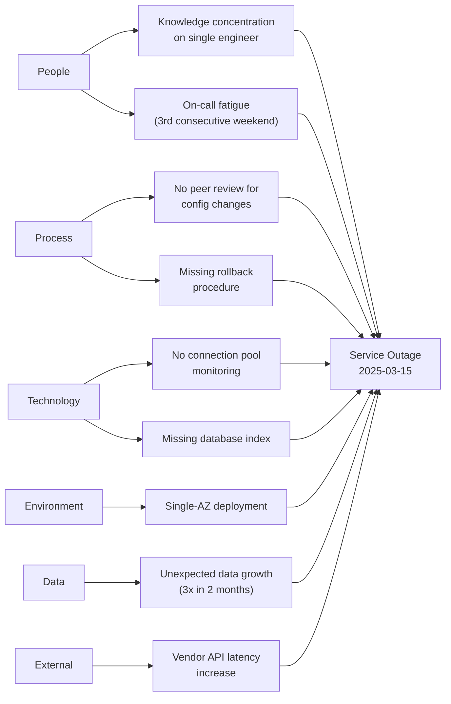

# RCA Methodologies Guide

## Overview

This guide covers three core Root Cause Analysis methodologies optimized for IT incident management. Each methodology is designed for organizational-level analysis, focusing on process and system improvements rather than technical debugging.

**Scope**: Organizational RCA processes. For log-level technical debugging, use the `log-debugger` skill.

---

## 1. 5 Whys with Branching Technique

### When to Use

- Incidents with a relatively clear causal chain
- When you need to quickly identify actionable root causes
- When stakeholders need an easy-to-understand causal explanation
- Suitable for P2-P4 incidents or as a starting point for more complex analysis

### Process

#### Step 1: Define the Problem Statement

Write a clear, specific problem statement. Avoid vague descriptions.

- **Bad**: "The system was down"
- **Good**: "The payment processing service returned HTTP 503 errors for 47 minutes, affecting 12,300 users between 14:22 and 15:09 UTC on 2025-03-15"

#### Step 2: Ask "Why?" Iteratively

For each answer, ask "Why did this happen?" and document:

| Level | Question | Answer | Evidence | Confidence |
|-------|----------|--------|----------|------------|
| Why 1 | Why did the payment service return 503? | Database connection pool exhausted | APM metrics showing 0 available connections | High |
| Why 2 | Why was the connection pool exhausted? | Long-running queries held connections | Slow query log showing 45s+ queries | High |
| Why 3 | Why were queries running for 45+ seconds? | Missing index on `transactions.created_at` | EXPLAIN plan showing full table scan | High |
| Why 4 | Why was the index missing? | Schema migration was not reviewed for performance | No DB review step in deployment checklist | Medium |
| Why 5 | Why was there no DB review step? | Deployment process lacks mandatory performance review gate | Process documentation confirms no such gate | High |

#### Step 3: Handle Branching

When a single "Why" leads to multiple valid causes, create branches and explore each independently.

```
Why 1: Payment service returned 503
├── Branch A: Database connection pool exhausted
│   └── Why 2A: Long-running queries...
│       └── Why 3A: Missing index...
│           └── Why 4A: No schema review...
│               └── Why 5A: No performance gate in deployment
└── Branch B: No connection pool monitoring alert
    └── Why 2B: Alert threshold not configured...
        └── Why 3B: Service onboarding skipped monitoring setup...
            └── Why 4B: No mandatory monitoring checklist for new services
```

**Rules for Branching:**
- Explore each branch to its root cause independently
- Do not merge branches prematurely
- Each branch should end with an actionable system or process improvement
- Document which branches are primary (direct cause) vs. contributing (enabled the impact)

#### Step 4: Human Error Decomposition

**Critical Rule**: NEVER accept "human error", "operator mistake", or "someone forgot" as a root cause.

When analysis reaches a human action as the cause, apply the Human Error Decomposition technique:

```
"Operator deployed wrong configuration"
    ↓ Why was this error possible?
    ├── Process Gap: No peer review required for config changes
    ├── System Gap: No validation check on configuration values
    └── Training Gap: Operator unfamiliar with new config format
```

**Decomposition Categories:**

| Category | Question to Ask | Example Root Cause |
|----------|----------------|-------------------|
| Process Gap | Was there a process that should have prevented this? | No change approval process for production configs |
| System Gap | Could a system check have caught this? | No automated validation of config schema |
| Training Gap | Did the person have adequate knowledge/training? | No onboarding for new deployment procedures |
| Design Gap | Does the system design make errors easy? | Config file format is error-prone (no type safety) |
| Communication Gap | Was necessary information available? | Runbook was outdated, team not notified of changes |

### Output Format

Present 5 Whys results as:
1. Numbered tree structure with branches clearly labeled
2. Evidence column for each causal link
3. Confidence level (High/Medium/Low) for each link
4. Root causes marked with recommended action category

---

## 2. Fishbone Diagram (Ishikawa) for IT Incidents

### When to Use

- Incidents with multiple contributing factors across different domains
- When you need to ensure comprehensive coverage of potential causes
- Brainstorming sessions with cross-functional teams
- P0-P1 incidents requiring thorough investigation
- When the causal chain is not obvious

### 6 Categories for IT Incidents

#### Category 1: People

Human factors contributing to the incident.

**Checklist:**
- [ ] Insufficient staffing levels during the incident window
- [ ] Skill gaps in the team handling the affected system
- [ ] Communication breakdowns between teams (DevOps, SRE, Dev, Support)
- [ ] Fatigue / cognitive overload (on-call burnout, after-hours work)
- [ ] Unclear roles and responsibilities during incident response
- [ ] Inadequate training on the affected system or runbooks
- [ ] Knowledge concentration (single point of knowledge)
- [ ] Handoff errors between shifts or teams

#### Category 2: Process

Procedural and workflow factors.

**Checklist:**
- [ ] Missing or outdated runbooks / playbooks
- [ ] Change management process gaps (insufficient review, testing)
- [ ] Deployment process lacking rollback procedures
- [ ] Incident response process unclear or not followed
- [ ] Escalation path undefined or too slow
- [ ] Release management gaps (no canary, no feature flags)
- [ ] Approval process too slow for emergency changes
- [ ] Post-deployment verification steps missing
- [ ] Capacity planning process inadequate

#### Category 3: Technology

Infrastructure, software, and tooling factors.

**Checklist:**
- [ ] Hardware failure (disk, memory, network interface)
- [ ] Software bug (application, library, framework)
- [ ] Configuration error (misconfigured service, wrong parameters)
- [ ] Capacity exhaustion (CPU, memory, disk, connections, threads)
- [ ] Dependency failure (upstream/downstream service)
- [ ] Infrastructure limitation (single AZ, no redundancy)
- [ ] Tooling gap (monitoring blind spots, inadequate alerting)
- [ ] Version incompatibility (library, API, protocol)
- [ ] Technical debt (deferred maintenance, known issues)

#### Category 4: Environment

Operational environment and infrastructure context.

**Checklist:**
- [ ] Network issues (latency, packet loss, DNS, routing)
- [ ] Cloud provider issues (region outage, service degradation)
- [ ] Data center conditions (power, cooling, physical access)
- [ ] Security posture issues (expired certificates, firewall rules)
- [ ] Multi-region / multi-cloud complexity
- [ ] Environment drift (prod differs from staging)
- [ ] Resource contention (noisy neighbor, shared infrastructure)
- [ ] Geographic/regulatory constraints

#### Category 5: Data

Data-related contributing factors.

**Checklist:**
- [ ] Data corruption or inconsistency
- [ ] Data migration issues (incomplete, incorrect mapping)
- [ ] Backup/restore failure
- [ ] Data volume exceeding expectations (growth planning)
- [ ] Data format changes (schema evolution, API contract)
- [ ] Cache inconsistency (stale data, invalidation failure)
- [ ] Replication lag or failure
- [ ] Data access patterns changed (query patterns, hot keys)

#### Category 6: External

Factors outside organizational control.

**Checklist:**
- [ ] Third-party service outage or degradation
- [ ] Vendor/supplier issues (SLA breach, support responsiveness)
- [ ] DDoS attack or security incident
- [ ] Regulatory/compliance change requiring emergency action
- [ ] Force majeure (natural disaster, power grid failure)
- [ ] Customer behavior change (traffic spike, usage pattern)
- [ ] Supply chain issues (hardware delivery, license renewal)
- [ ] Internet backbone / CDN issues

### Mermaid Output Format

Generate a Mermaid graph representing the fishbone structure:



### Process

1. Present the 6 categories and their checklists to the team
2. For each category, identify potential contributing factors
3. Score each factor by likelihood (1-5) and impact (1-5)
4. Prioritize factors with highest combined score
5. For top-priority factors, perform deeper analysis (5 Whys or FTA)
6. Generate the Mermaid fishbone diagram

---

## 3. Method Selection Decision Tree

Use this decision tree to select the appropriate RCA methodology:

```
Is the incident straightforward with a clear causal chain?
├── YES → Use 5 Whys
│   └── Did branching reveal multiple independent root causes?
│       └── YES → Add Fishbone to ensure coverage
└── NO → Is the incident a complex system failure?
    ├── YES → Use Fault Tree Analysis (FTA)
    │   └── Reference: fault_tree_analysis_guide.md
    └── NO → Are there multiple potential contributing factors?
        ├── YES → Start with Fishbone, then 5 Whys for each factor
        └── NO → Start with 5 Whys, escalate to FTA if needed
```

### Method Comparison

| Aspect | 5 Whys | Fishbone | FTA |
|--------|--------|----------|-----|
| Best for | Clear causal chains | Multi-factor analysis | Complex system failures |
| Complexity | Low | Medium | High |
| Time required | 30-60 min | 1-2 hours | 2-4 hours |
| Team size | 2-4 people | 4-8 people | 3-6 people |
| Output | Causal tree | Category map | Fault tree with gates |
| Severity fit | P2-P4 | P0-P2 | P0-P1 |
| Strength | Simple, fast | Comprehensive coverage | Structural rigor |
| Weakness | May miss factors | Can be unfocused | Complex, time-consuming |

### Combining Methods

For P0/P1 incidents, combine methods:

1. **Start with Fishbone**: Brainstorm all potential causes across 6 categories
2. **Apply 5 Whys**: Drill into the top 3-5 identified causes
3. **Use FTA** (if needed): For causes involving complex system interactions, build a fault tree to understand the failure structure
4. **Synthesize**: Map all root causes to corrective actions using the 3D framework

---

## 4. Quality Criteria for RCA Analysis

### Root Cause Validation Checklist

A valid root cause must satisfy ALL of the following:

- [ ] **Actionable**: A specific process or system change can address it
- [ ] **Not a human error**: Decomposed into process/system/training gap
- [ ] **Evidence-based**: Supported by data, logs, metrics, or testimony
- [ ] **Specific**: Not a vague statement like "communication was poor"
- [ ] **Causal**: Removing this cause would have prevented or reduced the incident
- [ ] **Within control**: The organization can take action to address it

### Common Anti-Patterns

| Anti-Pattern | Problem | Correction |
|-------------|---------|------------|
| "Human error" as root cause | Blames individual, not system | Decompose into process/system/training gap |
| "Monitoring was insufficient" | Too vague to act on | Specify what metric, what threshold, what alert |
| Stopping at first cause | Misses deeper issues | Continue to at least 5 levels |
| Single-method analysis | May miss causes | Use at least 2 methods for P0-P1 |
| No evidence cited | Unverifiable claims | Require evidence for every causal link |
| Confusing correlation with cause | Incorrect root cause | Verify causal mechanism, not just timing |
