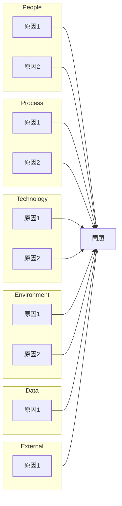

# Root Cause Analysis Report

## 1. Incident Summary

| Item | Detail |
|------|--------|
| **Incident ID** | [INC-YYYY-NNNN] |
| **Title** | [問題の簡潔な説明] |
| **Severity** | P0 / P1 / P2 / P3 |
| **Status** | Resolved / Mitigated / Investigating |
| **Reported By** | [報告者] |
| **Report Date** | [YYYY-MM-DD] |

### Impact

- **Affected Users**: [影響を受けたユーザー数/割合]
- **Affected Services**: [影響を受けたサービス/機能]
- **Business Impact**: [ビジネスへの影響]

### Timeline Summary

| Time (UTC) | Event |
|------------|-------|
| [YYYY-MM-DD HH:MM] | 問題発生開始 |
| [YYYY-MM-DD HH:MM] | 検知 |
| [YYYY-MM-DD HH:MM] | 対応開始 |
| [YYYY-MM-DD HH:MM] | 影響軽減 |
| [YYYY-MM-DD HH:MM] | 完全復旧 |

**Total Duration**: [X hours Y minutes]
**Time to Detect (TTD)**: [X minutes]
**Time to Mitigate (TTM)**: [X minutes]

---

## 2. Detailed Timeline

| Time | Source | Event | Action Taken |
|------|--------|-------|--------------|
| [HH:MM:SS] | [ログソース] | [イベント詳細] | [実施したアクション] |
| ... | ... | ... | ... |

---

## 3. Root Cause Analysis

### 5 Whys Analysis

| # | Question | Answer | Evidence |
|---|----------|--------|----------|
| 1 | なぜ[問題]が発生したか？ | [回答] | [証拠/ログ] |
| 2 | なぜ[Why1の回答]が起きたか？ | [回答] | [証拠/ログ] |
| 3 | なぜ[Why2の回答]が起きたか？ | [回答] | [証拠/ログ] |
| 4 | なぜ[Why3の回答]が起きたか？ | [回答] | [証拠/ログ] |
| 5 | なぜ[Why4の回答]が起きたか？ | [回答] | [証拠/ログ] |

### Fishbone Analysis



### Contributing Factors

| Category | Factor | Contribution Level |
|----------|--------|-------------------|
| People | [要因] | High / Medium / Low |
| Process | [要因] | High / Medium / Low |
| Technology | [要因] | High / Medium / Low |
| Environment | [要因] | High / Medium / Low |
| Data | [要因] | High / Medium / Low |
| External | [要因] | High / Medium / Low |

---

## 4. Root Cause Statement

> [根本原因の明確な記述。1-3文で、技術的な詳細と背景を含める]

**Primary Root Cause**: [主要な根本原因]

**Secondary Factors**: [副次的な要因があれば列挙]

---

## 5. Resolution

### Immediate Actions (応急処置)

| # | Action | Status | Owner | Completed |
|---|--------|--------|-------|-----------|
| 1 | [実施した応急処置] | Done | [担当者] | [日時] |
| 2 | ... | ... | ... | ... |

### Permanent Fix (恒久対策)

| # | Action | Status | Owner | Due Date |
|---|--------|--------|-------|----------|
| 1 | [恒久対策] | Planned / In Progress / Done | [担当者] | [期限] |
| 2 | ... | ... | ... | ... |

---

## 6. Prevention (再発防止策)

### Detection Improvements (検知の強化)

| # | Improvement | Status | Owner | Due Date |
|---|-------------|--------|-------|----------|
| 1 | [アラート追加/改善] | Planned | [担当者] | [期限] |
| 2 | [監視項目追加] | Planned | [担当者] | [期限] |

### Prevention Measures (防止の強化)

| # | Measure | Status | Owner | Due Date |
|---|---------|--------|-------|----------|
| 1 | [バリデーション追加] | Planned | [担当者] | [期限] |
| 2 | [テスト追加] | Planned | [担当者] | [期限] |
| 3 | [プロセス改善] | Planned | [担当者] | [期限] |

### Recovery Improvements (復旧の強化)

| # | Improvement | Status | Owner | Due Date |
|---|-------------|--------|-------|----------|
| 1 | [ランブック更新] | Planned | [担当者] | [期限] |
| 2 | [自動復旧機構] | Planned | [担当者] | [期限] |

---

## 7. Lessons Learned

### What Went Well

- [うまくいったこと1]
- [うまくいったこと2]

### What Could Be Improved

- [改善できること1]
- [改善できること2]

### Key Takeaways

1. [学び1]
2. [学び2]
3. [学び3]

---

## 8. Appendix

### Related Logs

```
[関連するログの抜粋]
```

### Related Metrics

[メトリクスのスクリーンショットやグラフへの参照]

### Related Documents

- [関連するドキュメントへのリンク]
- [関連するチケットへのリンク]

---

## Approval

| Role | Name | Date | Signature |
|------|------|------|-----------|
| Author | [作成者] | [日付] | |
| Reviewer | [レビュアー] | [日付] | |
| Approver | [承認者] | [日付] | |
