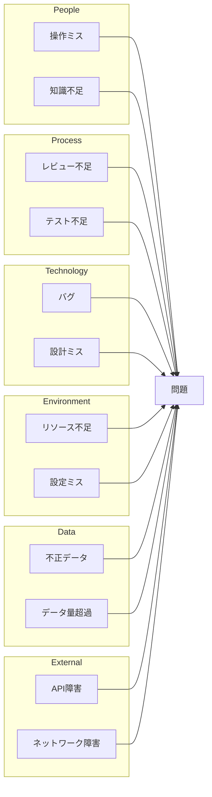

# Root Cause Analysis (RCA) Methodology

## Overview

根本原因分析（RCA）は、問題の表面的な症状ではなく、本質的な原因を特定するための体系的なアプローチです。このガイドでは、ログ分析における主要なRCA手法を解説します。

---

## 1. 5 Whys 分析

### 概要

「なぜ？」を5回繰り返すことで、問題の根本原因にたどり着く手法。トヨタ生産方式で開発された。

### プロセス

```
問題の定義
    ↓
Why 1: なぜこの問題が発生したか？
    ↓
Why 2: なぜWhy 1の原因が発生したか？
    ↓
Why 3: なぜWhy 2の原因が発生したか？
    ↓
Why 4: なぜWhy 3の原因が発生したか？
    ↓
Why 5: なぜWhy 4の原因が発生したか？
    ↓
根本原因の特定
```

### 実践例: APIタイムアウト

```
問題: APIが頻繁にタイムアウトする

Why 1: なぜAPIがタイムアウトするのか？
→ データベースクエリに30秒以上かかっている

Why 2: なぜクエリに30秒以上かかるのか？
→ 100万件のレコードをフルスキャンしている

Why 3: なぜフルスキャンが発生しているのか？
→ WHERE句で使用しているカラムにインデックスがない

Why 4: なぜインデックスがないのか？
→ 新機能追加時にインデックス追加を忘れた

Why 5: なぜ忘れたのか？
→ スキーマ変更時のインデックス確認プロセスがなかった

根本原因: スキーマ変更レビュープロセスの不備
```

### ベストプラクティス

| Do's | Don'ts |
|------|--------|
| 各回答を事実に基づいて検証する | 推測だけで進めない |
| 複数の分岐を探索する | 1つの経路だけで終わらない |
| 「人のミス」で止まらず、プロセスまで掘り下げる | 個人を責める結論で終わらない |
| 5回で足りなければ続ける | 5回で必ず止める必要はない |

### 5 Whys テンプレート

```markdown
## 5 Whys Analysis

**問題定義**: [問題の明確な記述]

**発生日時**: [YYYY-MM-DD HH:MM]

**影響範囲**: [影響を受けたユーザー/システム]

### 分析

| # | Question | Answer | Evidence |
|---|----------|--------|----------|
| 1 | なぜ[問題]が発生したか？ | [回答] | [ログ/データの証拠] |
| 2 | なぜ[Why1の回答]が起きたか？ | [回答] | [ログ/データの証拠] |
| 3 | なぜ[Why2の回答]が起きたか？ | [回答] | [ログ/データの証拠] |
| 4 | なぜ[Why3の回答]が起きたか？ | [回答] | [ログ/データの証拠] |
| 5 | なぜ[Why4の回答]が起きたか？ | [回答] | [ログ/データの証拠] |

### 根本原因

[特定された根本原因]

### 対策

- **応急処置**: [即座に実施した対応]
- **恒久対策**: [根本原因を解消する対策]
- **再発防止**: [同様の問題を防ぐ仕組み]
```

---

## 2. Fishbone（特性要因図）分析

### 概要

問題（特性）に対する様々な原因を、カテゴリ別に視覚的に整理する手法。石川ダイアグラムとも呼ばれる。

### 6Mカテゴリ（IT/ソフトウェア向け）

```
                    ┌─────────────────────────────────────────────┐
                    │                                             │
    People ─────────┤                                             │
                    │                                             │
    Process ────────┤                                             │
                    │                    問題                      │
    Technology ─────┤              ─────────────────►              │
                    │                                             │
    Environment ────┤                                             │
                    │                                             │
    Data ───────────┤                                             │
                    │                                             │
    External ───────┤                                             │
                    └─────────────────────────────────────────────┘
```

### カテゴリ別チェックリスト

#### People（人的要因）
- [ ] 操作ミスはなかったか？
- [ ] 必要な知識/トレーニングは十分だったか？
- [ ] コミュニケーションに問題はなかったか？
- [ ] 担当者の負荷は適切だったか？
- [ ] 引き継ぎは適切だったか？

#### Process（プロセス要因）
- [ ] 手順書/ドキュメントは正確だったか？
- [ ] レビュープロセスは機能したか？
- [ ] テストは十分だったか？
- [ ] 変更管理プロセスは遵守されたか？
- [ ] 承認プロセスに問題はなかったか？

#### Technology（技術要因）
- [ ] コードにバグはなかったか？
- [ ] 設計に問題はなかったか？
- [ ] 使用しているライブラリに問題はなかったか？
- [ ] アーキテクチャは適切だったか？
- [ ] 監視は十分だったか？

#### Environment（環境要因）
- [ ] インフラに問題はなかったか？
- [ ] ネットワークに問題はなかったか？
- [ ] リソース（CPU/メモリ/ディスク）は十分だったか？
- [ ] 設定に問題はなかったか？
- [ ] 環境間（dev/stg/prod）の差異はなかったか？

#### Data（データ要因）
- [ ] 入力データに問題はなかったか？
- [ ] データ量は想定内だったか？
- [ ] データ品質に問題はなかったか？
- [ ] データ形式は正しかったか？
- [ ] データの整合性は保たれていたか？

#### External（外部要因）
- [ ] サードパーティサービスに問題はなかったか？
- [ ] 外部APIに問題はなかったか？
- [ ] ユーザーの操作に問題はなかったか？
- [ ] セキュリティ攻撃はなかったか？
- [ ] 法規制/コンプライアンスの変更はなかったか？

### Mermaid形式のFishbone



---

## 3. タイムライン分析

### 概要

問題発生前後のイベントを時系列で整理し、因果関係を明らかにする手法。

### プロセス

1. **データ収集**: 関連するすべてのログソースを特定
2. **時刻同期**: タイムスタンプを統一（タイムゾーンに注意）
3. **イベント抽出**: 重要なイベントを抽出
4. **並べ替え**: 時系列順に整理
5. **相関分析**: イベント間の関係を分析

### タイムラインテンプレート

```markdown
## Timeline

### Context
- **Incident Start**: YYYY-MM-DD HH:MM:SS
- **Incident End**: YYYY-MM-DD HH:MM:SS
- **Duration**: X hours Y minutes
- **Timezone**: UTC/JST/etc.

### Events

| Time | Source | Event | Severity | Notes |
|------|--------|-------|----------|-------|
| 10:00:00 | app.log | Deployment started | INFO | Version 2.1.0 |
| 10:05:23 | app.log | First error detected | ERROR | NullPointerException |
| 10:05:25 | nginx.log | 502 errors increase | ERROR | 10 req/s → 500 req/s |
| 10:06:00 | alert | PagerDuty alert triggered | ALERT | |
| 10:10:00 | app.log | Rollback initiated | INFO | |
| 10:15:00 | app.log | Service restored | INFO | |

### Key Observations

1. **Trigger Event**: デプロイ開始（10:00:00）
2. **First Symptom**: 最初のエラー（10:05:23）- デプロイから5分後
3. **Impact Spread**: 502エラー急増（10:05:25）
4. **Detection**: アラート発報（10:06:00）- 最初のエラーから37秒後
5. **Resolution**: ロールバック完了（10:15:00）

### Correlation

- デプロイ → エラー発生 の時間差: 5分23秒
- デプロイされた変更に問題があった可能性が高い
```

### タイムライン分析のポイント

| チェック項目 | 質問 |
|-------------|------|
| 直前のイベント | 問題発生直前に何が起きたか？ |
| 変更 | デプロイ、設定変更、データ更新はあったか？ |
| 外部イベント | 外部システムの障害、メンテナンスはあったか？ |
| リソース変化 | CPU/メモリ/ディスクの急変はあったか？ |
| パターン | 過去に同様のパターンはあったか？ |

---

## 4. 因果関係 vs 相関関係

### 区別の重要性

- **相関関係**: 2つの事象が同時に発生する傾向がある
- **因果関係**: 一方の事象がもう一方を引き起こす

### 因果関係の検証方法

```
1. 時間的順序: 原因は結果より前に発生しているか？
2. 共変性: 原因が変化すると結果も変化するか？
3. 他の説明の排除: 他に考えられる原因はないか？
4. 再現性: 同じ原因で同じ結果が再現するか？
```

### 例: 相関と因果の違い

```
観察: メモリ使用量が増加すると、レスポンスタイムも増加する

これは因果関係か？

検証1: 時間的順序
→ メモリ増加が先、レスポンス低下が後 ✓

検証2: 共変性
→ メモリを解放するとレスポンスも改善する ✓

検証3: 他の説明
→ 同時にCPU使用率も上昇していた
→ CPUがボトルネックの可能性もある

検証4: 再現性
→ メモリを強制的に消費するテストで再現 ✓

結論: 因果関係の可能性が高いが、CPU影響も調査が必要
```

---

## 5. RCA実施のベストプラクティス

### Do's

1. **事実に基づく**: ログ、メトリクス、証拠に基づいて分析する
2. **多角的に見る**: 複数のカテゴリ/視点から原因を探る
3. **深く掘り下げる**: 表面的な原因で止まらない
4. **仮説を検証する**: 推測を証拠で裏付ける
5. **文書化する**: 分析過程と結論を記録する

### Don'ts

1. **最初の仮説に固執しない**: 他の可能性も検討する
2. **個人を責めない**: プロセスやシステムの改善に焦点を当てる
3. **相関を因果と混同しない**: 検証を行う
4. **急がない**: 十分な時間をかけて分析する
5. **1つの原因に限定しない**: 複合要因を考慮する

---

## 6. RCA完了チェックリスト

```markdown
□ 問題の定義が明確である
□ 影響範囲が特定されている
□ タイムラインが作成されている
□ 複数の分析手法を使用した（5 Whys, Fishbone等）
□ 根本原因が証拠に基づいて特定されている
□ 因果関係が検証されている
□ 応急処置が実施/計画されている
□ 恒久対策が計画されている
□ 再発防止策が検討されている
□ 学習事項が文書化されている
```
