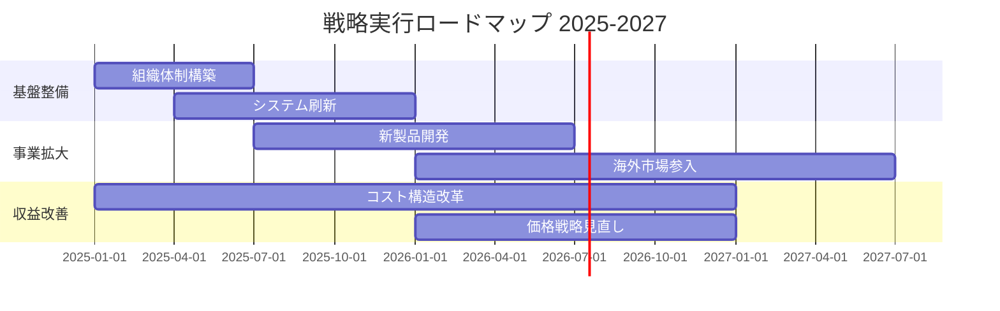

# Strategic Planner - 戦略企画スキル

## Overview

戦略企画スキルは、企業の中長期的な方向性を決定するための体系的な戦略立案を支援します。

### 主要機能

| 機能 | フレームワーク | 用途 |
|------|---------------|------|
| 外部環境分析 | PEST/PESTLE | マクロ環境の把握 |
| 業界構造分析 | Porter's Five Forces | 競争環境の理解 |
| 内部分析 | Value Chain | 自社強みの特定 |
| 統合分析 | SWOT / Cross-SWOT | 戦略オプション導出 |
| ビジネスモデル設計 | Business Model Canvas / Lean Canvas | 事業構造の設計 |
| ポートフォリオ分析 | BCG / GE Matrix | 事業投資配分 |
| 成長戦略立案 | Ansoff Matrix | 成長方向の決定 |

### 対象成果物

1. **中期経営計画** - 3〜5年の経営戦略ドキュメント
2. **新規事業企画書** - 新規事業の事業計画書
3. **事業ポートフォリオ分析レポート** - 事業投資配分の分析・提言

---

## When to Use This Skill

### 典型的なシナリオ

1. **中期経営計画策定**
   - 「3年後のビジョンと戦略を策定したい」
   - 「次期中計の骨子を作成してほしい」
   - 「現状分析から戦略施策までの一貫した計画が必要」

2. **新規事業企画**
   - 「新規事業のビジネスモデルを設計したい」
   - 「新規市場参入の事業計画を作成したい」
   - 「スタートアップ的な事業提案書が必要」

3. **事業ポートフォリオ見直し**
   - 「各事業の投資優先度を評価したい」
   - 「事業の選択と集中の判断材料が欲しい」
   - 「成長事業と成熟事業の戦略を整理したい」

4. **個別フレームワーク活用**
   - 「SWOT分析をしたい」
   - 「競合分析（Porter 5F）を行いたい」
   - 「ビジネスモデルキャンバスを作成したい」

---

## Workflow 1: Strategic Context Analysis (現状分析)

### 目的
外部環境と内部環境を体系的に分析し、戦略立案の基盤となる現状認識を確立する。

### Step 1: PEST/PESTLE分析の実施

マクロ環境を6つの観点から分析する。

| 要素 | 観点 | 分析ポイント |
|------|------|-------------|
| **P**olitical (政治) | 規制・政策 | 法規制変化、政府方針、税制 |
| **E**conomic (経済) | 経済動向 | GDP成長率、金利、為替、インフレ |
| **S**ocial (社会) | 社会変化 | 人口動態、価値観変化、ライフスタイル |
| **T**echnological (技術) | 技術革新 | 新技術、デジタル化、自動化 |
| **L**egal (法律) | 法的環境 | 労働法、知的財産、業界規制 |
| **E**nvironmental (環境) | 環境要因 | 環境規制、サステナビリティ、気候変動 |

**実施手順:**
1. 各要素について現状のトレンドを3〜5項目列挙
2. 自社への影響度（高/中/低）を評価
3. 機会（O）か脅威（T）かを判定
4. 優先的に対応すべき項目を特定

### Step 2: Porter's Five Forces分析

業界の競争構造を5つの力で分析する。

```
                    新規参入の脅威
                         ↓
売り手の交渉力 ← 業界内競争 → 買い手の交渉力
                         ↓
                    代替品の脅威
```

| Force | 評価観点 | 強い場合の意味 |
|-------|---------|---------------|
| 業界内競争 | 競合数、差別化、撤退障壁 | 収益性が低下 |
| 新規参入の脅威 | 参入障壁、規模の経済、資本要件 | 競争激化リスク |
| 代替品の脅威 | 代替品の価格性能比、スイッチングコスト | 価格圧力 |
| 買い手の交渉力 | 顧客集中度、スイッチングコスト | 値下げ圧力 |
| 売り手の交渉力 | 供給者集中度、代替調達先 | コスト上昇圧力 |

**評価スケール:** 1（非常に弱い）〜 5（非常に強い）

### Step 3: Value Chain分析

自社の価値創造活動を分析し、強みと改善点を特定する。

**主活動（Primary Activities）:**
1. **購買物流** - 原材料調達、在庫管理
2. **製造** - 製品・サービスの生産
3. **出荷物流** - 完成品の配送
4. **マーケティング・販売** - 市場開拓、販売促進
5. **サービス** - アフターサービス、顧客支援

**支援活動（Support Activities）:**
1. **全般管理** - 経営企画、財務、法務
2. **人事管理** - 採用、育成、評価
3. **技術開発** - R&D、プロセス改善
4. **調達** - 購買戦略、サプライヤー管理

**分析手順:**
1. 各活動の現状能力を評価（1〜5）
2. 競合との相対比較で強み/弱みを判定
3. 顧客価値への貢献度を評価
4. 改善優先度を決定

### Output: 現状分析レポート

```markdown
## 現状分析サマリー

### PEST分析結果
- 主要機会: [機会1], [機会2]
- 主要脅威: [脅威1], [脅威2]

### 業界構造分析（Porter 5F）
- 業界魅力度スコア: X.X / 5.0
- 最大の競争圧力: [要因]

### Value Chain分析
- コア強み: [強み1], [強み2]
- 改善必要領域: [領域1]
```

---

## Workflow 2: SWOT Analysis & Strategic Options (SWOT分析)

### 目的
現状分析の結果を統合し、戦略オプションを導出する。

### Step 1: SWOT要素の整理

**内部環境分析:**
- **Strengths（強み）**: 競合に対する優位性、コア・コンピタンス
- **Weaknesses（弱み）**: 競合に対する劣位、改善が必要な領域

**外部環境分析:**
- **Opportunities（機会）**: 市場の成長機会、有利な環境変化
- **Threats（脅威）**: 市場の脅威、不利な環境変化

**整理のポイント:**
- 各象限に3〜5項目を列挙
- 具体的・測定可能な表現を使用
- 重要度順にランキング

### Step 2: SWOTマトリクスの作成

```
              │ Strengths (S)      │ Weaknesses (W)
              │ 強み               │ 弱み
──────────────┼────────────────────┼─────────────────
Opportunities │ SO戦略            │ WO戦略
機会          │ 強みで機会を活かす│ 弱みを克服し機会を活かす
              │ 【積極攻勢】      │ 【弱点強化】
──────────────┼────────────────────┼─────────────────
Threats       │ ST戦略            │ WT戦略
脅威          │ 強みで脅威を回避  │ 弱みと脅威の影響を最小化
              │ 【差別化】        │ 【防衛・撤退】
```

### Step 3: Cross-SWOT戦略の導出

各象限で戦略オプションを検討する。

**SO戦略（積極攻勢戦略）:**
- 強みを活用して機会を最大限に捉える
- 成長投資の優先領域
- 例: 「技術力（S）を活かしてDX需要（O）を取り込む」

**WO戦略（弱点強化戦略）:**
- 弱みを克服して機会を活かす
- 投資による能力構築
- 例: 「海外営業力（W）を強化し、アジア市場（O）に展開」

**ST戦略（差別化戦略）:**
- 強みを活かして脅威を回避・軽減
- 競争優位の確立
- 例: 「ブランド力（S）で価格競争（T）を回避」

**WT戦略（防衛・撤退戦略）:**
- 弱みと脅威の組み合わせによるリスクを最小化
- 事業縮小・撤退の検討
- 例: 「競争力のない製品（W）から撤退し、規制強化（T）の影響を回避」

### Step 4: 戦略オプションの優先順位付け

評価基準で戦略オプションをスコアリング:

| 評価基準 | 重み | 説明 |
|---------|------|------|
| 実現可能性 | 30% | 自社リソースで実現できるか |
| インパクト | 30% | 収益・成長への貢献度 |
| 緊急性 | 20% | すぐに着手すべきか |
| リスク | 20% | 失敗リスクの大きさ |

### Output: SWOT分析レポート

SWOTマトリクスと優先戦略オプションを含むドキュメント。

---

## Workflow 3: Vision & Strategic Objectives (ビジョン・戦略目標設定)

### 目的
将来のあるべき姿（ビジョン）と、そこに至る戦略目標を設定する。

### Step 1: ビジョンステートメントの策定

**良いビジョンの特徴:**
- **明確性**: 誰が読んでも理解できる
- **魅力性**: 社員・ステークホルダーを惹きつける
- **実現可能性**: 挑戦的だが達成可能
- **時間軸**: 3〜10年後の姿を描く

**ビジョン策定テンプレート:**
```
[時期]までに、[対象顧客/市場]において、
[提供価値/ポジション]で[目指す姿/状態]を実現する。
```

**例:**
- 「2030年までに、アジア太平洋地域において、サステナブル素材のリーディングカンパニーとなる」
- 「3年後、国内市場シェアNo.1を達成し、顧客満足度トップ企業として認知される」

### Step 2: ミッションとの整合性確認

- ミッション（存在意義）とビジョン（目指す姿）の一貫性を確認
- 既存のミッションステートメントを参照
- 乖離がある場合は調整を検討

### Step 3: 戦略目標の設定（BSC視点）

Balanced Scorecardの4つの視点で戦略目標を設定:

| 視点 | 観点 | 目標例 |
|------|------|--------|
| **財務** | 株主・投資家への価値 | 売上成長率、ROE、営業利益率 |
| **顧客** | 顧客への価値提供 | 市場シェア、顧客満足度、NPS |
| **業務プロセス** | 内部プロセスの卓越性 | 生産性、品質、リードタイム |
| **学習と成長** | 組織能力の向上 | 従業員満足度、スキル習得率 |

**目標設定のSMART原則:**
- **S**pecific（具体的）
- **M**easurable（測定可能）
- **A**chievable（達成可能）
- **R**elevant（関連性）
- **T**ime-bound（期限付き）

### Step 4: KPI体系の構築

```
ビジョン
    ↓
戦略目標（BSC 4視点）
    ↓
重要成功要因（CSF）
    ↓
KPI（先行指標・遅行指標）
```

**KPI設定例:**

| 戦略目標 | CSF | KPI | 目標値 |
|---------|-----|-----|--------|
| 売上成長 | 新規顧客獲得 | 新規顧客数 | 年間100社 |
| 顧客満足向上 | 品質改善 | クレーム率 | 0.5%以下 |
| 生産性向上 | 業務効率化 | 人時生産性 | 20%向上 |

### Output: ビジョン・戦略目標ドキュメント

---

## Workflow 4: Business Model Design (ビジネスモデル設計)

### 目的
事業の価値創造・提供・獲得の仕組みを設計する。

### Step 1: Business Model Canvas作成

9つのビルディングブロックで事業モデルを可視化する。

```
┌─────────────┬─────────────┬─────────────┬─────────────┬─────────────┐
│ Key         │ Key         │ Value       │ Customer    │ Customer    │
│ Partners    │ Activities  │ Propositions│ Relation-   │ Segments    │
│             │             │             │ ships       │             │
│ 主要パートナー│ 主要活動     │ 価値提案     │ 顧客との関係  │ 顧客セグメント │
├─────────────┼─────────────┼─────────────┼─────────────┤             │
│ Key         │             │             │ Channels    │             │
│ Resources   │             │             │             │             │
│             │             │             │ チャネル     │             │
│ 主要リソース │             │             │             │             │
├─────────────┴─────────────┴─────────────┴─────────────┴─────────────┤
│ Cost Structure                          │ Revenue Streams            │
│ コスト構造                               │ 収益の流れ                  │
└─────────────────────────────────────────┴────────────────────────────┘
```

**各ブロックの検討ポイント:**

1. **顧客セグメント**: 誰のために価値を創るか
2. **価値提案**: 顧客のどんな課題を解決するか
3. **チャネル**: どうやって顧客に届けるか
4. **顧客との関係**: どんな関係を構築するか
5. **収益の流れ**: どうやって収益を得るか
6. **主要リソース**: 何が必要か（人材、設備、IP等）
7. **主要活動**: 何をするか
8. **主要パートナー**: 誰と協力するか
9. **コスト構造**: 何にコストがかかるか

### Step 2: Lean Canvas（スタートアップ/新規事業向け）

```
┌─────────────┬─────────────┬─────────────┬─────────────┬─────────────┐
│ Problem     │ Solution    │ Unique Value│ Unfair      │ Customer    │
│ 課題        │ ソリューション│ Proposition│ Advantage   │ Segments    │
│             │             │ 独自の価値提案│ 圧倒的優位性 │ 顧客セグメント │
├─────────────┤             ├─────────────┼─────────────┤             │
│ Existing    │             │ High-Level  │ Channels    │             │
│ Alternatives│             │ Concept     │ チャネル     │             │
│ 既存代替品  │             │ ハイレベル   │             │             │
│             │             │ コンセプト   │             │             │
├─────────────┴─────────────┴─────────────┴─────────────┴─────────────┤
│ Cost Structure                          │ Revenue Streams            │
│ コスト構造                               │ 収益の流れ                  │
├─────────────────────────────────────────┴────────────────────────────┤
│ Key Metrics                                                          │
│ 主要指標                                                              │
└──────────────────────────────────────────────────────────────────────┘
```

### Step 3: Value Proposition Canvas

顧客の課題と提供価値の適合を詳細に検討する。

**顧客プロファイル:**
- **Customer Jobs**: 顧客が達成したいこと
- **Pains**: 課題、障害、リスク
- **Gains**: 期待する成果、望むもの

**Value Map:**
- **Products & Services**: 提供する製品・サービス
- **Pain Relievers**: 課題をどう解決するか
- **Gain Creators**: どんな成果を生み出すか

### Step 4: 収益モデルの設計

| モデル類型 | 説明 | 例 |
|-----------|------|-----|
| 製品販売 | 製品の所有権移転 | 製造業、小売業 |
| サービス料 | サービス提供対価 | コンサルティング |
| サブスクリプション | 継続利用料 | SaaS、定期購読 |
| ライセンス | 知的財産の使用許諾 | ソフトウェア |
| 仲介手数料 | マッチング対価 | プラットフォーム |
| 広告収入 | 広告掲載料 | メディア |
| フリーミアム | 基本無料＋有料オプション | アプリ |

### Output: ビジネスモデル設計書

---

## Workflow 5: Portfolio Analysis (事業ポートフォリオ分析)

### 目的
複数事業の投資配分を最適化し、成長と収益のバランスを図る。

### Step 1: BCG Matrix分析

**マトリクス構成:**

```
                    高 ← 市場成長率 → 低
              ┌─────────────┬─────────────┐
    高        │   Star      │ Question    │
              │   花形      │ Mark        │
    ↑         │             │ 問題児      │
    相        ├─────────────┼─────────────┤
    対        │ Cash Cow    │    Dog      │
    市        │ 金のなる木  │   負け犬    │
    場        │             │             │
    シ        └─────────────┴─────────────┘
    ェ
    ア
    ↓
    低
```

**各象限の戦略指針:**

| 象限 | 特徴 | 推奨戦略 | 投資配分 |
|------|------|---------|---------|
| Star | 高成長・高シェア | 積極投資で成長維持 | 投資優先 |
| Question Mark | 高成長・低シェア | 選択的投資or撤退 | 選別投資 |
| Cash Cow | 低成長・高シェア | キャッシュ回収 | 最小投資 |
| Dog | 低成長・低シェア | 撤退・売却検討 | 投資抑制 |

**計算方法:**
- 市場成長率: 当該市場の年間成長率（%）
- 相対市場シェア: 自社シェア ÷ 最大競合シェア

### Step 2: GE/McKinsey Matrix分析

より詳細な9セル分析を実施する。

**評価軸:**
- **X軸: 事業の競争ポジション**（弱/中/強）
- **Y軸: 市場の魅力度**（低/中/高）

**市場魅力度の評価項目:**
| 項目 | 重み | スコア(1-5) |
|------|------|------------|
| 市場規模 | 20% | |
| 市場成長率 | 25% | |
| 収益性 | 20% | |
| 競争激しさ | 15% | |
| 技術要件 | 10% | |
| 環境・社会的影響 | 10% | |

**競争ポジションの評価項目:**
| 項目 | 重み | スコア(1-5) |
|------|------|------------|
| 市場シェア | 25% | |
| ブランド力 | 15% | |
| 生産能力 | 15% | |
| 技術力 | 20% | |
| コスト競争力 | 15% | |
| 組織能力 | 10% | |

**9セル戦略マトリクス:**

```
          │    強い    │    中程度   │    弱い    │
          │ 競争ポジション│  競争ポジション│ 競争ポジション│
──────────┼───────────┼───────────┼───────────┤
魅力度 高  │ 投資・成長  │ 選択的成長  │ 選択的投資 │
──────────┼───────────┼───────────┼───────────┤
魅力度 中  │ 選択的成長  │ 収益重視   │ 収穫・撤退 │
──────────┼───────────┼───────────┼───────────┤
魅力度 低  │ 収益重視   │ 収穫・撤退  │ 撤退      │
```

### Step 3: Ansoff Matrix分析

成長戦略の方向性を検討する。

```
              │    既存製品    │    新規製品    │
──────────────┼───────────────┼───────────────┤
既存市場      │ 市場浸透      │ 製品開発      │
              │ Market        │ Product       │
              │ Penetration   │ Development   │
              │ リスク：低    │ リスク：中    │
──────────────┼───────────────┼───────────────┤
新規市場      │ 市場開発      │ 多角化        │
              │ Market        │ Diversification│
              │ Development   │               │
              │ リスク：中    │ リスク：高    │
```

**各戦略の施策例:**

| 戦略 | 主な施策 |
|------|---------|
| 市場浸透 | 価格戦略、プロモーション強化、顧客ロイヤルティ向上 |
| 市場開発 | 新地域展開、新セグメント開拓、新チャネル活用 |
| 製品開発 | 新製品投入、製品改良、ラインナップ拡張 |
| 多角化 | 関連多角化、非関連多角化、M&A |

### Step 4: ポートフォリオ最適化の提言

分析結果を統合し、投資配分を提言する。

**出力フォーマット:**

| 事業 | BCG象限 | GEスコア | 推奨戦略 | 投資配分 |
|------|---------|---------|---------|---------|
| 事業A | Star | 4.2 | 積極投資 | 40% |
| 事業B | Cash Cow | 3.5 | 維持 | 25% |
| 事業C | Question Mark | 3.0 | 選択的投資 | 20% |
| 事業D | Dog | 2.1 | 撤退検討 | 5% |
| 新規 | - | - | 探索 | 10% |

### Output: ポートフォリオ分析レポート

BCGマトリクス図（Mermaid）と投資配分提言を含む。

---

## Workflow 6: Strategic Initiatives & Roadmap (戦略施策・ロードマップ)

### 目的
戦略を具体的な施策に落とし込み、実行計画を策定する。

### Step 1: 戦略施策の特定

SWOT分析とポートフォリオ分析から導出された戦略オプションを施策に変換する。

**施策の構造:**
```
戦略テーマ
├── 戦略施策1
│   ├── アクション1.1
│   ├── アクション1.2
│   └── アクション1.3
├── 戦略施策2
└── 戦略施策3
```

**施策定義テンプレート:**
| 項目 | 内容 |
|------|------|
| 施策名 | [具体的な施策名称] |
| 目的 | [この施策で達成したいこと] |
| 概要 | [施策の内容を2-3文で説明] |
| 期待効果 | [定量的な効果見込み] |
| 必要リソース | [人員、投資、期間] |
| リスク | [実行上のリスク] |
| 責任者 | [推進責任部門/者] |

### Step 2: 施策の優先順位付け

**評価マトリクス:**

| 施策 | 戦略適合性 | 実現可能性 | インパクト | 緊急性 | 総合スコア | 優先度 |
|------|-----------|-----------|-----------|--------|-----------|--------|
| 施策A | 5 | 4 | 5 | 4 | 4.5 | 高 |
| 施策B | 4 | 3 | 4 | 5 | 4.0 | 中 |
| 施策C | 3 | 5 | 3 | 3 | 3.5 | 中 |

**各項目の評価基準（1-5）:**
- **戦略適合性**: ビジョン・戦略目標との整合度
- **実現可能性**: リソース・能力面での実現性
- **インパクト**: 期待される効果の大きさ
- **緊急性**: 早期着手の必要性

### Step 3: 実行ロードマップの作成

**タイムライン構成:**
- 短期（1年目）: Quick Win施策、基盤整備
- 中期（2-3年目）: 主要戦略施策の実行
- 長期（4-5年目）: 成果の刈り取り、次期戦略準備

**Mermaidガントチャート例:**



### Step 4: マイルストーン設定

**主要マイルストーン定義:**

| 時期 | マイルストーン | 達成基準 |
|------|---------------|---------|
| Y1 Q2 | 新組織体制稼働 | 新組織図発効、責任者任命完了 |
| Y1 Q4 | 新製品開発完了 | プロトタイプ完成、テスト合格 |
| Y2 Q2 | 海外拠点開設 | 現地法人設立、初期人員配置 |
| Y2 Q4 | 売上目標達成 | 新製品売上10億円達成 |
| Y3 Q4 | 中計目標達成 | 営業利益率15%達成 |

### Output: 戦略ロードマップドキュメント

Mermaidガントチャートとマイルストーン表を含む実行計画。

---

## Workflow 7: Medium-Term Business Plan Integration (中期経営計画統合)

### 目的
これまでの分析・計画を統合し、完成度の高い中期経営計画書を作成する。

### Step 1: エグゼクティブサマリー作成

**含める要素:**
- 計画の背景と目的（1段落）
- ビジョンと戦略方向性（1段落）
- 主要戦略施策（3-5項目箇条書き）
- 財務目標（主要KPI）
- 投資計画概要
- 期待される成果

**分量:** 1ページ（A4換算400-500文字）

### Step 2: 財務計画の統合

**財務計画テンプレート:**

| 項目 | 基準年 | Y1 | Y2 | Y3 | CAGR |
|------|--------|-----|-----|-----|------|
| 売上高 | 100 | 110 | 125 | 140 | 12% |
| 営業利益 | 10 | 13 | 17 | 21 | 28% |
| 営業利益率 | 10% | 12% | 14% | 15% | - |
| ROE | 8% | 10% | 12% | 14% | - |

**投資計画:**
| 投資項目 | Y1 | Y2 | Y3 | 合計 |
|---------|-----|-----|-----|------|
| 設備投資 | 20 | 25 | 15 | 60 |
| R&D投資 | 10 | 12 | 15 | 37 |
| M&A/出資 | 0 | 30 | 20 | 50 |
| 合計 | 30 | 67 | 50 | 147 |

### Step 3: リスク分析と対応策

**リスクマトリクス:**

| リスク | 影響度 | 発生確率 | リスクレベル | 対応策 |
|--------|--------|---------|------------|--------|
| 競合参入 | 高 | 中 | 高 | 差別化強化、参入障壁構築 |
| 原材料高騰 | 中 | 高 | 高 | 調達先多様化、価格転嫁 |
| 人材不足 | 中 | 中 | 中 | 採用強化、育成投資 |
| 技術陳腐化 | 高 | 低 | 中 | R&D投資、オープンイノベーション |

### Step 4: ガバナンス・モニタリング体制

**進捗管理体制:**

| 会議体 | 頻度 | 参加者 | 議題 |
|--------|------|--------|------|
| 経営会議 | 月次 | 役員 | 全社業績、重要施策進捗 |
| 戦略会議 | 四半期 | 執行役員 | 戦略施策レビュー、軌道修正 |
| 取締役会 | 月次 | 取締役 | 中計進捗報告、重要決議 |

**KPIモニタリングダッシュボード:**
```
┌─────────────────────────────────────────────┐
│         戦略KPIダッシュボード               │
├─────────────┬───────────────────────────────┤
│ 売上高      │ ████████░░ 85% (目標比)      │
├─────────────┼───────────────────────────────┤
│ 営業利益率  │ ██████████ 100% (目標達成)   │
├─────────────┼───────────────────────────────┤
│ 新規顧客数  │ ██████░░░░ 60% (要対策)      │
├─────────────┼───────────────────────────────┤
│ 従業員満足度│ ████████░░ 80%               │
└─────────────┴───────────────────────────────┘
```

### Step 5: 最終ドキュメント構成

**中期経営計画書の標準構成:**

1. エグゼクティブサマリー（1ページ）
2. 経営理念・ビジョン（1ページ）
3. 外部環境分析（2-3ページ）
   - PEST分析
   - 業界動向・競合分析
4. 内部環境分析（2ページ）
   - SWOT分析
   - 財務分析
5. 戦略方針（2ページ）
   - 基本戦略
   - 事業ポートフォリオ戦略
6. 事業別戦略（各事業2ページ）
7. 機能別戦略（3ページ）
   - 人事戦略
   - デジタル戦略
   - サステナビリティ
8. 財務計画（2ページ）
9. 投資計画（1ページ）
10. リスク管理（1ページ）
11. 実行体制・ガバナンス（1ページ）
12. ロードマップ（1ページ）
13. 付録

### Output: 中期経営計画書

テンプレート `assets/strategic_plan_template.md` を使用して完成版を作成。

---

## Quick Reference

### フレームワーク選択ガイド

| 目的 | 推奨フレームワーク |
|------|-------------------|
| マクロ環境を理解したい | PEST/PESTLE |
| 業界の競争環境を分析したい | Porter's Five Forces |
| 自社の強み弱みを整理したい | Value Chain + SWOT |
| 戦略オプションを導出したい | Cross-SWOT |
| 事業モデルを設計したい | Business Model Canvas |
| スタートアップ事業を企画したい | Lean Canvas |
| 事業投資配分を決めたい | BCG Matrix, GE Matrix |
| 成長戦略の方向性を決めたい | Ansoff Matrix |

### 成果物別ワークフロー対応表

| 成果物 | 必須ワークフロー | オプション |
|--------|----------------|-----------|
| 中期経営計画 | 1,2,3,5,6,7 | 4 |
| 新規事業企画書 | 1,2,4 | 3,6 |
| ポートフォリオ分析 | 1,5 | 2 |
| SWOT分析レポート | 1,2 | - |

---

## Resources

### References（参照資料）

| ファイル | 内容 |
|---------|------|
| `references/strategic_analysis_frameworks.md` | PEST/Porter/Value Chain詳細ガイド |
| `references/business_model_frameworks.md` | BMC/Lean Canvas/Value Proposition詳細 |
| `references/portfolio_matrix_frameworks.md` | BCG/GE/Ansoff詳細手法 |

### Assets（テンプレート）

| ファイル | 用途 |
|---------|------|
| `assets/strategic_plan_template.md` | 中期経営計画テンプレート |
| `assets/new_business_proposal_template.md` | 新規事業企画書テンプレート |
| `assets/portfolio_analysis_template.md` | ポートフォリオ分析レポート |

---

## Best Practices

### 分析の質を高める

- [ ] データに基づく分析を心がける（主観を排除）
- [ ] 複数の情報源を活用する
- [ ] 仮説を立てて検証するアプローチを取る
- [ ] ステークホルダーへのヒアリングを実施する

### 戦略の実効性を高める

- [ ] 実行可能性を常に意識する
- [ ] 具体的なアクションに落とし込む
- [ ] 責任者とタイムラインを明確にする
- [ ] モニタリング指標を設定する

### ドキュメントの品質

- [ ] エグゼクティブサマリーは最後に書く
- [ ] 図表を効果的に活用する
- [ ] 論理の一貫性を確認する
- [ ] 数値の整合性をチェックする

---

## Example: 製造業向け中期経営計画

### シナリオ
中堅製造業（年商500億円）の3年中期経営計画策定

### 実行ステップ

1. **Workflow 1**: 自動車業界のPEST分析、サプライヤー間競争のPorter 5F分析
2. **Workflow 2**: EV化を機会、部品内製化を脅威としたSWOT分析
3. **Workflow 3**: 「電動化領域で主要Tier1サプライヤーになる」ビジョン設定
4. **Workflow 5**: 既存事業（Cash Cow）と新規EV部品（Star候補）のポートフォリオ分析
5. **Workflow 6**: EV部品開発投資、生産設備増強のロードマップ作成
6. **Workflow 7**: 売上700億円、営業利益率12%を目標とする中計統合

### 成果物
- 中期経営計画書（25ページ）
- 戦略ロードマップ（Mermaidガント）
- KPIダッシュボード設計書

---

## Troubleshooting

### よくある課題と対処法

| 課題 | 原因 | 対処法 |
|------|------|--------|
| SWOT分析が抽象的になる | 具体的なデータ不足 | 財務データ、市場調査を活用 |
| 戦略が総花的になる | 優先順位付けの不足 | 評価マトリクスで絞り込み |
| 実行計画が形骸化する | 責任者・期限の曖昧さ | 明確なアサインとマイルストーン |
| ポートフォリオ分析の評価が主観的 | 評価基準の不統一 | 事前に評価基準とウェイトを合意 |
