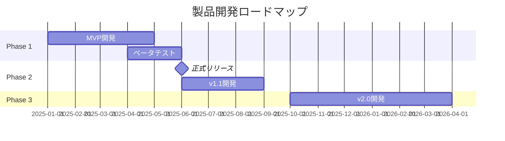
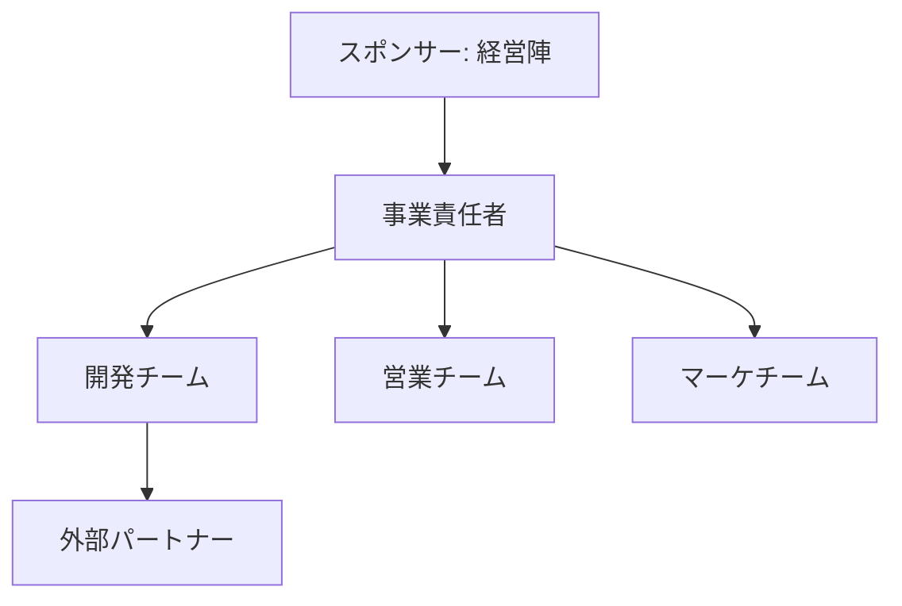

# 新規事業企画書

**事業名:** [事業名]
**提案日:** YYYY年MM月DD日
**提案者:** [提案者名/部署]
**バージョン:** 1.0

---

## エグゼクティブサマリー

### 事業概要

**ワンライナー:** [1文で事業を説明]

**例:** 「中小企業向けに、AIを活用した経理業務自動化サービスを月額制で提供する」

### 市場機会

| 項目 | 内容 |
|------|------|
| 市場規模 | [XXX]億円（[YYYY]年時点） |
| 市場成長率 | 年[X]%成長 |
| ターゲット顧客 | [ターゲット顧客セグメント] |
| 主な競合 | [主要競合名] |

### ビジネスモデル

| 項目 | 内容 |
|------|------|
| 収益モデル | [サブスクリプション/製品販売/etc.] |
| 価格帯 | [価格] |
| 主要コスト | [主要コスト項目] |
| 想定粗利率 | [X]% |

### 財務サマリー（5年計画）

| 項目 | 1年目 | 2年目 | 3年目 | 4年目 | 5年目 |
|------|-------|-------|-------|-------|-------|
| 売上高 | [X]億円 | [X]億円 | [X]億円 | [X]億円 | [X]億円 |
| 営業利益 | [X]億円 | [X]億円 | [X]億円 | [X]億円 | [X]億円 |
| 累積投資額 | [X]億円 | [X]億円 | [X]億円 | [X]億円 | [X]億円 |

### 必要投資と期待リターン

| 項目 | 金額/数値 |
|------|---------|
| 初期投資 | [XX]億円 |
| 累積投資（5年） | [XX]億円 |
| 黒字化時期 | [X]年目 |
| 投資回収期間 | [X]年 |
| 5年目売上 | [XX]億円 |
| IRR | [X]% |

---

## 1. 市場機会分析

### 1.1 市場概況

#### 市場規模と成長

| 年度 | 市場規模 | 成長率 |
|------|---------|--------|
| [YYYY]年 | [XXX]億円 | - |
| [YYYY]年（予測） | [XXX]億円 | [X]% |
| [YYYY]年（予測） | [XXX]億円 | [X]% |

**データソース:** [調査会社名/レポート名]

#### 市場成長のドライバー

1. [ドライバー1: 例）規制緩和による参入障壁低下]
2. [ドライバー2: 例）顧客のデジタル化ニーズ増大]
3. [ドライバー3: 例）人手不足による自動化需要]

### 1.2 顧客分析

#### ターゲット顧客像

**プライマリターゲット:**
| 項目 | 内容 |
|------|------|
| セグメント | [例：従業員50-200名の中小製造業] |
| 業種 | [業種] |
| 地域 | [地域] |
| 推定企業数 | [X]社 |
| 課題意識 | [抱えている主な課題] |

**セカンダリターゲット:**
| 項目 | 内容 |
|------|------|
| セグメント | [セグメント] |
| 推定企業数 | [X]社 |

#### 顧客の課題（Jobs to be Done）

| 課題 | 深刻度 | 現状の対処法 | 不満点 |
|------|--------|-------------|--------|
| [課題1] | 高/中/低 | [現状対処法] | [不満点] |
| [課題2] | 高/中/低 | [現状対処法] | [不満点] |
| [課題3] | 高/中/低 | [現状対処法] | [不満点] |

### 1.3 競合分析

#### 競合マップ

| 競合 | 市場シェア | 強み | 弱み | 価格帯 |
|------|-----------|------|------|--------|
| [競合A] | [X]% | [強み] | [弱み] | [価格] |
| [競合B] | [X]% | [強み] | [弱み] | [価格] |
| [競合C] | [X]% | [強み] | [弱み] | [価格] |

#### 競争ポジショニング

[競合との差別化ポイント、狙うポジションを記述]

---

## 2. ビジネスモデル設計

### 2.1 Business Model Canvas

```
┌─────────────┬─────────────┬─────────────┬─────────────┬─────────────┐
│ Key         │ Key         │ Value       │ Customer    │ Customer    │
│ Partners    │ Activities  │ Propositions│ Relation-   │ Segments    │
│             │             │             │ ships       │             │
│ [パートナー1]│ [活動1]     │             │ [関係性1]   │ [セグメント1]│
│ [パートナー2]│ [活動2]     │ [価値提案]   │ [関係性2]   │ [セグメント2]│
│             │ [活動3]     │             │             │             │
├─────────────┼─────────────┤             ├─────────────┤             │
│ Key         │             │             │ Channels    │             │
│ Resources   │             │             │             │             │
│             │             │             │ [チャネル1]  │             │
│ [リソース1]  │             │             │ [チャネル2]  │             │
│ [リソース2]  │             │             │             │             │
├─────────────┴─────────────┴─────────────┴─────────────┴─────────────┤
│ Cost Structure                          │ Revenue Streams            │
│                                         │                            │
│ [コスト項目1]                            │ [収益源1]                  │
│ [コスト項目2]                            │ [収益源2]                  │
└─────────────────────────────────────────┴────────────────────────────┘
```

### 2.2 価値提案（Value Proposition）

#### 解決する課題

| 顧客の課題 | 提供する解決策 | 顧客ベネフィット |
|-----------|---------------|----------------|
| [課題1] | [解決策1] | [ベネフィット1] |
| [課題2] | [解決策2] | [ベネフィット2] |
| [課題3] | [解決策3] | [ベネフィット3] |

#### 差別化ポイント

**なぜ顧客は当社を選ぶのか:**
1. [差別化ポイント1]
2. [差別化ポイント2]
3. [差別化ポイント3]

### 2.3 収益モデル

#### 価格体系

| プラン | 機能 | 価格 | ターゲット |
|--------|------|------|-----------|
| [プランA] | [機能] | [価格]/月 | [ターゲット] |
| [プランB] | [機能] | [価格]/月 | [ターゲット] |
| [プランC] | [機能] | [価格]/月 | [ターゲット] |

#### ユニットエコノミクス

| 指標 | 値 | 計算根拠 |
|------|-----|---------|
| 顧客獲得コスト（CAC） | [X]万円 | [計算根拠] |
| 顧客生涯価値（LTV） | [X]万円 | [計算根拠] |
| LTV/CAC比率 | [X]倍 | 目標3倍以上 |
| 月次解約率 | [X]% | [計算根拠] |
| 粗利率 | [X]% | [計算根拠] |

---

## 3. Go-to-Market戦略

### 3.1 マーケティング戦略

#### チャネル戦略

| チャネル | 目的 | 投資配分 | 期待効果 |
|---------|------|---------|---------|
| [チャネル1] | [目的] | [X]% | [効果] |
| [チャネル2] | [目的] | [X]% | [効果] |
| [チャネル3] | [目的] | [X]% | [効果] |

#### 顧客獲得戦略

**フェーズ1（立ち上げ期）: [期間]**
- 目標: [顧客数]社獲得
- 主な施策: [施策]
- 予算: [金額]

**フェーズ2（成長期）: [期間]**
- 目標: [顧客数]社獲得
- 主な施策: [施策]
- 予算: [金額]

### 3.2 販売戦略

#### 営業体制

| フェーズ | 営業人員 | 営業モデル | 目標商談数 |
|---------|---------|-----------|-----------|
| 1年目 | [X]名 | [直販/代理店] | [X]件/月 |
| 2年目 | [X]名 | [直販/代理店] | [X]件/月 |
| 3年目 | [X]名 | [直販/代理店] | [X]件/月 |

#### セールスファネル

| ステージ | KPI | 転換率 |
|---------|-----|--------|
| 認知 | [X]件/月 | - |
| リード | [X]件/月 | [X]% |
| 商談 | [X]件/月 | [X]% |
| 提案 | [X]件/月 | [X]% |
| 受注 | [X]件/月 | [X]% |

---

## 4. 製品・サービス開発

### 4.1 製品コンセプト

#### 製品概要
[製品・サービスの概要を記述]

#### 主要機能

| 機能 | 説明 | 優先度 | リリース |
|------|------|--------|---------|
| [機能1] | [説明] | Must | MVP |
| [機能2] | [説明] | Must | MVP |
| [機能3] | [説明] | Should | v1.1 |
| [機能4] | [説明] | Could | v2.0 |

### 4.2 開発ロードマップ



### 4.3 技術要件

#### 技術スタック

| レイヤー | 技術 | 選定理由 |
|---------|------|---------|
| フロントエンド | [技術名] | [理由] |
| バックエンド | [技術名] | [理由] |
| インフラ | [技術名] | [理由] |
| データベース | [技術名] | [理由] |

#### 必要な技術リソース

| 役割 | 人数 | スキル要件 |
|------|------|-----------|
| [役割1] | [X]名 | [スキル] |
| [役割2] | [X]名 | [スキル] |
| [役割3] | [X]名 | [スキル] |

---

## 5. 財務計画

### 5.1 5ヵ年損益計画

| 項目 | 1年目 | 2年目 | 3年目 | 4年目 | 5年目 |
|------|-------|-------|-------|-------|-------|
| **売上高** | [X] | [X] | [X] | [X] | [X] |
| 　売上原価 | [X] | [X] | [X] | [X] | [X] |
| **売上総利益** | [X] | [X] | [X] | [X] | [X] |
| 　人件費 | [X] | [X] | [X] | [X] | [X] |
| 　マーケティング費 | [X] | [X] | [X] | [X] | [X] |
| 　開発費 | [X] | [X] | [X] | [X] | [X] |
| 　その他経費 | [X] | [X] | [X] | [X] | [X] |
| **営業利益** | [X] | [X] | [X] | [X] | [X] |
| **営業利益率** | [X]% | [X]% | [X]% | [X]% | [X]% |

（単位: 百万円）

### 5.2 KPI計画

| KPI | 1年目 | 2年目 | 3年目 | 4年目 | 5年目 |
|-----|-------|-------|-------|-------|-------|
| 顧客数 | [X]社 | [X]社 | [X]社 | [X]社 | [X]社 |
| ARPU | [X]万円 | [X]万円 | [X]万円 | [X]万円 | [X]万円 |
| 月次解約率 | [X]% | [X]% | [X]% | [X]% | [X]% |
| NRR | [X]% | [X]% | [X]% | [X]% | [X]% |

### 5.3 投資計画

| 投資項目 | 1年目 | 2年目 | 3年目 | 合計 |
|---------|-------|-------|-------|------|
| 開発投資 | [X] | [X] | [X] | [X] |
| マーケティング投資 | [X] | [X] | [X] | [X] |
| 設備投資 | [X] | [X] | [X] | [X] |
| 運転資金 | [X] | [X] | [X] | [X] |
| **合計** | **[X]** | **[X]** | **[X]** | **[X]** |

（単位: 百万円）

### 5.4 投資回収分析

| 指標 | 値 |
|------|-----|
| 累積投資額 | [X]億円 |
| 黒字化時期 | [X]年目 [X]月 |
| 投資回収期間 | [X]年 |
| NPV（5年、割引率10%） | [X]億円 |
| IRR | [X]% |

---

## 6. リスク分析

### 6.1 リスク識別

| リスク | 影響度 | 発生確率 | リスクレベル |
|--------|--------|---------|------------|
| 市場リスク: [内容] | 高/中/低 | 高/中/低 | [レベル] |
| 競合リスク: [内容] | 高/中/低 | 高/中/低 | [レベル] |
| 技術リスク: [内容] | 高/中/低 | 高/中/低 | [レベル] |
| 人材リスク: [内容] | 高/中/低 | 高/中/低 | [レベル] |
| 規制リスク: [内容] | 高/中/低 | 高/中/低 | [レベル] |

### 6.2 リスク対応策

| リスク | 対応策 | 担当 |
|--------|--------|------|
| [リスク1] | [対応策] | [担当] |
| [リスク2] | [対応策] | [担当] |
| [リスク3] | [対応策] | [担当] |

### 6.3 撤退基準

| 判断時期 | 撤退基準 | 判断方法 |
|---------|---------|---------|
| [X]年目 | [基準: 例）顧客獲得数が目標の50%未満] | [判断方法] |
| [X]年目 | [基準: 例）累積赤字がX億円超過] | [判断方法] |

---

## 7. 実行計画

### 7.1 マイルストーン

| フェーズ | 時期 | マイルストーン | 成功基準 |
|---------|------|---------------|---------|
| 構想 | [時期] | 事業計画承認 | 経営会議承認 |
| 開発 | [時期] | MVP完成 | 機能テスト合格 |
| 検証 | [時期] | ベータ版リリース | [X]社トライアル |
| 立上げ | [時期] | 正式リリース | [X]社契約 |
| 成長 | [時期] | 黒字化 | 月次黒字達成 |

### 7.2 必要リソース

#### 人員計画

| 役割 | 1年目 | 2年目 | 3年目 |
|------|-------|-------|-------|
| 事業責任者 | 1名 | 1名 | 1名 |
| 開発エンジニア | [X]名 | [X]名 | [X]名 |
| 営業 | [X]名 | [X]名 | [X]名 |
| カスタマーサクセス | [X]名 | [X]名 | [X]名 |
| マーケティング | [X]名 | [X]名 | [X]名 |
| **合計** | **[X]名** | **[X]名** | **[X]名** |

#### 既存リソース活用

| リソース | 活用方法 | 効果 |
|---------|---------|------|
| [既存リソース1] | [活用方法] | [効果] |
| [既存リソース2] | [活用方法] | [効果] |

### 7.3 推進体制



---

## 8. 承認要求

### 8.1 承認事項

| 項目 | 内容 |
|------|------|
| 事業化承認 | 本事業の正式立ち上げ承認 |
| 投資承認 | 初期投資[X]億円の承認 |
| 人員配置 | [X]名の専任チーム組成承認 |

### 8.2 今後のスケジュール

| 日程 | アクション | 担当 |
|------|-----------|------|
| [日付] | 経営会議報告 | [担当] |
| [日付] | 承認決議 | 経営会議 |
| [日付] | チーム組成 | [担当] |
| [日付] | 開発着手 | 開発チーム |

---

## 付録

### A. 顧客インタビュー結果

[顧客インタビューのサマリーを記載]

### B. 競合製品分析

[競合製品の詳細分析を記載]

### C. 財務詳細

[月次の詳細計画などを記載]

---

**作成履歴**

| バージョン | 日付 | 変更内容 | 作成者 |
|-----------|------|---------|--------|
| 1.0 | YYYY/MM/DD | 初版作成 | [作成者] |
