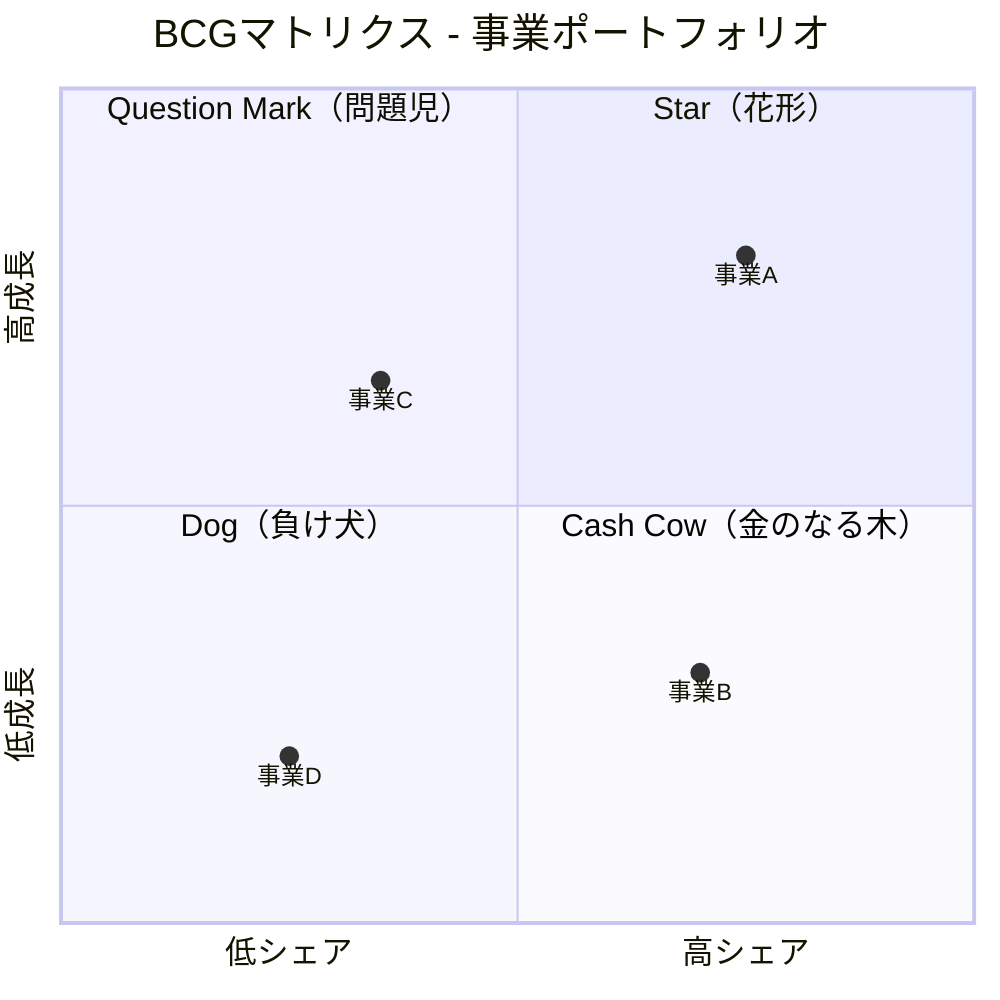

# 事業ポートフォリオ分析レポート

**企業名:** [企業名]
**分析日:** YYYY年MM月DD日
**作成者:** [作成者名]
**バージョン:** 1.0

---

## エグゼクティブサマリー

### 分析概要

本レポートは、[企業名]の事業ポートフォリオを分析し、経営資源の最適配分と成長戦略の方向性を提言するものである。

### 分析対象事業

| No. | 事業名 | 売上高 | 構成比 | 営業利益 |
|-----|--------|--------|--------|---------|
| 1 | [事業A] | [XX]億円 | [X]% | [XX]億円 |
| 2 | [事業B] | [XX]億円 | [X]% | [XX]億円 |
| 3 | [事業C] | [XX]億円 | [X]% | [XX]億円 |
| 4 | [事業D] | [XX]億円 | [X]% | [XX]億円 |
| - | **合計** | **[XXX]億円** | **100%** | **[XX]億円** |

### 分析結果サマリー

| 事業 | BCG象限 | GEスコア | 推奨戦略 | 投資配分 |
|------|---------|---------|---------|---------|
| [事業A] | Star | 4.2 | 積極投資 | [X]% |
| [事業B] | Cash Cow | 3.5 | 維持・収穫 | [X]% |
| [事業C] | Question Mark | 3.0 | 選択的投資 | [X]% |
| [事業D] | Dog | 2.0 | 撤退検討 | [X]% |
| 新規事業 | - | - | 探索 | [X]% |
| **合計** | - | - | - | **100%** |

### 主要提言

1. **[提言1]:** [例）事業Aへの積極投資により、市場リーダーシップを確立]
2. **[提言2]:** [例）事業Bからのキャッシュフローを成長事業へ再配分]
3. **[提言3]:** [例）事業Dの段階的撤退と資源の再配置]

---

## 1. 事業概要

### 1.1 [事業A]

#### 事業プロファイル

| 項目 | 内容 |
|------|------|
| 事業内容 | [事業の概要] |
| 主要製品/サービス | [主要製品・サービス] |
| ターゲット市場 | [ターゲット市場] |
| 主要顧客 | [主要顧客] |
| 主要競合 | [主要競合] |

#### 財務パフォーマンス

| 指標 | 3年前 | 2年前 | 前年 | 当年 | CAGR |
|------|-------|-------|------|------|------|
| 売上高（億円） | [X] | [X] | [X] | [X] | [X]% |
| 営業利益（億円） | [X] | [X] | [X] | [X] | [X]% |
| 営業利益率（%） | [X] | [X] | [X] | [X] | - |

### 1.2 [事業B]

[事業Aと同様の構成で記述]

### 1.3 [事業C]

[事業Aと同様の構成で記述]

### 1.4 [事業D]

[事業Aと同様の構成で記述]

---

## 2. BCGマトリクス分析

### 2.1 市場成長率の算出

| 事業 | 対象市場 | 市場規模（前年） | 市場規模（当年） | 市場成長率 |
|------|---------|----------------|----------------|-----------|
| [事業A] | [市場名] | [XX]億円 | [XX]億円 | [X]% |
| [事業B] | [市場名] | [XX]億円 | [XX]億円 | [X]% |
| [事業C] | [市場名] | [XX]億円 | [XX]億円 | [X]% |
| [事業D] | [市場名] | [XX]億円 | [XX]億円 | [X]% |

**閾値設定:** 市場成長率 [X]%（業界平均成長率）を基準とする

### 2.2 相対市場シェアの算出

| 事業 | 自社シェア | 最大競合 | 競合シェア | 相対シェア |
|------|-----------|---------|-----------|-----------|
| [事業A] | [X]% | [競合名] | [X]% | [X.X] |
| [事業B] | [X]% | [競合名] | [X]% | [X.X] |
| [事業C] | [X]% | [競合名] | [X]% | [X.X] |
| [事業D] | [X]% | [競合名] | [X]% | [X.X] |

**閾値設定:** 相対市場シェア 1.0 を基準とする

### 2.3 BCGマトリクス



**注:** バブルサイズは売上規模を表す

### 2.4 象限別分析

#### Star（花形）: [事業A]

**現状:**
- 市場成長率: [X]%（高成長）
- 相対シェア: [X.X]（リーダーポジション）
- キャッシュフロー: [状況]

**戦略方向性:**
[積極投資によりシェア維持・拡大を図り、将来のCash Cowへ育成]

#### Cash Cow（金のなる木）: [事業B]

**現状:**
- 市場成長率: [X]%（低成長・成熟市場）
- 相対シェア: [X.X]（高シェア維持）
- キャッシュフロー: [安定的なキャッシュ創出]

**戦略方向性:**
[最小限の投資でキャッシュ創出を継続、成長事業への資金供給源]

#### Question Mark（問題児）: [事業C]

**現状:**
- 市場成長率: [X]%（高成長市場）
- 相対シェア: [X.X]（低シェア）
- キャッシュフロー: [投資超過]

**戦略方向性:**
[選択的投資か撤退かの判断が必要。Star化の可能性を評価]

#### Dog（負け犬）: [事業D]

**現状:**
- 市場成長率: [X]%（低成長）
- 相対シェア: [X.X]（低シェア）
- キャッシュフロー: [微小または損失]

**戦略方向性:**
[段階的撤退を検討。残存価値を最大化しながら事業縮小]

---

## 3. GE/McKinseyマトリクス分析

### 3.1 市場魅力度の評価

#### 評価基準

| 評価項目 | 重み | 説明 |
|---------|------|------|
| 市場規模 | 15% | 現在の市場規模 |
| 市場成長率 | 20% | 将来の成長見通し |
| 収益性 | 20% | 業界平均利益率 |
| 競争激しさ | 15% | 競合状況 |
| 技術要件 | 15% | 技術変化の影響 |
| 参入障壁 | 15% | 新規参入の難易度 |

#### 事業別評価

**[事業A] の市場魅力度:**
| 項目 | 重み | スコア(1-5) | 加重スコア |
|------|------|------------|-----------|
| 市場規模 | 15% | [X] | [X.XX] |
| 市場成長率 | 20% | [X] | [X.XX] |
| 収益性 | 20% | [X] | [X.XX] |
| 競争激しさ | 15% | [X] | [X.XX] |
| 技術要件 | 15% | [X] | [X.XX] |
| 参入障壁 | 15% | [X] | [X.XX] |
| **合計** | **100%** | - | **[X.XX]** |

[他の事業も同様に評価]

### 3.2 競争ポジションの評価

#### 評価基準

| 評価項目 | 重み | 説明 |
|---------|------|------|
| 市場シェア | 20% | 現在のシェア水準 |
| シェアトレンド | 10% | シェアの増減傾向 |
| ブランド力 | 15% | ブランド認知・評価 |
| 製品品質 | 15% | 品質競争力 |
| 技術力 | 20% | R&D能力、特許 |
| コスト競争力 | 20% | コスト構造 |

#### 事業別評価

**[事業A] の競争ポジション:**
| 項目 | 重み | スコア(1-5) | 加重スコア |
|------|------|------------|-----------|
| 市場シェア | 20% | [X] | [X.XX] |
| シェアトレンド | 10% | [X] | [X.XX] |
| ブランド力 | 15% | [X] | [X.XX] |
| 製品品質 | 15% | [X] | [X.XX] |
| 技術力 | 20% | [X] | [X.XX] |
| コスト競争力 | 20% | [X] | [X.XX] |
| **合計** | **100%** | - | **[X.XX]** |

[他の事業も同様に評価]

### 3.3 GEマトリクス

#### 評価結果サマリー

| 事業 | 市場魅力度 | 競争ポジション | セル位置 |
|------|-----------|---------------|---------|
| [事業A] | [X.XX] (高) | [X.XX] (強) | 投資・成長 |
| [事業B] | [X.XX] (中) | [X.XX] (強) | 選択的成長 |
| [事業C] | [X.XX] (高) | [X.XX] (弱) | 選択的投資 |
| [事業D] | [X.XX] (低) | [X.XX] (弱) | 撤退 |

#### 9セル戦略マトリクス

```
          │    強い(4-5)   │   中程度(2.5-4) │   弱い(1-2.5)  │
          │  競争ポジション │  競争ポジション  │  競争ポジション │
──────────┼───────────────┼────────────────┼───────────────┤
魅力度    │               │                │               │
高(4-5)   │ [事業A]       │                │ [事業C]       │
          │ ▶投資・成長   │ ▶選択的成長    │ ▶選択的投資   │
──────────┼───────────────┼────────────────┼───────────────┤
魅力度    │               │                │               │
中(2.5-4) │ [事業B]       │                │               │
          │ ▶選択的成長   │ ▶収益重視     │ ▶収穫・撤退   │
──────────┼───────────────┼────────────────┼───────────────┤
魅力度    │               │                │               │
低(1-2.5) │               │                │ [事業D]       │
          │ ▶収益重視     │ ▶収穫・撤退    │ ▶撤退        │
```

---

## 4. Ansoffマトリクス分析

### 4.1 成長方向性の評価

| 事業 | 現在戦略 | 推奨成長方向 | 理由 |
|------|---------|-------------|------|
| [事業A] | [現在] | 製品開発 | [理由] |
| [事業B] | [現在] | 市場浸透 | [理由] |
| [事業C] | [現在] | 市場開発 | [理由] |
| [事業D] | [現在] | 撤退 | [理由] |
| 新規 | - | 多角化 | [理由] |

### 4.2 成長戦略の詳細

#### [事業A]: 製品開発戦略

| 施策 | 内容 | 投資額 | 期待効果 |
|------|------|--------|---------|
| [施策1] | [内容] | [X]億円 | 売上+[X]% |
| [施策2] | [内容] | [X]億円 | 売上+[X]% |

#### [事業B]: 市場浸透戦略

| 施策 | 内容 | 投資額 | 期待効果 |
|------|------|--------|---------|
| [施策1] | [内容] | [X]億円 | シェア+[X]% |
| [施策2] | [内容] | [X]億円 | シェア+[X]% |

---

## 5. 投資配分提言

### 5.1 現状と提言の比較

| 事業 | 現状配分 | 提言配分 | 増減 | 理由 |
|------|---------|---------|------|------|
| [事業A] | [X]% | [X]% | +[X]% | Star育成 |
| [事業B] | [X]% | [X]% | -[X]% | 収穫優先 |
| [事業C] | [X]% | [X]% | ±0% | 選択的継続 |
| [事業D] | [X]% | [X]% | -[X]% | 撤退準備 |
| 新規 | [X]% | [X]% | +[X]% | 将来成長 |
| **合計** | **100%** | **100%** | - | - |

### 5.2 投資金額計画（3ヵ年）

| 事業 | 1年目 | 2年目 | 3年目 | 合計 |
|------|-------|-------|-------|------|
| [事業A] | [XX]億円 | [XX]億円 | [XX]億円 | [XX]億円 |
| [事業B] | [XX]億円 | [XX]億円 | [XX]億円 | [XX]億円 |
| [事業C] | [XX]億円 | [XX]億円 | [XX]億円 | [XX]億円 |
| [事業D] | [XX]億円 | [XX]億円 | [XX]億円 | [XX]億円 |
| 新規 | [XX]億円 | [XX]億円 | [XX]億円 | [XX]億円 |
| **合計** | **[XX]億円** | **[XX]億円** | **[XX]億円** | **[XXX]億円** |

### 5.3 期待効果

| 事業 | 現状売上 | 3年後売上 | 成長率 | 利益貢献 |
|------|---------|---------|--------|---------|
| [事業A] | [XX]億円 | [XX]億円 | [X]% | [XX]億円 |
| [事業B] | [XX]億円 | [XX]億円 | [X]% | [XX]億円 |
| [事業C] | [XX]億円 | [XX]億円 | [X]% | [XX]億円 |
| [事業D] | [XX]億円 | [XX]億円 | [X]% | [XX]億円 |
| 新規 | - | [XX]億円 | - | [XX]億円 |
| **合計** | **[XXX]億円** | **[XXX]億円** | **[X]%** | **[XX]億円** |

---

## 6. リスクと留意事項

### 6.1 主要リスク

| リスク | 対象事業 | 影響度 | 対応策 |
|--------|---------|--------|--------|
| [リスク1] | [事業名] | 高/中/低 | [対応策] |
| [リスク2] | [事業名] | 高/中/低 | [対応策] |
| [リスク3] | [事業名] | 高/中/低 | [対応策] |

### 6.2 分析上の前提条件

| 項目 | 前提条件 |
|------|---------|
| 市場成長率 | [前提条件] |
| 為替レート | [前提条件] |
| 競合動向 | [前提条件] |
| 規制環境 | [前提条件] |

### 6.3 モニタリング指標

| 事業 | KPI | 目標値 | 測定頻度 |
|------|-----|--------|---------|
| [事業A] | 市場シェア | [X]% | 四半期 |
| [事業A] | 売上成長率 | [X]% | 月次 |
| [事業B] | 営業利益率 | [X]% | 月次 |
| [事業C] | 新規顧客数 | [X]社 | 月次 |

---

## 7. アクションプラン

### 7.1 短期アクション（〜6ヶ月）

| No. | アクション | 担当 | 期限 |
|-----|-----------|------|------|
| 1 | [アクション1] | [担当] | [期限] |
| 2 | [アクション2] | [担当] | [期限] |
| 3 | [アクション3] | [担当] | [期限] |

### 7.2 中期アクション（6ヶ月〜1年）

| No. | アクション | 担当 | 期限 |
|-----|-----------|------|------|
| 1 | [アクション1] | [担当] | [期限] |
| 2 | [アクション2] | [担当] | [期限] |
| 3 | [アクション3] | [担当] | [期限] |

### 7.3 次回レビュー

| 項目 | 内容 |
|------|------|
| 次回レビュー日 | [日付] |
| レビュー対象 | [対象範囲] |
| 参加者 | [参加者] |

---

## 付録

### A. データソース

| データ項目 | ソース | 取得日 |
|-----------|--------|--------|
| 市場規模 | [ソース] | [日付] |
| 競合シェア | [ソース] | [日付] |
| 業界動向 | [ソース] | [日付] |

### B. 評価スコアリング基準

[各評価項目のスコアリング基準の詳細を記載]

### C. 分析手法の補足

[BCG/GE/Ansoff各手法の適用方法の詳細を記載]

---

**レビュー履歴**

| バージョン | 日付 | レビューア | コメント |
|-----------|------|-----------|---------|
| 1.0 | YYYY/MM/DD | [レビューア] | 初版作成 |
