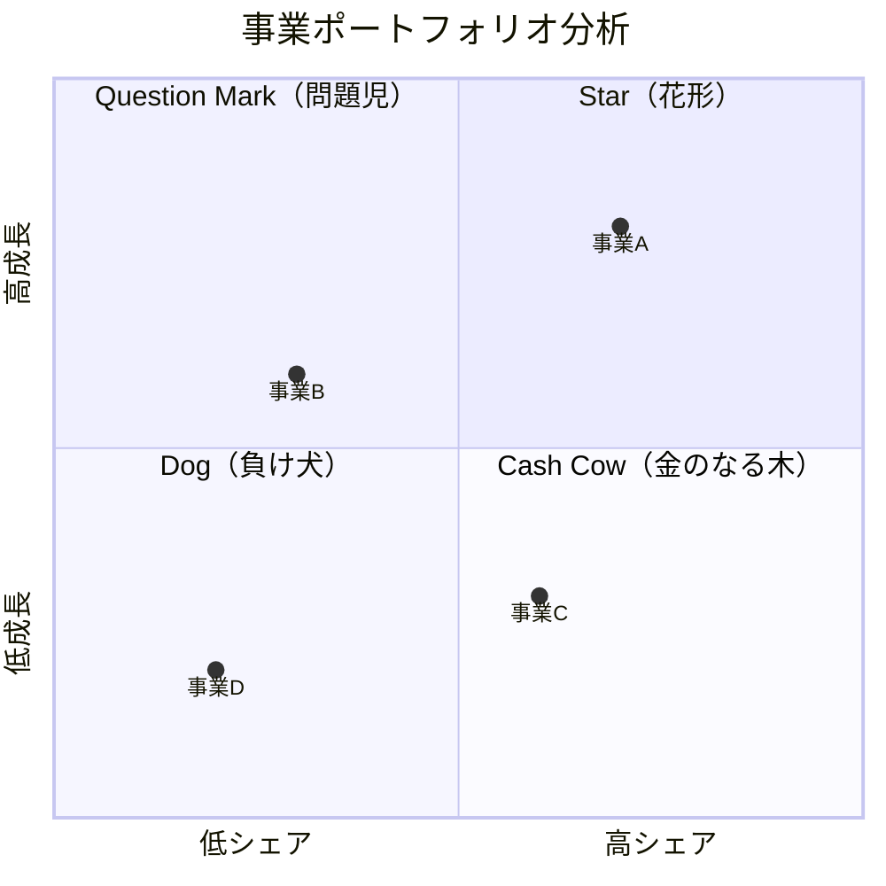
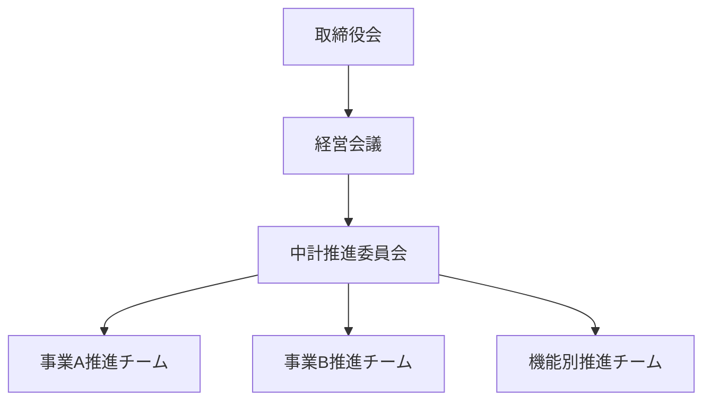

# 中期経営計画書

**企業名:** [企業名]
**計画期間:** [YYYY年度 〜 YYYY年度]（3ヵ年）
**作成日:** YYYY年MM月DD日
**バージョン:** 1.0
**作成者:** [作成者名]
**承認者:** [承認者名]

---

## エグゼクティブサマリー

### 計画の背景と目的

[計画策定の背景と目的を1段落で記述。例: 当社は創業XX年を迎え、既存事業の成熟化と新たな成長機会の模索という転換期にある。本中期経営計画は、変化する事業環境に適応し、持続的な成長を実現するための3ヵ年の道筋を示すものである。]

### ビジョンと戦略方向性

**ビジョン:** [YYYY年までに実現したい姿を1文で記述]

**基本方針:**
1. [方針1: 例）既存事業の収益基盤強化]
2. [方針2: 例）成長領域への戦略投資]
3. [方針3: 例）経営基盤の変革]

### 主要戦略施策

| No. | 戦略施策 | 概要 | 投資額 |
|-----|---------|------|--------|
| 1 | [施策名] | [概要] | [XX億円] |
| 2 | [施策名] | [概要] | [XX億円] |
| 3 | [施策名] | [概要] | [XX億円] |
| 4 | [施策名] | [概要] | [XX億円] |
| 5 | [施策名] | [概要] | [XX億円] |

### 財務目標

| 指標 | 基準年度 | 1年目 | 2年目 | 3年目 | CAGR |
|------|---------|-------|-------|-------|------|
| 売上高 | [XX]億円 | [XX]億円 | [XX]億円 | [XX]億円 | [X]% |
| 営業利益 | [XX]億円 | [XX]億円 | [XX]億円 | [XX]億円 | [X]% |
| 営業利益率 | [X]% | [X]% | [X]% | [X]% | - |
| ROE | [X]% | [X]% | [X]% | [X]% | - |

---

## 1. 経営理念・ビジョン

### 1.1 経営理念（Mission）

[企業の存在意義・使命を記述]

### 1.2 経営ビジョン（Vision）

**2030年ビジョン:**
[長期ビジョンを記述]

**中計期間ビジョン（[YYYY]年）:**
[中期計画期間終了時点の目指す姿を記述]

### 1.3 バリュー（Values）

| バリュー | 説明 |
|---------|------|
| [バリュー1] | [説明] |
| [バリュー2] | [説明] |
| [バリュー3] | [説明] |

---

## 2. 外部環境分析

### 2.1 マクロ環境分析（PEST）

#### Political（政治的要因）

| トレンド | 影響度 | 機会/脅威 | 対応方向性 |
|---------|--------|----------|-----------|
| [トレンド1] | 高/中/低 | O/T | [対応方向性] |
| [トレンド2] | 高/中/低 | O/T | [対応方向性] |
| [トレンド3] | 高/中/低 | O/T | [対応方向性] |

#### Economic（経済的要因）

| トレンド | 影響度 | 機会/脅威 | 対応方向性 |
|---------|--------|----------|-----------|
| [トレンド1] | 高/中/低 | O/T | [対応方向性] |
| [トレンド2] | 高/中/低 | O/T | [対応方向性] |

#### Social（社会的要因）

| トレンド | 影響度 | 機会/脅威 | 対応方向性 |
|---------|--------|----------|-----------|
| [トレンド1] | 高/中/低 | O/T | [対応方向性] |
| [トレンド2] | 高/中/低 | O/T | [対応方向性] |

#### Technological（技術的要因）

| トレンド | 影響度 | 機会/脅威 | 対応方向性 |
|---------|--------|----------|-----------|
| [トレンド1] | 高/中/低 | O/T | [対応方向性] |
| [トレンド2] | 高/中/低 | O/T | [対応方向性] |

### 2.2 業界動向分析

#### 市場規模・成長率

| 市場セグメント | 市場規模 | 成長率 | 将来予測 |
|---------------|---------|--------|---------|
| [セグメント1] | [XX]億円 | [X]% | [予測] |
| [セグメント2] | [XX]億円 | [X]% | [予測] |

#### 業界構造分析（Porter 5F）

| 競争要因 | 評価 | 分析結果 |
|---------|------|---------|
| 業界内競争 | 高/中/低 | [分析結果] |
| 新規参入の脅威 | 高/中/低 | [分析結果] |
| 代替品の脅威 | 高/中/低 | [分析結果] |
| 買い手の交渉力 | 高/中/低 | [分析結果] |
| 売り手の交渉力 | 高/中/低 | [分析結果] |

**業界魅力度:** [X.X / 5.0]

### 2.3 競合分析

| 競合 | 市場シェア | 強み | 弱み | 戦略方向性 |
|------|-----------|------|------|-----------|
| [競合A] | [X]% | [強み] | [弱み] | [戦略] |
| [競合B] | [X]% | [強み] | [弱み] | [戦略] |
| [競合C] | [X]% | [強み] | [弱み] | [戦略] |

---

## 3. 内部環境分析

### 3.1 SWOT分析

```
              │ 強み (S)                 │ 弱み (W)
              │ 1. [強み1]               │ 1. [弱み1]
              │ 2. [強み2]               │ 2. [弱み2]
              │ 3. [強み3]               │ 3. [弱み3]
──────────────┼──────────────────────────┼──────────────────────────
機会 (O)      │ SO戦略                   │ WO戦略
1. [機会1]    │ ・[戦略オプション1]       │ ・[戦略オプション1]
2. [機会2]    │ ・[戦略オプション2]       │ ・[戦略オプション2]
3. [機会3]    │                          │
──────────────┼──────────────────────────┼──────────────────────────
脅威 (T)      │ ST戦略                   │ WT戦略
1. [脅威1]    │ ・[戦略オプション1]       │ ・[戦略オプション1]
2. [脅威2]    │ ・[戦略オプション2]       │ ・[戦略オプション2]
3. [脅威3]    │                          │
```

### 3.2 財務分析

#### 収益性分析

| 指標 | 3年前 | 2年前 | 前年 | 業界平均 | 評価 |
|------|-------|-------|------|---------|------|
| 売上高成長率 | [X]% | [X]% | [X]% | [X]% | [評価] |
| 営業利益率 | [X]% | [X]% | [X]% | [X]% | [評価] |
| ROE | [X]% | [X]% | [X]% | [X]% | [評価] |
| ROA | [X]% | [X]% | [X]% | [X]% | [評価] |

#### 財務健全性

| 指標 | 現状 | 目標水準 | 評価 |
|------|------|---------|------|
| 自己資本比率 | [X]% | [X]% | [評価] |
| D/Eレシオ | [X.X] | [X.X] | [評価] |
| 流動比率 | [X]% | [X]% | [評価] |

---

## 4. 戦略方針

### 4.1 基本戦略

#### 全社戦略

[全社戦略の説明を記述。成長戦略（Ansoff Matrix）、競争戦略（差別化/コストリーダーシップ/集中）の選択根拠を含む]

#### 戦略テーマ

| テーマ | 概要 | 対象事業 |
|--------|------|---------|
| [テーマ1] | [概要] | [対象事業] |
| [テーマ2] | [概要] | [対象事業] |
| [テーマ3] | [概要] | [対象事業] |

### 4.2 事業ポートフォリオ戦略

#### BCGマトリクス分析



#### 投資配分方針

| 事業 | BCG象限 | 現状売上 | 投資方針 | 投資配分 |
|------|---------|---------|---------|---------|
| [事業A] | Star | [XX]億円 | 積極投資 | [X]% |
| [事業B] | Q.Mark | [XX]億円 | 選択的投資 | [X]% |
| [事業C] | Cash Cow | [XX]億円 | 維持 | [X]% |
| [事業D] | Dog | [XX]億円 | 撤退検討 | [X]% |
| 新規 | - | - | 探索 | [X]% |
| **合計** | - | **[XX]億円** | - | **100%** |

---

## 5. 事業別戦略

### 5.1 [事業A名]

#### 事業概要
- **売上高:** [XX]億円（構成比[X]%）
- **営業利益:** [XX]億円（利益率[X]%）
- **市場ポジション:** [シェアXX%、X位]

#### 事業戦略
[事業Aの戦略方向性を記述]

#### 重点施策

| 施策 | 内容 | 目標 | 投資額 |
|------|------|------|--------|
| [施策1] | [内容] | [目標] | [XX]億円 |
| [施策2] | [内容] | [目標] | [XX]億円 |

#### 数値計画

| 指標 | 基準年 | 1年目 | 2年目 | 3年目 |
|------|--------|-------|-------|-------|
| 売上高 | [XX]億円 | [XX]億円 | [XX]億円 | [XX]億円 |
| 営業利益 | [XX]億円 | [XX]億円 | [XX]億円 | [XX]億円 |

### 5.2 [事業B名]

[事業Aと同様の構成で記述]

### 5.3 [事業C名]

[事業Aと同様の構成で記述]

---

## 6. 機能別戦略

### 6.1 人事戦略

#### 人員計画

| 区分 | 基準年 | 1年目 | 2年目 | 3年目 |
|------|--------|-------|-------|-------|
| 正社員 | [X]名 | [X]名 | [X]名 | [X]名 |
| 契約社員 | [X]名 | [X]名 | [X]名 | [X]名 |
| 合計 | [X]名 | [X]名 | [X]名 | [X]名 |

#### 重点施策
1. [施策1: 例）デジタル人材の獲得・育成]
2. [施策2: 例）次世代リーダー育成プログラム]
3. [施策3: 例）働き方改革の推進]

### 6.2 デジタル戦略

#### DX推進方針
[デジタルトランスフォーメーションの方向性を記述]

#### 重点施策
1. [施策1: 例）基幹システムのクラウド移行]
2. [施策2: 例）データ分析基盤の構築]
3. [施策3: 例）顧客接点のデジタル化]

### 6.3 サステナビリティ戦略

#### ESG目標

| 領域 | 指標 | 現状 | 目標（3年目） |
|------|------|------|-------------|
| 環境 (E) | CO2排出量 | [X]t | [X]t（[X]%削減） |
| 社会 (S) | 女性管理職比率 | [X]% | [X]% |
| ガバナンス (G) | 社外取締役比率 | [X]% | [X]% |

---

## 7. 財務計画

### 7.1 損益計画

| 項目 | 基準年度 | 1年目 | 2年目 | 3年目 |
|------|---------|-------|-------|-------|
| 売上高 | [XXX] | [XXX] | [XXX] | [XXX] |
| 売上原価 | [XXX] | [XXX] | [XXX] | [XXX] |
| 売上総利益 | [XXX] | [XXX] | [XXX] | [XXX] |
| 販管費 | [XXX] | [XXX] | [XXX] | [XXX] |
| 営業利益 | [XXX] | [XXX] | [XXX] | [XXX] |
| 経常利益 | [XXX] | [XXX] | [XXX] | [XXX] |
| 当期純利益 | [XXX] | [XXX] | [XXX] | [XXX] |

（単位: 億円）

### 7.2 投資計画

| 投資項目 | 1年目 | 2年目 | 3年目 | 合計 |
|---------|-------|-------|-------|------|
| 設備投資 | [XX] | [XX] | [XX] | [XX] |
| R&D投資 | [XX] | [XX] | [XX] | [XX] |
| M&A・出資 | [XX] | [XX] | [XX] | [XX] |
| IT投資 | [XX] | [XX] | [XX] | [XX] |
| **合計** | **[XX]** | **[XX]** | **[XX]** | **[XX]** |

（単位: 億円）

### 7.3 株主還元方針

| 指標 | 方針 |
|------|------|
| 配当性向 | [X]%を目標 |
| 自己株式取得 | [方針] |
| DOE | [X]%を目安 |

---

## 8. リスク管理

### 8.1 主要リスクと対応策

| リスク | 影響度 | 発生確率 | 対応策 |
|--------|--------|---------|--------|
| [リスク1] | 高/中/低 | 高/中/低 | [対応策] |
| [リスク2] | 高/中/低 | 高/中/低 | [対応策] |
| [リスク3] | 高/中/低 | 高/中/低 | [対応策] |
| [リスク4] | 高/中/低 | 高/中/低 | [対応策] |
| [リスク5] | 高/中/低 | 高/中/低 | [対応策] |

### 8.2 リスクマネジメント体制

[リスク管理体制、モニタリング方法を記述]

---

## 9. 実行体制・ガバナンス

### 9.1 推進体制



### 9.2 進捗管理体制

| 会議体 | 頻度 | 参加者 | 議題 |
|--------|------|--------|------|
| 取締役会 | 月1回 | 取締役 | 中計進捗報告、重要決議 |
| 経営会議 | 週1回 | 役員・事業部長 | 業績確認、課題対応 |
| 中計推進委員会 | 月2回 | 推進責任者 | 施策進捗、課題解決 |

### 9.3 KPIモニタリング

| カテゴリ | KPI | 目標値 | 測定頻度 |
|---------|-----|--------|---------|
| 財務 | 売上高 | [XX]億円 | 月次 |
| 財務 | 営業利益率 | [X]% | 月次 |
| 顧客 | 顧客満足度 | [X]点 | 四半期 |
| プロセス | 生産性 | [X]%向上 | 月次 |
| 人材 | 従業員満足度 | [X]点 | 半期 |

---

## 10. 実行ロードマップ

### 3ヵ年ロードマップ

```mermaid
gantt
    title 中期経営計画ロードマップ
    dateFormat  YYYY-Q
    section 基盤整備
    組織体制構築      :2025-Q1, 2Q
    システム刷新      :2025-Q2, 4Q
    section 成長投資
    新製品開発        :2025-Q3, 4Q
    海外市場参入      :2026-Q1, 6Q
    section 収益改善
    コスト構造改革    :2025-Q1, 8Q
    価格戦略見直し    :2026-Q2, 4Q
    section 新規事業
    事業探索          :2025-Q1, 4Q
    事業立ち上げ      :2026-Q1, 6Q
```

### 主要マイルストーン

| 時期 | マイルストーン | 達成基準 |
|------|---------------|---------|
| 1年目 Q2 | [マイルストーン1] | [達成基準] |
| 1年目 Q4 | [マイルストーン2] | [達成基準] |
| 2年目 Q2 | [マイルストーン3] | [達成基準] |
| 2年目 Q4 | [マイルストーン4] | [達成基準] |
| 3年目 Q4 | [マイルストーン5] | [達成基準] |

---

## 付録

### A. 用語集

| 用語 | 説明 |
|------|------|
| [用語1] | [説明] |
| [用語2] | [説明] |

### B. 前提条件

[計画策定にあたっての前提条件を記述]

### C. 参考資料

[参考にした資料・データソースを記載]

---

## 承認履歴

| バージョン | 日付 | 承認者 | コメント |
|-----------|------|--------|---------|
| 1.0 | YYYY/MM/DD | [承認者名] | 初版承認 |
