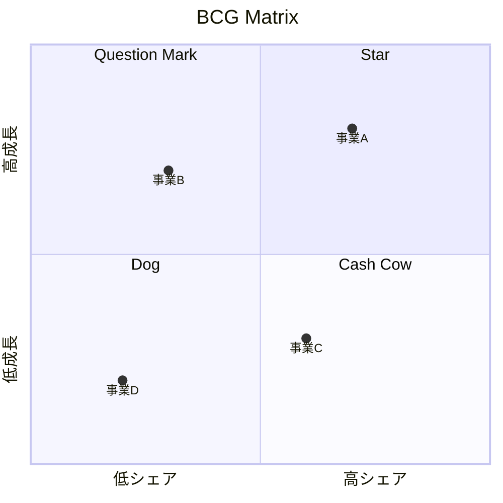

# ポートフォリオ分析フレームワーク詳細ガイド

このドキュメントは、事業ポートフォリオ分析と成長戦略立案のための主要マトリクスの詳細な実施手法を提供します。

---

## 1. BCG Matrix（BCGマトリクス）

### 概要

ボストン・コンサルティング・グループが1970年代に開発した事業ポートフォリオ分析フレームワーク。市場成長率と相対市場シェアの2軸で事業を4象限に分類します。

### 理論的基盤

**前提となる経験曲線効果:**
- 累積生産量が2倍になると、コストが20-30%低下
- 高いシェア → 高い累積生産量 → 低コスト → 高収益

**キャッシュフローの観点:**
- 高成長市場は投資（キャッシュ消費）が必要
- 高シェア事業はキャッシュを生み出す
- ポートフォリオ全体でキャッシュバランスを取る

### マトリクス構造

```
                    市場成長率
                    高 (10%以上)
                        │
           ┌────────────┼────────────┐
           │   Star     │  Question  │
           │   花形     │   Mark     │
           │            │   問題児   │
           │ キャッシュ中立│ キャッシュ消費│
           │ → 成長投資 │ → 選別投資  │
相対市場   ├────────────┼────────────┤  相対市場
シェア 高  │ Cash Cow   │   Dog      │  シェア 低
(1.0以上)  │ 金のなる木 │  負け犬    │  (1.0未満)
           │            │            │
           │ キャッシュ創出│ キャッシュ中立│
           │ → 維持    │ → 撤退検討  │
           └────────────┴────────────┘
                        │
                    市場成長率
                    低 (10%未満)
```

### 各象限の詳細戦略

#### Star（花形事業）

**特徴:**
- 高成長市場で高シェアを持つ
- 将来のCash Cowになる候補
- 成長維持のための投資が必要

**戦略オプション:**
| 戦略 | 内容 | 投資レベル |
|------|------|-----------|
| 成長維持 | シェア維持のための積極投資 | 高 |
| 選択的投資 | 収益性の高いセグメントに集中 | 中〜高 |
| 収穫準備 | 成長鈍化に備えたコスト最適化 | 中 |

**KPI:**
- 市場シェア維持・拡大率
- 売上成長率
- 投資対効果（ROIC）

#### Question Mark（問題児）

**特徴:**
- 高成長市場だがシェアが低い
- 将来性は不確実
- 大きな投資か撤退かの判断が必要

**戦略オプション:**
| 戦略 | 内容 | 条件 |
|------|------|------|
| 積極投資 | シェア獲得への集中投資 | 勝てる見込みがある |
| 選択的投資 | ニッチポジション確立 | 全体シェアは難しいがニッチは可能 |
| 撤退 | 事業売却・縮小 | 勝ち目がない |

**判断基準:**
1. Star化の可能性（競争優位構築可能性）
2. 必要投資額と自社資金力
3. 競合の動向と参入障壁
4. 全社戦略との整合性

**評価マトリクス:**
| 評価項目 | 重み | スコア(1-5) |
|---------|------|------------|
| 市場魅力度 | 25% | |
| 競争優位構築可能性 | 25% | |
| シナジー | 20% | |
| 投資対効果 | 20% | |
| リスク | 10% | |

#### Cash Cow（金のなる木）

**特徴:**
- 成熟市場で高シェアを持つ
- 安定したキャッシュ創出
- 低い追加投資で高収益

**戦略オプション:**
| 戦略 | 内容 | キャッシュ配分 |
|------|------|---------------|
| 維持 | 現状ポジション維持 | 他事業への配分 |
| 効率化 | コスト削減でマージン向上 | より多くを他事業へ |
| 延命 | 製品改良で市場延命 | 一部を当該事業へ |

**KPI:**
- 営業利益率
- フリーキャッシュフロー
- 市場シェア維持率

#### Dog（負け犬）

**特徴:**
- 低成長市場で低シェア
- 利益貢献が低いまたはマイナス
- 経営資源の非効率な配分

**戦略オプション:**
| 戦略 | 内容 | 判断基準 |
|------|------|---------|
| 収穫 | 投資を抑えてキャッシュ回収 | 短期的利益創出可能 |
| 売却 | 事業譲渡・MBO | 買い手がいる |
| 清算 | 事業終了 | 継続価値なし |
| ターンアラウンド | 再建への投資 | 回復可能性あり（稀） |

**撤退判断のフレームワーク:**
1. 撤退障壁の評価（契約、資産、人員）
2. 撤退コストの算定
3. 事業継続コストとの比較
4. 戦略的価値の再評価

### BCGマトリクスの作成手順

#### Step 1: 事業単位の定義

**SBU（Strategic Business Unit）の定義基準:**
- 独自の顧客・競合を持つ
- 独立した戦略立案が可能
- 業績測定が可能

#### Step 2: 市場成長率の算出

**計算方法:**
```
市場成長率 = (今年の市場規模 - 前年の市場規模) / 前年の市場規模 × 100
```

**データソース:**
- 業界団体統計
- 調査会社レポート
- 政府統計

**注意点:**
- 実質成長率（インフレ調整後）を使用
- 予測成長率も考慮
- 市場定義を明確に

#### Step 3: 相対市場シェアの算出

**計算方法:**
```
相対市場シェア = 自社シェア / 最大競合シェア
```

**例:**
| 企業 | シェア | 相対シェア（自社基準） |
|------|--------|----------------------|
| 自社 | 30% | 30/25 = 1.2 |
| 競合A | 25% | - |
| 競合B | 20% | - |
| その他 | 25% | - |

**閾値:**
- 1.0以上: 高シェア（リーダーポジション）
- 1.0未満: 低シェア

#### Step 4: プロット

**バブルチャートでの表現:**
- X軸: 相対市場シェア（対数スケール）
- Y軸: 市場成長率
- バブルサイズ: 売上規模



### BCGマトリクスの限界と注意点

| 限界 | 説明 | 対応策 |
|------|------|--------|
| 2軸の単純化 | 市場魅力度・競争力は多面的 | GE Matrixで補完 |
| 経験曲線前提 | すべての業界に当てはまらない | 業界特性を考慮 |
| 静的分析 | 時間軸の動きを捉えない | 複数年の推移を見る |
| 相互作用無視 | 事業間シナジーを考慮しない | シナジー分析を別途実施 |

---

## 2. GE/McKinsey Matrix（GEマッキンゼーマトリクス）

### 概要

GEとマッキンゼーが共同開発した、より詳細な事業ポートフォリオ分析フレームワーク。BCGの2軸を多面的に評価する9セルマトリクスです。

### BCGとの違い

| 観点 | BCG | GE/McKinsey |
|------|-----|-------------|
| 軸の数 | 2軸（各1指標） | 2軸（各複数指標） |
| セル数 | 4 | 9 |
| 評価方法 | 定量的 | 定量+定性 |
| 適用範囲 | 製造業中心 | 全業種 |

### マトリクス構造

```
              事業の競争ポジション
              強い        中程度       弱い
         ┌──────────┬──────────┬──────────┐
    高   │ 投資・成長│ 選択的成長 │ 選択的投資│
         │          │          │/再建     │
魅  ─────┼──────────┼──────────┼──────────┤
力   中  │ 選択的成長│ 収益重視  │ 収穫・撤退│
度       │          │/維持     │          │
    ─────┼──────────┼──────────┼──────────┤
    低   │ 収益重視 │ 収穫・撤退│  撤退    │
         │/維持     │          │          │
         └──────────┴──────────┴──────────┘
```

### 9セル戦略指針

#### 投資・成長（Invest/Grow）
- 魅力度: 高、競争力: 強
- **戦略**: 積極投資で市場リーダーシップ維持・強化
- **投資配分**: 高優先

#### 選択的成長（Selective Growth）
- 魅力度: 高-中、競争力: 中-強
- **戦略**: 強みのある領域に選択的投資
- **投資配分**: 中〜高

#### 選択的投資/再建（Selectivity/Earnings）
- 魅力度: 高、競争力: 弱
- **戦略**: 改善可能性を評価、投資か撤退か判断
- **投資配分**: 条件付き

#### 収益重視/維持（Earnings/Protect）
- 魅力度: 中-低、競争力: 強
- **戦略**: 追加投資を抑え、収益最大化
- **投資配分**: 低（維持レベル）

#### 収穫/撤退（Harvest/Divest）
- 魅力度: 中-低、競争力: 中-弱
- **戦略**: キャッシュ回収、段階的撤退
- **投資配分**: 最小限

#### 撤退（Divest）
- 魅力度: 低、競争力: 弱
- **戦略**: 売却または清算
- **投資配分**: なし

### 評価指標の設定

#### 市場魅力度の評価項目

| 評価項目 | 重み | 説明 |
|---------|------|------|
| 市場規模 | 15% | 現在の市場規模（金額・数量） |
| 市場成長率 | 20% | 過去・将来の成長率 |
| 市場収益性 | 20% | 業界平均利益率 |
| 競争激しさ | 15% | 競合数、競争のタイプ |
| 技術要件 | 10% | 技術変化のスピード |
| 参入障壁 | 10% | 新規参入の難易度 |
| 環境影響 | 10% | 規制、社会的影響 |

**スコアリング基準（例: 市場成長率）:**
| スコア | 基準 |
|--------|------|
| 5 | 15%以上 |
| 4 | 10-15% |
| 3 | 5-10% |
| 2 | 0-5% |
| 1 | マイナス成長 |

#### 競争ポジションの評価項目

| 評価項目 | 重み | 説明 |
|---------|------|------|
| 市場シェア | 20% | 現在のシェアと推移 |
| シェアトレンド | 10% | シェアの増減傾向 |
| ブランド力 | 15% | ブランド認知・評価 |
| 製品品質 | 15% | 品質競争力 |
| 技術力 | 15% | R&D能力、特許 |
| コスト競争力 | 15% | コスト構造の優位性 |
| マネジメント力 | 10% | 経営チームの能力 |

### 評価プロセス

#### Step 1: 評価項目と重みの設定

業界・自社の状況に応じて評価項目と重みをカスタマイズ

#### Step 2: 各事業のスコアリング

**評価ワークシート:**
```
事業名: ○○○○
日付: YYYY-MM-DD
評価者: ○○○○

【市場魅力度】
項目          重み    スコア(1-5)    加重スコア
市場規模      15%     ___           ___
市場成長率    20%     ___           ___
...
合計          100%                  ___

【競争ポジション】
項目          重み    スコア(1-5)    加重スコア
市場シェア    20%     ___           ___
ブランド力    15%     ___           ___
...
合計          100%                  ___
```

#### Step 3: マトリクスへのプロット

**座標の計算:**
- 横軸（競争ポジション）: 1.0-2.33 = 弱, 2.34-3.66 = 中, 3.67-5.0 = 強
- 縦軸（市場魅力度）: 1.0-2.33 = 低, 2.34-3.66 = 中, 3.67-5.0 = 高

#### Step 4: 戦略的示唆の導出

各事業の位置に基づいて戦略方向性を決定

### GE Matrixの活用ポイント

**複数年分析:**
- 現在位置だけでなく、過去からの軌跡を確認
- 将来の位置を予測

**感度分析:**
- 重み付けを変えた場合の結果確認
- 不確実性の高い項目の影響評価

**シナリオ分析:**
- 楽観/中立/悲観シナリオでの位置変化

---

## 3. Ansoff Matrix（アンゾフマトリクス）

### 概要

イゴール・アンゾフが1957年に提唱した成長戦略のフレームワーク。製品と市場の2軸で4つの成長方向を示します。

### マトリクス構造

```
                      製品
              既存製品        新規製品
         ┌──────────────┬──────────────┐
    既存  │  市場浸透    │  製品開発    │
    市場  │  Market      │  Product     │
         │  Penetration │  Development │
         │              │              │
市        │ リスク: 低   │ リスク: 中   │
場        │ ROI: 安定   │ ROI: 中      │
         ├──────────────┼──────────────┤
    新規  │  市場開発    │  多角化      │
    市場  │  Market      │ Diversifi-   │
         │  Development │  cation      │
         │              │              │
         │ リスク: 中   │ リスク: 高   │
         │ ROI: 中      │ ROI: 高/低   │
         └──────────────┴──────────────┘
```

### 各戦略の詳細

#### 市場浸透（Market Penetration）

**定義:** 既存製品を既存市場でより多く売る

**主な施策:**
| 施策カテゴリ | 具体策 |
|-------------|--------|
| 利用頻度向上 | 使用量増加提案、クロスセル |
| 競合からの獲得 | 価格競争、プロモーション強化 |
| 非顧客の転換 | 認知向上、トライアル促進 |
| 販売力強化 | 販路拡大、営業体制強化 |

**成功要因:**
- 市場にまだ成長余地がある
- 競合からシェアを奪える
- 生産・供給能力に余裕がある

**リスク:**
- 低（最もリスクが低い成長戦略）
- ただし、成熟市場では限界がある

#### 市場開発（Market Development）

**定義:** 既存製品を新しい市場に展開する

**主な施策:**
| 施策カテゴリ | 具体策 |
|-------------|--------|
| 地理的拡大 | 新地域進出、海外展開 |
| 新セグメント | 異なる年齢層、業種への展開 |
| 新チャネル | EC、直販、新規代理店 |
| 新用途開発 | 既存製品の新しい使い方提案 |

**成功要因:**
- 製品が新市場のニーズに適合
- 新市場への参入障壁が低い
- 現地パートナーの確保

**リスク:**
- 中（市場理解の不足リスク）
- 文化・規制の違いへの対応必要

#### 製品開発（Product Development）

**定義:** 既存市場に新製品を投入する

**主な施策:**
| 施策カテゴリ | 具体策 |
|-------------|--------|
| 製品改良 | 機能追加、品質向上 |
| 製品ライン拡張 | バリエーション追加 |
| 新世代製品 | 次世代モデル開発 |
| 関連製品開発 | 周辺製品、アクセサリー |

**成功要因:**
- 強いR&D能力
- 顧客ニーズの深い理解
- 既存の顧客基盤・チャネル活用

**リスク:**
- 中（開発失敗リスク、カニバリゼーション）
- 開発投資の回収不確実性

#### 多角化（Diversification）

**定義:** 新製品を新市場に展開する

**多角化の類型:**

| 類型 | 説明 | 例 |
|------|------|-----|
| 関連多角化（水平） | 類似技術・市場への拡張 | 自動車→二輪車 |
| 関連多角化（垂直） | バリューチェーン上下への統合 | メーカー→小売 |
| 非関連多角化 | 全く異なる事業への参入 | 鉄道→不動産 |

**主な施策:**
| 手法 | 説明 | 時間 | リスク |
|------|------|------|--------|
| 内部開発 | 自社でゼロから開発 | 長い | 中 |
| M&A | 既存企業の買収 | 短い | 高 |
| JV/提携 | パートナーとの共同事業 | 中 | 中 |

**成功要因:**
- 明確な戦略的根拠（シナジー、成長限界打破）
- 十分なリソース（資金、人材）
- 事業運営能力の獲得

**リスク:**
- 高（最もリスクの高い成長戦略）
- 既存事業とのシナジーが鍵

### 戦略選択のフレームワーク

#### 選択の判断基準

```
                        市場の成長性
                    高            低
              ┌──────────────┬──────────────┐
    市場での   │ 製品開発     │ 市場浸透     │
    ポジション │ または       │ （シェア拡大）│
    強い      │ 市場開発     │              │
              ├──────────────┼──────────────┤
    市場での   │ 多角化       │ 市場開発     │
    ポジション │ （成長機会   │ または       │
    弱い      │   を探す）   │ 撤退検討     │
              └──────────────┴──────────────┘
```

#### リスク・リターン評価

| 戦略 | リスク | 期待リターン | 成功確率 | 必要投資 |
|------|--------|-------------|---------|---------|
| 市場浸透 | 低 | 低〜中 | 高（50%+） | 低 |
| 市場開発 | 中 | 中 | 中（35%） | 中 |
| 製品開発 | 中 | 中〜高 | 中（35%） | 中〜高 |
| 多角化 | 高 | 高 | 低（25%以下） | 高 |

### 成長戦略の組み合わせ

**段階的アプローチ:**
```
Phase 1: 市場浸透で基盤強化
    ↓
Phase 2: 製品開発 or 市場開発で拡張
    ↓
Phase 3: 多角化で新たな成長エンジン構築
```

**ポートフォリオバランス:**
- 短期収益: 市場浸透（70%）
- 中期成長: 製品開発・市場開発（20%）
- 長期成長: 多角化（10%）

---

## 4. ポートフォリオ分析の統合アプローチ

### BCG + GE + Ansoffの統合フレームワーク

```
現状分析                戦略方向性              成長戦略
┌─────────────┐       ┌─────────────┐       ┌─────────────┐
│  BCG Matrix │──────▶│ 投資/撤退   │──────▶│   Ansoff    │
│             │       │   判断      │       │  Matrix     │
└─────────────┘       └─────────────┘       └─────────────┘
       │                     │                     │
       ▼                     ▼                     ▼
┌─────────────┐       ┌─────────────┐       ┌─────────────┐
│  GE Matrix  │──────▶│ 詳細評価    │──────▶│ 具体施策    │
│             │       │   実施      │       │   立案      │
└─────────────┘       └─────────────┘       └─────────────┘
```

### 統合分析ワークシート

```
┌──────────────────────────────────────────────────────────────────────┐
│                 ポートフォリオ統合分析ワークシート                    │
├──────────┬────────┬─────────┬────────────┬──────────┬───────────────┤
│ 事業名   │ BCG    │ GEスコア │ 推奨戦略   │ 成長方向  │ 投資配分     │
│          │ 象限   │ 魅力/競争│            │ (Ansoff) │              │
├──────────┼────────┼─────────┼────────────┼──────────┼───────────────┤
│ 事業A    │ Star   │ 4.2/4.0 │ 投資・成長 │ 製品開発  │ 40%          │
├──────────┼────────┼─────────┼────────────┼──────────┼───────────────┤
│ 事業B    │ CashCow│ 3.0/4.5 │ 維持・収穫 │ 市場浸透  │ 25%          │
├──────────┼────────┼─────────┼────────────┼──────────┼───────────────┤
│ 事業C    │ QMark  │ 3.8/2.5 │ 選択的投資 │ 市場開発  │ 20%          │
├──────────┼────────┼─────────┼────────────┼──────────┼───────────────┤
│ 事業D    │ Dog    │ 2.0/2.0 │ 撤退検討   │ -        │ 5%           │
├──────────┼────────┼─────────┼────────────┼──────────┼───────────────┤
│ 新規事業 │ -      │ 4.5/1.0 │ 探索       │ 多角化    │ 10%          │
└──────────┴────────┴─────────┴────────────┴──────────┴───────────────┘
```

### 分析品質チェックリスト

- [ ] BCG: 市場成長率の定義と計算は適切か
- [ ] BCG: 相対シェアの最大競合は正しく特定されているか
- [ ] GE: 評価項目と重みは業界特性を反映しているか
- [ ] GE: スコアリングは客観的なデータに基づいているか
- [ ] Ansoff: 各戦略のリスク評価は現実的か
- [ ] 統合: 3つのフレームワークの結論は整合しているか
- [ ] 全体: 投資配分の合計は100%になっているか
- [ ] 全体: 財務的制約（投資可能額）を考慮しているか
