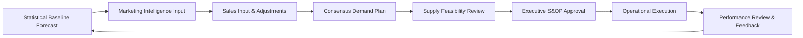

# Supply Chain Consultant（サプライチェーンコンサルティング)

## Overview

This skill provides professional supply chain management consulting services, covering demand forecasting, inventory optimization, procurement strategy, logistics network design, and Sales & Operations Planning (S&OP). Helps organizations improve supply chain efficiency, reduce costs, and increase customer service levels.

**Primary language**: Japanese (default), English supported
**Frameworks**: SCOR (Supply Chain Operations Reference), S&OP best practices, Lean Supply Chain, Theory of Constraints
**Output format**: Supply chain analysis reports, optimization recommendations, S&OP plans, network design proposals

Use this skill when:
- Optimizing inventory levels and reducing carrying costs
- Improving demand forecasting accuracy
- Designing or redesigning logistics networks
- Developing procurement strategies
- Implementing or improving S&OP processes
- Conducting supply chain risk assessments
- Reducing supply chain costs while maintaining service levels

---

## Core Framework: SCOR Model

### SCOR (Supply Chain Operations Reference Model)

Developed by APICS (Association for Supply Chain Management), SCOR is the global standard for supply chain process modeling.

**SCOR Structure**:
```
Level 1: Process Types
├── Plan: Demand/Supply planning, S&OP
├── Source: Procurement, supplier management
├── Make: Manufacturing, production planning
├── Deliver: Order fulfillment, logistics, warehousing
├── Return: Returns management, reverse logistics
└── Enable: Support processes (IT, finance, HR, quality)

Level 2: Process Categories (30 categories across 6 process types)
Level 3: Process Elements (Detailed activities)
Level 4: Implementation (Company-specific practices)
```

**SCOR Performance Attributes**:
1. **Reliability**: Ability to perform tasks as expected (On-Time Delivery, Perfect Order %)
2. **Responsiveness**: Speed of performing tasks (Order Fulfillment Lead Time, Supply Chain Cycle Time)
3. **Agility**: Ability to respond to marketplace changes (Upside flexibility, Downside adaptability)
4. **Cost**: Cost of operating supply chain (Total Supply Chain Cost, Cost of Goods Sold)
5. **Assets**: Efficiency in utilizing assets (Cash-to-Cash Cycle Time, Inventory Days of Supply)

---

## Core Workflows

### Workflow 1: Demand Forecasting Optimization

**Purpose**: Improve demand forecast accuracy to reduce stockouts and excess inventory.

#### Step 1: Current State Analysis

**Assess Current Forecasting Approach**:

1. **Forecasting Method Review**:
   - Current method: Qualitative (judgment-based), Time Series, Causal, Simulation?
   - Forecasting horizon: Short-term (0-3 months), Medium-term (3-12 months), Long-term (1+ years)
   - Forecast frequency: Weekly, monthly, quarterly?
   - Who owns forecasting? Sales, Marketing, Supply Chain, Cross-functional?

2. **Forecast Accuracy Measurement**:
   ```
   Common Metrics:

   MAPE (Mean Absolute Percentage Error):
   MAPE = (1/n) × Σ|Actual - Forecast| / Actual × 100%
   → Target: <20% for stable products, <30% for volatile products

   Bias (Forecast Error):
   Bias = Σ(Forecast - Actual) / n
   → Target: Close to 0 (indicates no systematic over/under forecasting)

   Tracking Signal:
   TS = Running Sum of Forecast Errors / MAD (Mean Absolute Deviation)
   → Target: -4 to +4 (outside range indicates bias)
   ```

3. **Product Segmentation (ABC-XYZ Analysis)**:
   ```
   ABC Analysis (by Revenue/Volume):
   - A items: Top 20% of SKUs → 80% of revenue (High priority)
   - B items: Next 30% of SKUs → 15% of revenue (Medium priority)
   - C items: Bottom 50% of SKUs → 5% of revenue (Low priority, consider discontinuation)

   XYZ Analysis (by Demand Variability):
   - X items: Stable demand (CV < 0.5) → Easy to forecast
   - Y items: Moderate variability (CV 0.5-1.0) → Requires attention
   - Z items: Highly variable (CV > 1.0) → Difficult to forecast, consider make-to-order

   CV (Coefficient of Variation) = Std Dev of Demand / Mean Demand
   ```

**Segmentation Matrix**:
```markdown
|        | X (Stable) | Y (Moderate) | Z (Variable) |
|--------|------------|--------------|--------------|
| A (High Value) | AX: Statistical forecasting | AY: Collaborative planning | AZ: Demand sensing, buffer stock |
| B (Medium Value) | BX: Simple time series | BY: Statistical + judgment | BZ: Safety stock strategy |
| C (Low Value) | CX: Replenishment rules | CY: Min/Max inventory | CZ: Make-to-order or discontinue |
```

#### Step 2: Forecasting Method Selection

**Forecasting Techniques by Product Type**:

**1. Time Series Methods** (for stable, historical patterns):

- **Moving Average**: Simple, equal weight to recent periods
  ```
  Forecast = (D₁ + D₂ + ... + Dₙ) / n
  Use case: Stable demand with no trend
  ```

- **Exponential Smoothing**: Recent data weighted more heavily
  ```
  Forecast_t+1 = α × Actual_t + (1-α) × Forecast_t
  α (smoothing constant): 0.1-0.3 for stable, 0.4-0.6 for responsive
  Use case: Stable demand, quick response to changes
  ```

- **Holt-Winters (Triple Exponential Smoothing)**: Captures trend and seasonality
  ```
  Use case: Seasonal products with trend (e.g., winter apparel, holiday items)
  ```

**2. Causal Methods** (for products influenced by external factors):

- **Regression Analysis**: Forecast based on causal variables
  ```
  Sales = f(Price, Promotion, GDP, Weather, Competitor Price, etc.)
  Use case: Products with known drivers (promotions, pricing, economic indicators)
  ```

**3. Collaborative Methods** (for new products or strategic items):

- **Consensus Forecasting**: Sales, Marketing, Finance input combined
- **Delphi Method**: Expert panel iterative forecasting
- **Use case**: New product launches, high-value strategic items

**4. Advanced Methods** (for complex patterns):

- **Machine Learning (ARIMA, LSTM, Random Forest)**: For large datasets with complex patterns
- **Demand Sensing**: Real-time data (POS, social media, weather) to adjust short-term forecast
- **Use case**: High SKU count, omnichannel retail, fast-moving consumer goods

#### Step 3: Forecast Process Design

**S&OP-Integrated Forecasting Process**:



**Roles and Responsibilities**:
```markdown
| Role | Responsibility | Frequency |
|------|----------------|-----------|
| Demand Planner | Generate statistical baseline forecast | Weekly |
| Marketing | Provide promotional plans, new product launches | Monthly |
| Sales | Validate forecast, provide market intelligence | Monthly |
| Supply Chain | Assess supply feasibility, capacity constraints | Monthly |
| Finance | Validate revenue projections | Monthly |
| Executive Team | Approve final demand/supply plan | Monthly (S&OP) |
```

#### Step 4: Forecast Performance Monitoring

**KPI Dashboard**:
```markdown
# Demand Forecast Performance Dashboard

## Overall Accuracy
- **MAPE (This Month)**: 18.2% ✓ (Target: <20%)
- **MAPE (Rolling 12 Months)**: 19.5% ✓
- **Bias**: +2.3% (Slight over-forecasting)

## By Product Category
| Category | MAPE | Bias | Tracking Signal | Status |
|----------|------|------|-----------------|--------|
| Category A | 15.1% | -1.2% | +1.5 | ✓ Good |
| Category B | 22.4% | +5.8% | +3.2 | ⚠ Review (Over-forecasting) |
| Category C | 31.2% | -8.1% | -4.5 | ❌ Action Required |

## Forecast Value Add (FVA)
FVA = (Baseline Forecast Error - Adjusted Forecast Error) / Baseline Forecast Error

- **Sales Adjustments FVA**: -5% (Sales adjustments making forecast worse)
- **Marketing Adjustments FVA**: +8% (Marketing input improving forecast)
→ **Action**: Coach sales team on forecast adjustment discipline

## Stockout vs. Excess Inventory
- **Stockouts due to forecast error**: 12 incidents (down from 18 last month)
- **Excess inventory due to over-forecast**: $450K (target: <$300K)
```

---

### Workflow 2: Inventory Optimization

**Purpose**: Determine optimal inventory levels to balance cost and service level.

#### Step 1: Current Inventory Analysis

**Key Inventory Metrics**:

1. **Inventory Turnover Ratio**:
   ```
   Inventory Turnover = Cost of Goods Sold (annual) / Average Inventory Value

   Benchmark:
   - Retail: 5-10x (higher for grocery, lower for luxury)
   - Manufacturing: 4-8x
   - High-tech: 8-15x

   Low turnover → Excess inventory, obsolescence risk
   High turnover → Efficient, but risk of stockouts
   ```

2. **Days of Inventory (DOI)**:
   ```
   DOI = (Average Inventory / COGS) × 365

   Example: If inventory turnover = 6x → DOI = 365/6 = 61 days
   ```

3. **Inventory Carrying Cost**:
   ```
   Annual Carrying Cost = Average Inventory Value × Carrying Cost %

   Carrying Cost % typically includes:
   - Cost of capital (8-12%)
   - Storage cost (2-4%)
   - Insurance (1-3%)
   - Obsolescence/shrinkage (2-5%)
   → Total: 15-25% of inventory value

   Example: $5M average inventory × 20% = $1M annual carrying cost
   ```

4. **Service Level Achievement**:
   ```
   Fill Rate = Orders Fulfilled Completely / Total Orders × 100%
   Target: 95-99% depending on industry

   Stockout Frequency = Number of Stockout Days / Total Days
   ```

**Inventory Health Assessment**:
```markdown
| Category | Current Inventory | DOI | Turnover | Excess (>90 days) | Obsolete (>180 days) | Status |
|----------|-------------------|-----|----------|-------------------|----------------------|--------|
| Raw Materials | $2.5M | 45 days | 8.1x | $180K | $45K | ✓ Healthy |
| WIP | $800K | 12 days | 30.4x | $0 | $0 | ✓ Healthy |
| Finished Goods | $3.2M | 58 days | 6.3x | $680K | $125K | ⚠ Excess |
| **Total** | **$6.5M** | **52 days** | **7.0x** | **$860K** | **$170K** | **⚠ Action Required** |
```

#### Step 2: Safety Stock Calculation

**Safety Stock Formula** (for normally distributed demand):
```
SS = Z × σ_LT

Where:
- Z = Service level factor (Z-score)
  95% service level → Z = 1.65
  97.5% service level → Z = 1.96
  99% service level → Z = 2.33

- σ_LT = Standard deviation of demand during lead time
  σ_LT = √(LT × σ_D² + D_avg² × σ_LT²)

  Where:
  - LT = Lead time (in days)
  - σ_D = Standard deviation of daily demand
  - D_avg = Average daily demand
  - σ_LT = Standard deviation of lead time
```

**Example Calculation**:
```
Product: Widget A
- Average daily demand: 100 units
- Std dev of daily demand: 20 units
- Average lead time: 14 days
- Std dev of lead time: 3 days
- Target service level: 97.5% (Z = 1.96)

Step 1: Calculate σ_LT
σ_LT = √(14 × 20² + 100² × 3²)
σ_LT = √(14 × 400 + 10,000 × 9)
σ_LT = √(5,600 + 90,000)
σ_LT = √95,600
σ_LT = 309 units

Step 2: Calculate Safety Stock
SS = 1.96 × 309 = 605 units

Step 3: Reorder Point
ROP = (Average Daily Demand × Lead Time) + Safety Stock
ROP = (100 × 14) + 605 = 2,005 units

Interpretation:
- When inventory reaches 2,005 units → Place replenishment order
- Safety stock of 605 units provides 97.5% service level
```

#### Step 3: Economic Order Quantity (EOQ)

**EOQ Formula** (optimal order quantity to minimize total cost):
```
EOQ = √(2 × D × S / H)

Where:
- D = Annual demand (units)
- S = Order cost per order ($)
- H = Holding cost per unit per year ($)

Total Cost = (D/Q × S) + (Q/2 × H)
Where Q = Order quantity
```

**Example**:
```
Product: Widget A
- Annual demand: 36,000 units
- Order cost: $150 per order
- Unit cost: $50
- Holding cost: 20% of unit cost = $10 per unit per year

EOQ = √(2 × 36,000 × 150 / 10)
EOQ = √(10,800,000 / 10)
EOQ = √1,080,000
EOQ = 1,039 units

Number of orders per year = 36,000 / 1,039 = 35 orders
Order frequency = 365 / 35 = every 10.4 days

Total Cost at EOQ:
- Ordering cost: (36,000/1,039) × $150 = $5,196
- Holding cost: (1,039/2) × $10 = $5,195
- Total: $10,391

(Note: At EOQ, ordering cost = holding cost)
```

**EOQ Adjustments**:
- **Quantity Discounts**: Adjust EOQ if supplier offers price breaks
- **Storage Constraints**: May need to order less than EOQ due to warehouse space
- **Shelf Life**: Perishable items may require smaller orders
- **ABC Classification**: Calculate EOQ for A items, use simpler rules for B/C items

#### Step 4: Inventory Policy Design

**Policy by Product Category**:

**A Items (High Value)**:
- **Policy**: Continuous Review (s, Q) - Monitor constantly, order fixed quantity when reaching reorder point
- **Parameters**: Calculate EOQ and Safety Stock precisely
- **Review Frequency**: Daily monitoring
- **Example**: Order 1,039 units when inventory reaches 2,005 units

**B Items (Medium Value)**:
- **Policy**: Periodic Review (R, S) - Review at fixed intervals, order up to target level
- **Parameters**: Review weekly, order up to target inventory level
- **Review Frequency**: Weekly
- **Example**: Every Monday, order enough to reach 5,000 units target

**C Items (Low Value)**:
- **Policy**: Min-Max or Two-Bin System
- **Parameters**: Simple replenishment rules
- **Review Frequency**: Monthly or when bin empty
- **Example**: When inventory falls below 500 units, order 2,000 units

**Inventory Policy Documentation**:
```markdown
| SKU | Category | Policy Type | Reorder Point | Order Qty | Max Stock | Review Freq |
|-----|----------|-------------|---------------|-----------|-----------|-------------|
| WGT-A-001 | A | Continuous (s,Q) | 2,005 | 1,039 | 4,000 | Daily |
| WGT-B-015 | B | Periodic (R,S) | - | Variable | 5,000 | Weekly |
| WGT-C-203 | C | Min-Max | 500 | 2,000 | 2,500 | Monthly |
```

---

### Workflow 3: Sales & Operations Planning (S&OP)

**Purpose**: Balance demand and supply at an aggregate level, align cross-functional plans.

#### S&OP Process Structure

**S&OP Cycle** (Monthly):

```
Week 1: Data Gathering
├── Update demand forecast (Demand Planning)
├── Update supply plan (Supply Planning)
└── Gather financial projections (Finance)

Week 2: Demand Review Meeting
├── Present statistical baseline forecast
├── Marketing input (promotions, new products)
├── Sales input (market intelligence)
└── Output: Consensus demand plan

Week 3: Supply Review Meeting
├── Assess capacity vs. demand
├── Identify constraints (materials, labor, equipment)
├── Develop supply scenarios
└── Output: Supply plan options

Week 4: Pre-S&OP Meeting
├── Integrate demand and supply plans
├── Identify gaps and trade-offs
├── Prepare recommendations for executive team
└── Output: Executive S&OP agenda

Week 5 (Start of Month): Executive S&OP Meeting
├── Review demand/supply balance
├── Make strategic decisions (capacity investment, product portfolio)
├── Approve final plan
└── Output: Authorized operating plan for execution
```

#### S&OP Deliverables

**1. Demand Plan** (by Product Family):
```markdown
| Product Family | Jan Actual | Feb Fcst | Mar Fcst | Apr Fcst | May Fcst | Q2 Total |
|----------------|------------|----------|----------|----------|----------|----------|
| Product Line A | 1,250 | 1,300 | 1,400 | 1,450 | 1,500 | 4,350 |
| Product Line B | 890 | 900 | 920 | 950 | 980 | 2,850 |
| Product Line C | 450 | 430 | 410 | 400 | 390 | 1,200 |
| **Total** | **2,590** | **2,630** | **2,730** | **2,800** | **2,870** | **8,400** |

**Key Assumptions**:
- Product Line A: +8% growth driven by Q2 marketing campaign
- Product Line C: Decline due to planned phase-out
```

**2. Supply Plan** (by Product Family):
```markdown
| Product Family | Feb Plan | Mar Plan | Apr Plan | May Plan | Q2 Total | Capacity |
|----------------|----------|----------|----------|----------|----------|----------|
| Product Line A | 1,300 | 1,400 | 1,450 | 1,500 | 4,350 | 4,500 ✓ |
| Product Line B | 900 | 920 | 950 | 980 | 2,850 | 3,000 ✓ |
| Product Line C | 430 | 410 | 400 | 390 | 1,200 | 1,500 ✓ |
| **Total** | **2,630** | **2,730** | **2,800** | **2,870** | **8,400** | **9,000 ✓** |

**Capacity Utilization**: 93% (within target range of 85-95%)
**Constraints**: None identified
```

**3. Inventory Plan**:
```markdown
| Product Family | Jan Ending | Feb Plan | Mar Plan | Apr Plan | May Plan | Target DOI |
|----------------|------------|----------|----------|----------|----------|------------|
| Product Line A | 320 | 340 | 360 | 370 | 380 | 25 days ✓ |
| Product Line B | 180 | 185 | 190 | 195 | 200 | 22 days ✓ |
| Product Line C | 95 | 90 | 85 | 80 | 75 | 20 days ✓ |
| **Total** | **595** | **615** | **635** | **645** | **655** | **23 days ✓** |

**Total Inventory Value**: $5.2M (ending May) - within target
```

**4. Gap Analysis and Scenarios**:
```markdown
# S&OP Gap Analysis - April

## Demand-Supply Balance
- **Demand Plan**: 2,800 units
- **Current Supply Plan**: 2,700 units
- **Gap**: -100 units (Supply shortage)

## Scenarios

### Scenario 1: Increase Production (Recommended)
- **Action**: Add overtime shifts (10% capacity increase)
- **Cost**: $15,000 additional labor cost
- **Pros**: Meet demand, maintain service level
- **Cons**: Higher cost, potential quality issues with overtime
- **Decision**: Approved by COO

### Scenario 2: Backorder / Delay Fulfillment
- **Action**: Communicate delays to customers, prioritize key accounts
- **Cost**: $0 immediate cost, potential lost sales $50K
- **Pros**: No additional production cost
- **Cons**: Service level impact, customer dissatisfaction
- **Decision**: Rejected - unacceptable service impact

### Scenario 3: Buy from Contract Manufacturer
- **Action**: Outsource 100 units to contract manufacturer
- **Cost**: $25,000 premium vs. internal production
- **Pros**: No internal capacity strain, maintains service level
- **Cons**: Higher cost, lead time 2 weeks longer
- **Decision**: Rejected - too expensive
```

#### S&OP Meeting Agenda Template

```markdown
# Executive S&OP Meeting Agenda
**Date**: May 5, 2025
**Time**: 9:00 AM - 11:00 AM
**Attendees**: CEO, CFO, COO, VP Sales, VP Marketing, VP Supply Chain

---

## 1. Previous Meeting Follow-Up (10 min)
- Review action items from April S&OP meeting
- Status of capacity expansion project

## 2. Business Review (15 min)
- Financial performance vs. plan (CFO)
- Market trends and competitive landscape (VP Marketing)
- Key customer feedback (VP Sales)

## 3. Demand Review (20 min)
- Q2 demand plan by product family
- Forecast accuracy review (last 3 months)
- Key assumptions and risks
- **Decision Required**: Approve Q2 demand plan

## 4. Supply Review (20 min)
- Q2 supply plan and capacity utilization
- Supply constraints and bottlenecks
- Inventory plan and targets
- **Decision Required**: Approve Q2 supply plan

## 5. Gap Analysis & Trade-Offs (20 min)
- April demand-supply gap (100 units shortage)
- Scenario analysis (overtime vs. backorder vs. outsource)
- **Decision Required**: Approve overtime plan for April

## 6. New Product Launch Review (15 min)
- Product Line D launch readiness (June launch)
- Demand ramp-up assumptions
- Supply readiness (materials, capacity, training)
- **Decision Required**: Approve launch date or delay

## 7. Strategic Topics (15 min)
- Capacity expansion proposal (new production line)
- Product portfolio rationalization (phase out Product Line C)
- **Decision Required**: Approve capital investment for new line

## 8. Wrap-Up (5 min)
- Summary of decisions made
- Action items and owners
- Next meeting: June 2, 2025

---

**Pre-Read Materials** (distributed 2 days before meeting):
- S&OP Demand Plan (6 pages)
- S&OP Supply Plan (4 pages)
- Gap Analysis & Scenarios (3 pages)
- Financial Summary (2 pages)
```

---

### Workflow 4: Logistics Network Design

**Purpose**: Optimize distribution network to minimize cost while meeting service level requirements.

#### Step 1: Current Network Assessment

**Network Mapping**:
```
Current Distribution Network:

Manufacturing Plants (3):
├── Plant A (Chicago): Capacity 10,000 units/month
├── Plant B (Dallas): Capacity 8,000 units/month
└── Plant C (Los Angeles): Capacity 6,000 units/month

Distribution Centers (5):
├── DC 1 (New York): Serves Northeast (30% of demand)
├── DC 2 (Atlanta): Serves Southeast (20% of demand)
├── DC 3 (Chicago): Serves Midwest (15% of demand)
├── DC 4 (Dallas): Serves South Central (20% of demand)
└── DC 5 (Los Angeles): Serves West (15% of demand)

Customers (500+):
└── Retail stores, distributors, direct customers across US
```

**Cost Structure Analysis**:
```markdown
# Annual Logistics Cost Breakdown

## Total Cost: $12.5M

| Cost Category | Annual Cost | % of Total | $/Unit |
|---------------|-------------|------------|--------|
| Inbound Transportation (Plant → DC) | $2.8M | 22% | $2.80 |
| Outbound Transportation (DC → Customer) | $5.2M | 42% | $5.20 |
| Warehouse Operating Cost | $3.0M | 24% | $3.00 |
| Inventory Carrying Cost | $1.5M | 12% | $1.50 |
| **Total** | **$12.5M** | **100%** | **$12.50** |

**Units Shipped**: 1,000,000 units/year
**Cost per Unit**: $12.50 (10% of product cost)
```

**Service Level Metrics**:
```markdown
| Region | Avg Lead Time | On-Time Delivery % | Fill Rate | Target |
|--------|---------------|---------------------|-----------|--------|
| Northeast | 3.2 days | 94% | 96% | ≤3 days, ≥95% |
| Southeast | 2.8 days | 96% | 97% | ≤3 days, ≥95% |
| Midwest | 2.1 days | 98% | 99% | ≤3 days, ≥95% |
| South Central | 2.5 days | 97% | 98% | ≤3 days, ≥95% |
| West | 3.5 days | 92% | 94% | ≤3 days, ≥95% |

**Overall**: 3.0 days avg, 95% OTD → Meeting target but high cost
```

#### Step 2: Network Optimization Modeling

**Optimization Objective**:
```
Minimize: Total Cost = Transportation Cost + Warehouse Fixed Cost + Warehouse Variable Cost + Inventory Cost

Subject to:
- Demand satisfaction (all customer demand met)
- Capacity constraints (plant production capacity, DC storage capacity)
- Service level requirements (lead time ≤ 3 days for 95% of orders)
- Network continuity (minimum number of DCs for risk mitigation)
```

**Analysis Scenarios**:

**Scenario 1: Current Network (Baseline)**:
- 5 DCs
- Total cost: $12.5M
- Service level: 95% on-time delivery

**Scenario 2: Consolidate to 3 Regional DCs**:
- Close DC 1 (NY) and DC 3 (Chicago), serve from nearby DCs
- Savings: $600K in warehouse fixed costs
- Trade-off: Increased transportation cost (+$300K), slightly longer lead times
- **Net Savings**: $300K/year (2.4% cost reduction)
- **Service Impact**: 93% OTD (below target) → Rejected

**Scenario 3: Add 1 DC (Total 6 DCs)**:
- Add DC in Seattle to improve West Coast service
- Cost Increase: $800K (new DC) - $400K (transportation savings) = +$400K net cost
- **Service Improvement**: West Coast OTD improves from 92% to 97%
- **Decision**: Approved if West Coast growth justifies investment

**Scenario 4: Direct Ship High-Volume Customers**:
- Ship top 10 customers directly from plants (bypass DCs)
- Savings: $200K in DC handling costs, $150K in transportation
- **Net Savings**: $350K/year (2.8% cost reduction)
- **Service Impact**: Neutral (these customers accept longer lead times for lower cost)
- **Decision**: Approved

#### Step 3: Network Design Recommendations

**Recommended Network Design**:
```markdown
# Optimized Logistics Network - Recommended Configuration

## Network Structure
- **Plants**: 3 (no change)
- **DCs**: 5 (no change in count, but operational improvements)
- **Direct Ship Program**: 10 key accounts (new)

## Key Changes

### 1. Direct Ship Program
**Action**: Ship top 10 customers directly from plants
- **Customers Affected**: 10 accounts (40% of volume)
- **Cost Savings**: $350K/year
- **Implementation**: Q3 2025

### 2. DC Operational Improvements
**Action**: Implement cross-docking at DC 4 (Dallas) and DC 5 (LA)
- **Benefit**: Reduce warehouse handling time by 30%, lower inventory by 15%
- **Cost Savings**: $280K/year
- **Implementation**: Q4 2025

### 3. Transportation Optimization
**Action**: Consolidate LTL (Less-Than-Truckload) shipments, negotiate FTL (Full Truckload) rates
- **Cost Savings**: $420K/year
- **Implementation**: Ongoing

## Total Cost Impact
- **Current Network Cost**: $12.5M/year
- **Savings from Direct Ship**: -$350K
- **Savings from DC Improvements**: -$280K
- **Savings from Transportation**: -$420K
- **New Network Cost**: $11.45M/year
- **Total Savings**: $1.05M/year (8.4% reduction)

## Service Level Impact
- **Current OTD**: 95%
- **Projected OTD**: 96% (slight improvement due to direct ship for key accounts)
- **Risk Mitigation**: No increase in risk, maintain 5 DC redundancy

## Implementation Roadmap
- **Q2 2025**: Negotiate direct ship agreements with top 10 customers
- **Q3 2025**: Launch direct ship program
- **Q4 2025**: Implement cross-docking at DC 4 and DC 5
- **Ongoing**: Transportation rate negotiations and consolidation

## Investment Required
- **Cross-docking equipment**: $150K (one-time)
- **IT system updates**: $80K (one-time)
- **Payback Period**: 2.6 months
```

---

### Workflow 5: Procurement Strategy Development

**Purpose**: Develop strategic sourcing approach to optimize cost, quality, and supply risk.

#### Step 1: Spend Analysis

**Category Spend Breakdown**:
```markdown
# Annual Procurement Spend: $50M

| Category | Annual Spend | % of Total | # Suppliers | Top Supplier Concentration |
|----------|--------------|------------|-------------|-----------------------------|
| Raw Materials | $25M | 50% | 45 | 35% (Supplier A) |
| Components | $12M | 24% | 120 | 18% (Supplier B) |
| Packaging | $4M | 8% | 15 | 42% (Supplier C) |
| Indirect Materials | $3M | 6% | 200+ | <5% each |
| Services | $6M | 12% | 80 | 12% (Supplier D) |

**Key Insights**:
- Raw materials: High concentration risk (35% from one supplier)
- Components: Fragmented supplier base (120 suppliers)
- Indirect materials: Tail spend (200+ suppliers, low individual value)
```

**Supplier Performance Scorecard**:
```markdown
| Supplier | Category | Annual Spend | Quality (PPM defects) | Delivery (OTD%) | Cost Trend | Overall Rating |
|----------|----------|--------------|------------------------|-----------------|------------|----------------|
| Supplier A | Raw Mat | $8.75M | 150 PPM | 96% | Stable | A (Preferred) |
| Supplier B | Components | $2.16M | 2,500 PPM | 89% | +3%/year | C (Develop) |
| Supplier C | Packaging | $1.68M | 50 PPM | 99% | -2%/year | A (Preferred) |
| Supplier D | Services | $720K | N/A | 95% | +5%/year | B (Acceptable) |

**PPM**: Parts Per Million defects (lower is better)
```

#### Step 2: Category Strategy by Kraljic Matrix

**Kraljic Purchasing Portfolio Matrix**:
```
         High Supply Risk
              │
   Strategic  │  Bottleneck
   Items      │  Items
              │
──────────────┼──────────────
              │
   Leverage   │  Non-Critical
   Items      │  Items
              │
         Low Supply Risk

                  High Profit Impact → Low Profit Impact
```

**Category Classification**:

**1. Strategic Items** (High Risk, High Impact):
- Example: Raw Material A (proprietary chemical, single source)
- **Strategy**: Partnership, long-term contracts, joint development
- **Actions**:
  - Develop strategic partnership with Supplier A
  - Co-invest in capacity expansion
  - 3-year contract with volume commitments
  - Quarterly business reviews

**2. Bottleneck Items** (High Risk, Low Impact):
- Example: Specialized component (single supplier, low volume)
- **Strategy**: Ensure supply security
- **Actions**:
  - Increase safety stock
  - Seek alternative suppliers or substitute materials
  - Long-term agreements with guaranteed supply

**3. Leverage Items** (Low Risk, High Impact):
- Example: Standard components (multiple suppliers, high volume)
- **Strategy**: Competitive bidding, price negotiation
- **Actions**:
  - Consolidate volume with fewer suppliers (3-5 suppliers)
  - Annual RFQ process
  - Performance-based contracts with incentives
  - Target 5-10% cost reduction

**4. Non-Critical Items** (Low Risk, Low Impact):
- Example: Office supplies, MRO (Maintenance, Repair, Operations)
- **Strategy**: Simplify procurement process
- **Actions**:
  - E-procurement system with catalog
  - Consolidate to 1-2 suppliers per category
  - Standardize specifications
  - Automate purchasing (minimize manual effort)

#### Step 3: Supplier Risk Management

**Risk Assessment Framework**:
```markdown
| Risk Category | Description | Mitigation Strategy |
|---------------|-------------|---------------------|
| **Single Source Risk** | Over-reliance on one supplier | Dual sourcing, qualify alternate suppliers |
| **Geographic Risk** | Supplier concentration in one region | Regional diversification |
| **Financial Risk** | Supplier financial instability | Financial health monitoring, backup suppliers |
| **Quality Risk** | Supplier quality issues | Supplier audits, quality agreements, incoming inspection |
| **Capacity Risk** | Supplier capacity constraints | Capacity sharing agreements, alternative suppliers |
| **Geopolitical Risk** | Trade wars, tariffs, sanctions | Multi-country sourcing, nearshoring |
| **Cybersecurity Risk** | Supplier data breach affecting supply chain | Supplier cyber audits, contractual requirements |
```

**Supplier Risk Mitigation Plan (Example: Raw Material A)**:
```markdown
# Risk Mitigation Plan: Raw Material A

## Current State
- **Single Supplier**: Supplier A (100% of supply)
- **Annual Spend**: $8.75M
- **Risk Level**: HIGH (single source, proprietary material)

## Mitigation Actions

### Short-Term (0-6 months)
1. **Increase Safety Stock**: From 30 days to 60 days supply
   - Cost: +$145K inventory carrying cost
   - Benefit: Buffer against supply disruption

2. **Establish Consignment Inventory**: Supplier A holds inventory at our facility
   - Cost: Negotiated as part of contract
   - Benefit: Supplier incentivized to maintain supply

### Medium-Term (6-18 months)
3. **Qualify Second Source**: Initiate qualification of Supplier E
   - Investment: $200K (trials, testing, validation)
   - Timeline: 12 months to full qualification
   - Target: 70% Supplier A / 30% Supplier E by end of 2026

4. **Develop Substitute Material**: R&D project to formulate alternative material
   - Investment: $500K R&D cost
   - Timeline: 18 months
   - Risk: May require product re-certification

### Long-Term (18+ months)
5. **Backward Integration**: Evaluate feasibility of in-house production
   - Investment: $2-5M (facility, equipment)
   - Timeline: 2-3 years
   - Decision: Pending strategic review

## Contingency Plan (Supply Disruption)
- **Scenario**: Supplier A plant fire, 3-month disruption
- **Action**:
  1. Activate 60-day safety stock
  2. Expedite qualification of Supplier E (accept higher defect rate temporarily)
  3. Reduce non-critical product production, prioritize high-margin products
  4. Communicate proactively with customers, manage expectations
```

---

## Key Performance Indicators (KPIs)

### Supply Chain Operational KPIs

**Delivery Performance**:
- **On-Time Delivery (OTD)**: % of orders delivered on or before promised date (Target: ≥95%)
- **Order Fulfillment Lead Time**: Average days from order receipt to delivery (Target: ≤3 days)
- **Perfect Order Rate**: % of orders delivered complete, on-time, damage-free, with correct documentation (Target: ≥90%)

**Inventory Management**:
- **Inventory Turnover**: COGS / Average Inventory (Target: Industry benchmark)
- **Days of Inventory (DOI)**: Average inventory / (COGS/365) (Target: 45-60 days)
- **Stockout Frequency**: # of stockout incidents per month (Target: <5 per month)
- **Excess Inventory**: $ value of inventory >90 days old (Target: <5% of total inventory)
- **Obsolete Inventory**: $ value of inventory >180 days old (Target: <2% of total inventory)

**Demand Planning**:
- **Forecast Accuracy (MAPE)**: Mean Absolute Percentage Error (Target: <20%)
- **Bias**: Average forecast error (Target: ±5%)

**Procurement**:
- **Supplier OTD**: % of supplier deliveries on-time (Target: ≥95%)
- **Supplier Quality (PPM)**: Parts per million defects (Target: <500 PPM)
- **Cost Savings**: Annual procurement cost reduction (Target: 3-5%)

**Logistics**:
- **Transportation Cost per Unit**: Total transportation cost / units shipped (Target: Industry benchmark)
- **Warehouse Utilization**: % of warehouse capacity used (Target: 80-90%)

### Supply Chain Financial KPIs

- **Cash-to-Cash Cycle Time**: Days Inventory Outstanding + Days Sales Outstanding - Days Payable Outstanding (Target: Minimize)
- **Supply Chain Cost as % of Revenue**: Total SC cost / Revenue (Target: 8-12% depending on industry)
- **Total Cost to Serve**: All costs to deliver product to customer (Target: Monitor trend)

---

## Best Practices

### 1. Cross-Functional Collaboration

Supply chain success requires collaboration:
- **S&OP**: Monthly alignment between Sales, Operations, Finance
- **New Product Introduction**: Early Supply Chain involvement in product design
- **Customer Service**: Direct communication channel for escalations

### 2. Data-Driven Decision Making

Use analytics, not gut feel:
- Demand forecasting with statistical methods
- Inventory optimization with safety stock calculations
- Network optimization with modeling tools

### 3. Continuous Improvement

Apply Lean principles:
- Identify and eliminate waste (8 wastes: Defects, Overproduction, Waiting, Non-utilized talent, Transportation, Inventory, Motion, Extra-processing)
- Kaizen events for process improvement
- Value stream mapping to visualize and improve flow

### 4. Supply Chain Visibility

Implement end-to-end visibility:
- Real-time inventory visibility across network
- Shipment tracking and alerts
- Supplier performance dashboards

### 5. Risk Management

Proactively manage supply chain risks:
- Supplier risk assessments
- Dual sourcing for critical materials
- Business continuity planning for disruptions

---

## Common Pitfalls

### ❌ Forecast Chasing

Reacting to every forecast change without understanding root cause.
**Solution**: Establish forecast change governance; only adjust for significant, validated changes.

### ❌ Excess Safety Stock

Over-buffering inventory "just in case."
**Solution**: Calculate safety stock scientifically based on demand variability and lead time.

### ❌ Ignoring Total Cost

Focusing only on purchase price, ignoring logistics, quality, and inventory costs.
**Solution**: Use Total Cost of Ownership (TCO) analysis in sourcing decisions.

### ❌ Siloed Decision Making

Each function (Sales, Ops, Finance) optimizing independently.
**Solution**: Implement robust S&OP process to align cross-functionally.

### ❌ No Contingency Planning

Assuming supply chain will run smoothly without disruptions.
**Solution**: Develop business continuity plans and stress-test scenarios (supplier bankruptcy, natural disaster, demand surge).

---

このスキルの目的は、組織のサプライチェーンを最適化し、コスト削減とサービスレベル向上を両立させることです。需要予測、在庫管理、S&OP、物流ネットワーク、調達戦略の各領域において、データに基づいた意思決定と継続的改善を推進してください。
