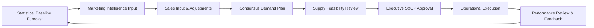

# Demand Forecasting Optimization Guide

## Current State Analysis

### Forecasting Method Review

1. **Forecasting Method Review**:
   - Current method: Qualitative (judgment-based), Time Series, Causal, Simulation?
   - Forecasting horizon: Short-term (0-3 months), Medium-term (3-12 months), Long-term (1+ years)
   - Forecast frequency: Weekly, monthly, quarterly?
   - Who owns forecasting? Sales, Marketing, Supply Chain, Cross-functional?

2. **Forecast Accuracy Measurement**:
   ```
   Common Metrics:

   MAPE (Mean Absolute Percentage Error):
   MAPE = (1/n) * |Actual - Forecast| / Actual * 100%
   -> Target: <20% for stable products, <30% for volatile products

   Bias (Forecast Error):
   Bias = Sum(Forecast - Actual) / n
   -> Target: Close to 0 (indicates no systematic over/under forecasting)

   Tracking Signal:
   TS = Running Sum of Forecast Errors / MAD (Mean Absolute Deviation)
   -> Target: -4 to +4 (outside range indicates bias)
   ```

3. **Product Segmentation (ABC-XYZ Analysis)**:
   ```
   ABC Analysis (by Revenue/Volume):
   - A items: Top 20% of SKUs -> 80% of revenue (High priority)
   - B items: Next 30% of SKUs -> 15% of revenue (Medium priority)
   - C items: Bottom 50% of SKUs -> 5% of revenue (Low priority, consider discontinuation)

   XYZ Analysis (by Demand Variability):
   - X items: Stable demand (CV < 0.5) -> Easy to forecast
   - Y items: Moderate variability (CV 0.5-1.0) -> Requires attention
   - Z items: Highly variable (CV > 1.0) -> Difficult to forecast, consider make-to-order

   CV (Coefficient of Variation) = Std Dev of Demand / Mean Demand
   ```

### Segmentation Matrix

|        | X (Stable) | Y (Moderate) | Z (Variable) |
|--------|------------|--------------|--------------|
| A (High Value) | AX: Statistical forecasting | AY: Collaborative planning | AZ: Demand sensing, buffer stock |
| B (Medium Value) | BX: Simple time series | BY: Statistical + judgment | BZ: Safety stock strategy |
| C (Low Value) | CX: Replenishment rules | CY: Min/Max inventory | CZ: Make-to-order or discontinue |

---

## Forecasting Techniques by Product Type

### 1. Time Series Methods (for stable, historical patterns)

- **Moving Average**: Simple, equal weight to recent periods
  ```
  Forecast = (D1 + D2 + ... + Dn) / n
  Use case: Stable demand with no trend
  ```

- **Exponential Smoothing**: Recent data weighted more heavily
  ```
  Forecast_t+1 = alpha * Actual_t + (1 - alpha) * Forecast_t
  alpha (smoothing constant): 0.1-0.3 for stable, 0.4-0.6 for responsive
  Use case: Stable demand, quick response to changes
  ```

- **Holt-Winters (Triple Exponential Smoothing)**: Captures trend and seasonality
  ```
  Use case: Seasonal products with trend (e.g., winter apparel, holiday items)
  ```

### 2. Causal Methods (for products influenced by external factors)

- **Regression Analysis**: Forecast based on causal variables
  ```
  Sales = f(Price, Promotion, GDP, Weather, Competitor Price, etc.)
  Use case: Products with known drivers (promotions, pricing, economic indicators)
  ```

### 3. Collaborative Methods (for new products or strategic items)

- **Consensus Forecasting**: Sales, Marketing, Finance input combined
- **Delphi Method**: Expert panel iterative forecasting
- **Use case**: New product launches, high-value strategic items

### 4. Advanced Methods (for complex patterns)

- **Machine Learning (ARIMA, LSTM, Random Forest)**: For large datasets with complex patterns
- **Demand Sensing**: Real-time data (POS, social media, weather) to adjust short-term forecast
- **Use case**: High SKU count, omnichannel retail, fast-moving consumer goods

---

## S&OP-Integrated Forecasting Process



### Roles and Responsibilities

| Role | Responsibility | Frequency |
|------|----------------|-----------|
| Demand Planner | Generate statistical baseline forecast | Weekly |
| Marketing | Provide promotional plans, new product launches | Monthly |
| Sales | Validate forecast, provide market intelligence | Monthly |
| Supply Chain | Assess supply feasibility, capacity constraints | Monthly |
| Finance | Validate revenue projections | Monthly |
| Executive Team | Approve final demand/supply plan | Monthly (S&OP) |

---

## Forecast Performance Monitoring

Use `scripts/generate_demand_kpi_dashboard.py` to generate a KPI dashboard, or use the template below:

```markdown
# Demand Forecast Performance Dashboard

## Overall Accuracy
- **MAPE (This Month)**: [value]% [status] (Target: <20%)
- **MAPE (Rolling 12 Months)**: [value]%
- **Bias**: [value]% ([over/under]-forecasting)

## By Product Category
| Category | MAPE | Bias | Tracking Signal | Status |
|----------|------|------|-----------------|--------|
| Category A | [value]% | [value]% | [value] | [status] |
| Category B | [value]% | [value]% | [value] | [status] |
| Category C | [value]% | [value]% | [value] | [status] |

## Forecast Value Add (FVA)
FVA = (Baseline Forecast Error - Adjusted Forecast Error) / Baseline Forecast Error

- **Sales Adjustments FVA**: [value]%
- **Marketing Adjustments FVA**: [value]%
-> Action: [improvement action based on FVA results]

## Stockout vs. Excess Inventory
- **Stockouts due to forecast error**: [count] incidents
- **Excess inventory due to over-forecast**: $[value] (target: <$[target])
```
