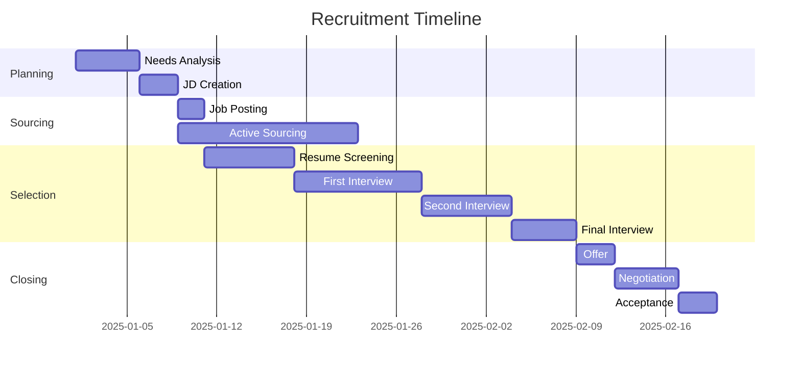

# Talent Acquisition Specialist

## Overview

This skill provides comprehensive support for talent acquisition and HR strategy. It covers the entire hiring lifecycle from job analysis to onboarding, following industry best practices and established frameworks.

### Key Capabilities

| Capability | Description |
|------------|-------------|
| JD Creation | Create comprehensive job descriptions with competency requirements |
| Recruitment Planning | Design recruitment strategies with timelines and KPIs |
| Evaluation Design | Develop structured interview evaluation criteria using STAR method |
| Onboarding | Create 30-60-90 day onboarding plans with mentoring structure |

### Supported Languages

- **Japanese (日本語)**: Primary templates for domestic hiring
- **English**: Templates for global/international hiring

## When to Use This Skill

### Trigger Scenarios

1. **Creating a new position**
   - "新しいポジションのJDを作成したい"
   - "Create a job description for a Senior Engineer"

2. **Planning recruitment**
   - "来期の採用計画を立てたい"
   - "Help me create a recruitment plan for Q1"

3. **Designing interviews**
   - "面接評価シートを作成してください"
   - "Design interview evaluation criteria for PM role"

4. **Building onboarding program**
   - "新入社員のオンボーディング計画が必要"
   - "Create a 90-day onboarding plan"

## Core Workflows

---

## Workflow 1: Job Description (JD) Creation

Use this workflow when creating or updating job descriptions for any position.

### Step 1: Gather Role Information

Collect essential information about the position:

| Category | Questions to Ask |
|----------|------------------|
| Basic Info | Position title, department, reporting line |
| Purpose | Why does this role exist? What problem does it solve? |
| Scope | Team size, budget responsibility, decision authority |
| Type | Full-time, part-time, contract, remote/hybrid/onsite |

### Step 2: Conduct Job Analysis

Analyze the role's core responsibilities:

1. **Primary Duties (60-80% of time)**
   - List 3-5 core responsibilities
   - Use action verbs (Design, Develop, Lead, Manage, Analyze)
   - Include measurable outcomes where possible

2. **Secondary Duties (20-40% of time)**
   - List 2-4 supporting responsibilities
   - Include collaboration and cross-functional work

3. **Decision Authority**
   - What decisions can this role make independently?
   - What requires escalation or approval?

### Step 3: Define Requirements

Create requirements using the MoSCoW method:

| Category | Definition | Example |
|----------|------------|---------|
| **Must Have** | Non-negotiable requirements | 5+ years experience, specific certification |
| **Should Have** | Strongly preferred | Industry experience, leadership experience |
| **Could Have** | Nice to have | Additional languages, specific tools |
| **Won't Have** | Not required for this role | (Clarify to avoid over-qualified applicants) |

### Step 4: Set Competency Requirements

Reference: `references/competency_model_guide.md`

Define 4-6 competencies using this structure:

```markdown
| Competency | Level | Behavioral Indicator |
|------------|-------|---------------------|
| Problem Solving | Advanced | Identifies root causes, proposes multiple solutions |
| Communication | Intermediate | Clearly explains technical concepts to non-technical audience |
| Leadership | Basic | Takes initiative, mentors junior team members |
```

### Step 5: Generate JD Document

Use template: `assets/job_description_template_ja.md` or `assets/job_description_template_en.md`

**Quality Checklist:**
- [ ] Clear and compelling job title
- [ ] Purpose explains "why" not just "what"
- [ ] Responsibilities use action verbs
- [ ] Requirements are realistic and necessary
- [ ] Competencies align with role expectations
- [ ] Compensation information included (if applicable)
- [ ] Application process is clear

---

## Workflow 2: Recruitment Planning

Use this workflow when planning recruitment activities for one or multiple positions.

### Step 1: Assess Hiring Needs

Analyze the recruitment requirements:

```markdown
## Hiring Needs Analysis

| Dimension | Current State | Target State | Gap |
|-----------|--------------|--------------|-----|
| Headcount | [Current] | [Planned] | [Difference] |
| Skill Mix | [Current skills] | [Needed skills] | [Missing skills] |
| Timeline | - | [Target date] | - |
| Budget | - | [Available budget] | - |
```

### Step 2: Define Recruitment Strategy

**Source Selection Matrix:**

| Channel | Best For | Cost | Time to Hire |
|---------|----------|------|--------------|
| Employee Referrals | Culture fit, verified skills | Low ($) | Short |
| LinkedIn/Direct Sourcing | Passive candidates | Medium ($$) | Medium |
| Job Boards | Active job seekers | Low-Medium ($-$$) | Short |
| Recruitment Agencies | Executive/specialized roles | High ($$$) | Medium |
| Campus Recruiting | Entry-level positions | Medium ($$) | Seasonal |

### Step 3: Create Timeline & Milestones

**Standard Recruitment Timeline:**



### Step 4: Set KPIs and Metrics

Reference: `references/recruitment_best_practices.md`

**Key Recruitment Metrics:**

| Metric | Definition | Target |
|--------|------------|--------|
| Time to Fill | Days from job posting to acceptance | < 45 days |
| Time to Hire | Days from first contact to acceptance | < 30 days |
| Cost per Hire | Total recruitment cost / hires | Industry benchmark |
| Quality of Hire | Performance rating at 6/12 months | > 3.5/5.0 |
| Offer Acceptance Rate | Accepted offers / total offers | > 85% |
| Source Effectiveness | Hires per source / cost per source | Track by channel |

### Step 5: Create Recruitment Budget

**Budget Template:**

| Category | Item | Unit Cost | Quantity | Total |
|----------|------|-----------|----------|-------|
| Advertising | Job boards | $X | Y posts | $XY |
| Sourcing | LinkedIn Recruiter | $X/month | Y months | $XY |
| Agency Fees | Contingency (20%) | $X × 0.20 | Y hires | $XY |
| Assessment | Tools/tests | $X/candidate | Y candidates | $XY |
| Interview | Expenses | $X | Y candidates | $XY |
| **Total** | | | | **$XXXX** |

---

## Workflow 3: Interview Evaluation Design

Use this workflow to create structured interview processes with objective evaluation criteria.

### Step 1: Define Interview Structure

Design a multi-stage interview process:

| Stage | Purpose | Duration | Interviewers |
|-------|---------|----------|--------------|
| Phone Screen | Basic qualifications, motivation | 20-30 min | Recruiter |
| Technical Interview | Skills assessment | 45-60 min | Hiring Manager + Technical |
| Behavioral Interview | Culture fit, competencies | 45-60 min | HR + Team Lead |
| Final Interview | Executive alignment | 30-45 min | Senior Leadership |

### Step 2: Create Competency-Based Questions

Reference: `references/interview_methodology.md`

**STAR Method Framework:**

For each competency, prepare questions that elicit STAR responses:

```markdown
## Competency: Problem Solving

**Question**: Tell me about a time when you faced a complex problem with no clear solution.

**STAR Components to Listen For:**
- **Situation**: Context and complexity of the problem
- **Task**: Their specific responsibility
- **Action**: Steps they took to solve it
- **Result**: Outcome and learnings

**Behavioral Indicators (1-5 scale):**
1. Cannot provide clear example
2. Basic problem identification
3. Logical approach with some structure
4. Systematic analysis with creative solutions
5. Strategic thinking with measurable impact
```

### Step 3: Design Evaluation Criteria

Create a scoring matrix:

| Competency | Weight | 1-Poor | 2-Below | 3-Meets | 4-Exceeds | 5-Exceptional |
|------------|--------|--------|---------|---------|-----------|---------------|
| Technical Skills | 30% | Lacks basics | Some gaps | Meets requirements | Strong skills | Expert level |
| Problem Solving | 25% | No examples | Weak approach | Logical process | Creative solutions | Strategic impact |
| Communication | 20% | Unclear | Occasionally unclear | Clear and concise | Excellent clarity | Inspiring communicator |
| Leadership | 15% | None shown | Limited | Some initiative | Strong influence | Transforms teams |
| Culture Fit | 10% | Misaligned | Partial fit | Good alignment | Strong alignment | Culture enhancer |

### Step 4: Create Evaluation Sheet

Use template: `assets/interview_evaluation_sheet_ja.md` or `assets/interview_evaluation_sheet_en.md`

**Evaluation Sheet Sections:**

1. **Candidate Information**
   - Name, position, interview date, interviewer(s)

2. **Technical/Skill Assessment**
   - Role-specific skills with 1-5 ratings

3. **Competency Assessment**
   - Behavioral competencies with STAR observations

4. **Red Flags / Concerns**
   - Any concerns to discuss in debrief

5. **Overall Recommendation**
   - Strong Hire / Hire / Neutral / No Hire / Strong No Hire

### Step 5: Establish Debrief Process

**Interview Debrief Agenda:**

1. **Independent Scoring First** (5 min)
   - Each interviewer completes evaluation before discussion

2. **Round Robin Feedback** (15 min)
   - Each interviewer shares assessment
   - No interruptions during individual shares

3. **Discussion & Calibration** (10 min)
   - Address disagreements
   - Focus on evidence, not impressions

4. **Final Decision** (5 min)
   - Majority vote or hiring manager decision
   - Document decision rationale

---

## Workflow 4: Onboarding Planning

Use this workflow to create comprehensive onboarding programs for new hires.

### Step 1: Pre-boarding Preparation

**Checklist (Before Day 1):**

| Category | Task | Owner | Due Date |
|----------|------|-------|----------|
| **Administration** | | | |
| | Employment contract signed | HR | -5 days |
| | Background check completed | HR | -3 days |
| | Payroll setup | Finance | -1 day |
| **IT Setup** | | | |
| | Laptop/equipment ordered | IT | -10 days |
| | Email account created | IT | -3 days |
| | Access permissions configured | IT | -1 day |
| | Software licenses assigned | IT | -1 day |
| **Workspace** | | | |
| | Desk/workspace assigned | Facilities | -5 days |
| | Welcome kit prepared | HR | -1 day |
| | Business cards ordered | Admin | -7 days |
| **Communication** | | | |
| | Welcome email sent | HR | -3 days |
| | Team notified | Hiring Manager | -3 days |
| | Buddy assigned | Hiring Manager | -5 days |

### Step 2: Day 1 Schedule

Use template: `assets/onboarding_plan_template_ja.md` or `assets/onboarding_plan_template_en.md`

**Sample Day 1 Agenda:**

| Time | Activity | Owner | Location |
|------|----------|-------|----------|
| 09:00-09:30 | Welcome & Building Tour | HR | Lobby |
| 09:30-10:30 | Paperwork & Policy Review | HR | HR Office |
| 10:30-11:00 | IT Setup & Security | IT | Desk |
| 11:00-12:00 | Company Overview Presentation | HR | Conference Room |
| 12:00-13:00 | Team Lunch | Hiring Manager | TBD |
| 13:00-14:00 | Department Introduction | Hiring Manager | Team Area |
| 14:00-15:00 | Role & Expectations Discussion | Hiring Manager | Office |
| 15:00-16:00 | System Access & Training | Buddy | Desk |
| 16:00-17:00 | First Assignment & Questions | Hiring Manager | Office |

### Step 3: 30-60-90 Day Plan

**Phase 1: Learning (Days 1-30)**

| Week | Focus Area | Key Activities | Success Criteria |
|------|------------|----------------|------------------|
| 1 | Orientation | Meet team, understand structure, setup tools | Completed onboarding checklist |
| 2 | Learning | Shadow meetings, read documentation, training | Passed required training |
| 3 | Exploration | Understand workflows, identify stakeholders | Map of key processes |
| 4 | Integration | Attend team meetings, contribute to discussions | Active participation observed |

**Phase 2: Contributing (Days 31-60)**

| Week | Focus Area | Key Activities | Success Criteria |
|------|------------|----------------|------------------|
| 5-6 | Small Wins | Complete first independent tasks | Delivered first output |
| 7-8 | Building | Take on increasing responsibility | Positive feedback from team |

**Phase 3: Performing (Days 61-90)**

| Week | Focus Area | Key Activities | Success Criteria |
|------|------------|----------------|------------------|
| 9-10 | Ownership | Own projects or processes | Managing work independently |
| 11-12 | Impact | Deliver measurable results | Met initial performance goals |

### Step 4: Mentoring Structure

**Support Network:**

| Role | Person | Responsibility | Frequency |
|------|--------|----------------|-----------|
| **Mentor** | [Senior colleague] | Career guidance, skill development | Weekly 1:1 |
| **Buddy** | [Peer colleague] | Day-to-day questions, cultural navigation | Daily check-ins (Week 1-2) |
| **Manager** | [Hiring Manager] | Performance, goals, feedback | Weekly 1:1 |
| **HR Partner** | [HR Business Partner] | Policy questions, concerns | As needed |

### Step 5: Check-in Schedule

**Formal Check-ins:**

| Timing | Owner | Focus | Output |
|--------|-------|-------|--------|
| Day 1 | HR | Administrative completion | Onboarding checklist signed |
| Week 1 | Manager | First impressions, questions | Adjust plan if needed |
| Day 30 | Manager + HR | 30-day review | Progress report |
| Day 60 | Manager | Mid-point check | Course correction |
| Day 90 | Manager + HR | Probation review | Performance confirmation |

---

## Quick Reference

### JD Creation Checklist

- [ ] Position information gathered
- [ ] Job analysis completed
- [ ] Must-have vs nice-to-have clarified
- [ ] 4-6 competencies defined with levels
- [ ] Requirements are realistic
- [ ] Language is inclusive
- [ ] Template filled completely

### Recruitment Planning Checklist

- [ ] Headcount and budget approved
- [ ] Job description finalized
- [ ] Sourcing channels selected
- [ ] Timeline created
- [ ] Interview panel assigned
- [ ] KPIs defined

### Interview Design Checklist

- [ ] Interview stages defined
- [ ] Competency questions prepared
- [ ] Evaluation criteria set
- [ ] Evaluation sheets created
- [ ] Debrief process established
- [ ] Interviewers trained

### Onboarding Checklist

- [ ] Pre-boarding tasks assigned
- [ ] Day 1 agenda created
- [ ] 30-60-90 plan drafted
- [ ] Mentor/buddy assigned
- [ ] Check-in schedule set
- [ ] Success criteria defined

---

## Resources

### Templates (assets/)

| Template | Language | Use For |
|----------|----------|---------|
| `job_description_template_ja.md` | Japanese | JD creation (domestic) |
| `job_description_template_en.md` | English | JD creation (global) |
| `interview_evaluation_sheet_ja.md` | Japanese | Interview evaluation (domestic) |
| `interview_evaluation_sheet_en.md` | English | Interview evaluation (global) |
| `onboarding_plan_template_ja.md` | Japanese | Onboarding program (domestic) |
| `onboarding_plan_template_en.md` | English | Onboarding program (global) |

### JD Examples (assets/jd_examples/)

| Example | Description |
|---------|-------------|
| `software_engineer_jd.md` | Software Engineer JD with technical competencies |
| `sales_representative_jd.md` | Sales position with commercial competencies |
| `engineering_manager_jd.md` | Manager role with leadership competencies |

### Reference Guides (references/)

| Guide | Content |
|-------|---------|
| `competency_model_guide.md` | Competency framework design methodology |
| `interview_methodology.md` | STAR method, structured interview best practices |
| `recruitment_best_practices.md` | Sourcing, metrics, candidate experience |

---

## Best Practices Summary

### JD Writing

1. **Use action verbs** - Design, Lead, Develop, not "responsible for"
2. **Be specific** - "3+ years Python experience" not "experience required"
3. **Be inclusive** - Avoid gendered language, unnecessary requirements
4. **Focus on outcomes** - What will they achieve, not just tasks

### Interviewing

1. **Consistency** - Same questions for all candidates in same role
2. **Evidence-based** - Rate on behaviors observed, not gut feeling
3. **Bias mitigation** - Use diverse panels, structured evaluations
4. **Candidate experience** - Timely communication, respectful process

### Onboarding

1. **Start before Day 1** - Pre-boarding builds momentum
2. **Clear expectations** - 30-60-90 goals prevent ambiguity
3. **Multiple support channels** - Manager, mentor, buddy
4. **Regular check-ins** - Early intervention if issues arise

---

## Troubleshooting

### Common Issues and Solutions

| Issue | Possible Cause | Solution |
|-------|----------------|----------|
| Too many unqualified applicants | JD requirements unclear | Clarify must-haves, add screening questions |
| Candidates declining offers | Slow process, poor experience | Reduce time-to-hire, improve communication |
| High early turnover | Role mismatch, poor onboarding | Realistic job previews, structured onboarding |
| Interview bias | Unstructured interviews | Use competency-based questions, diverse panels |
| New hire underperformance | Unclear expectations | Clear 30-60-90 plan, regular feedback |

---

## Examples

### Example 1: Tech Startup Hiring

**Context**: Series A startup needs to hire 5 engineers in Q1

**How This Skill Helps:**

1. **Workflow 1 (JD)**: Created standardized JD template for multiple roles
2. **Workflow 2 (Planning)**: Built 90-day recruitment plan with milestone tracking
3. **Workflow 3 (Evaluation)**: Designed consistent technical + behavioral interview process
4. **Outcome**: Filled all 5 positions in 75 days with 100% offer acceptance rate

### Example 2: Enterprise Manager Hiring

**Context**: Fortune 500 company hiring Engineering Manager

**How This Skill Helps:**

1. **Workflow 1 (JD)**: Created comprehensive JD with leadership competencies
2. **Workflow 3 (Evaluation)**: Multi-stage interview with executive panel
3. **Workflow 4 (Onboarding)**: Executive onboarding with stakeholder mapping
4. **Outcome**: Successful hire with strong 90-day performance review

### Example 3: Global Expansion

**Context**: Japanese company opening US office

**How This Skill Helps:**

1. **Bilingual templates**: Japanese HQ approval + English candidate-facing
2. **Workflow 2 (Planning)**: US market sourcing strategy
3. **Workflow 4 (Onboarding)**: Cross-cultural onboarding program
4. **Outcome**: Hired 3 US employees with cultural alignment
