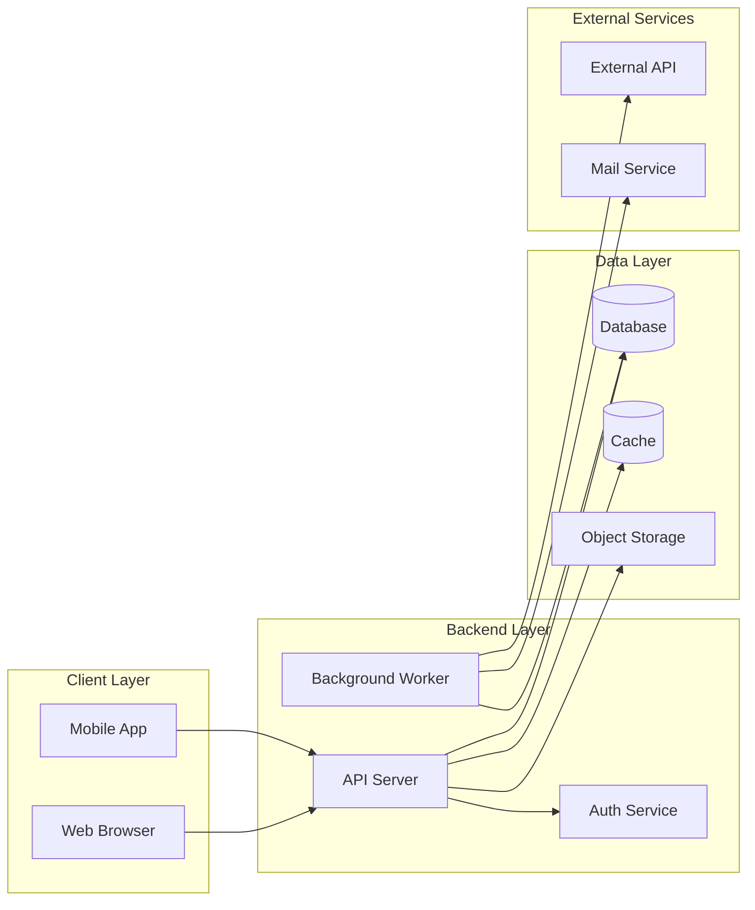
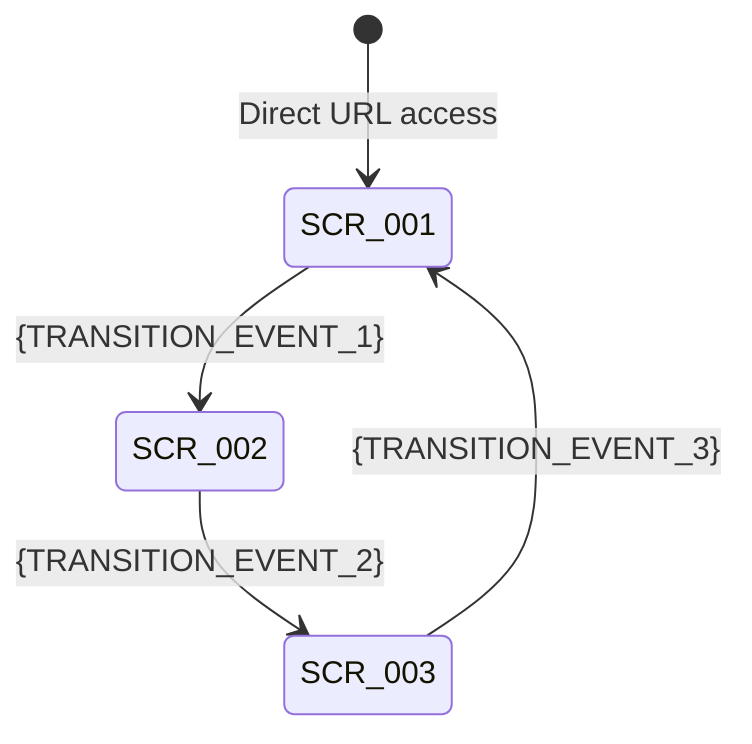
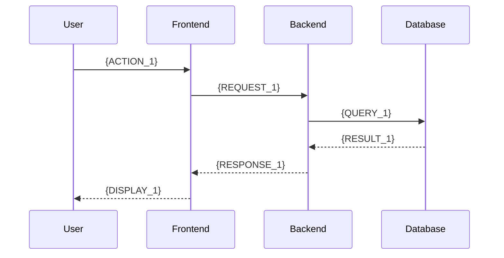

# {PROJECT_NAME} Technical Specification

---

## 1. Document Information

| Field | Value |
|-------|-------|
| Document ID | {DOC_ID} |
| Version | {VERSION} |
| Created Date | {CREATED_DATE} |
| Last Updated | {UPDATED_DATE} |
| Author | {AUTHOR} |
| Approver | {APPROVER} |
| Status | Draft / Under Review / Approved |

### Change History

| Version | Date | Changed By | Section Changed | Description |
|---------|------|-----------|----------------|-------------|
| 0.1 | {CREATED_DATE} | {AUTHOR} | All | Initial draft |

---

## 2. Introduction

### 2.1 Purpose

This document defines the technical specification for {PROJECT_NAME}. Based on the Business Requirements Document ({BRD_REF}), it describes screen design, API design, database design, and system interaction flows.

### 2.2 Scope

**In Scope:**

- {SCOPE_IN_1}
- {SCOPE_IN_2}
- {SCOPE_IN_3}

**Out of Scope:**

- {SCOPE_OUT_1}
- {SCOPE_OUT_2}

### 2.3 Definitions

| Term | Definition | Notes |
|------|-----------|-------|
| {TERM_1} | {DEFINITION_1} | {NOTE_1} |
| {TERM_2} | {DEFINITION_2} | {NOTE_2} |
| {TERM_3} | {DEFINITION_3} | {NOTE_3} |

### 2.4 References

| Document | Version | Description |
|----------|---------|-------------|
| {BRD_REF} | {BRD_VERSION} | Business Requirements Document |
| {REF_DOC_2} | {REF_VERSION_2} | {REF_DESC_2} |

---

## 3. System Overview

### 3.1 Architecture Diagram



### 3.2 Technology Stack

| Layer | Technology | Version | Notes |
|-------|-----------|---------|-------|
| Frontend | {FE_TECH} | {FE_VERSION} | {FE_NOTE} |
| Backend | {BE_TECH} | {BE_VERSION} | {BE_NOTE} |
| Database | {DB_TECH} | {DB_VERSION} | {DB_NOTE} |
| Cache | {CACHE_TECH} | {CACHE_VERSION} | {CACHE_NOTE} |
| Infrastructure | {INFRA_TECH} | {INFRA_VERSION} | {INFRA_NOTE} |

---

## 4. Screen Design

### 4.1 Screen List

| Screen ID | Screen Name | Path | Description | Mapped REQ |
|-----------|------------|------|-------------|-----------|
| SCR-001 | {SCREEN_NAME_1} | {SCREEN_PATH_1} | {SCREEN_DESC_1} | {REQ_ID_1} |
| SCR-002 | {SCREEN_NAME_2} | {SCREEN_PATH_2} | {SCREEN_DESC_2} | {REQ_ID_2} |
| SCR-003 | {SCREEN_NAME_3} | {SCREEN_PATH_3} | {SCREEN_DESC_3} | {REQ_ID_3} |

### 4.2 Screen Transition Diagram



### 4.3 Screen Detail: {SCREEN_NAME_1} (SCR-001)

#### Screen Summary

- **Screen ID**: SCR-001
- **Screen Name**: {SCREEN_NAME_1}
- **Path**: {SCREEN_PATH_1}
- **Description**: {SCREEN_DESC_1}
- **Mapped Requirements**: {REQ_ID_1}

#### UI Elements

| Element ID | Type | Label | Validation Rules | Default Value | Notes |
|-----------|------|-------|-----------------|--------------|-------|
| SCR-001-E01 | text | {LABEL_1} | {VALIDATION_1} | {DEFAULT_1} | {NOTE_1} |
| SCR-001-E02 | select | {LABEL_2} | {VALIDATION_2} | {DEFAULT_2} | {NOTE_2} |
| SCR-001-E03 | button | {LABEL_3} | — | — | {NOTE_3} |

#### Event List

| Event ID | Trigger Element | Event Type | Action | Target |
|----------|----------------|------------|--------|--------|
| SCR-001-EV01 | SCR-001-E03 | click | {ACTION_1} | {TARGET_1} |

#### Responsive Breakpoints

| Breakpoint | Layout Changes |
|-----------|---------------|
| Mobile (~375px) | {MOBILE_LAYOUT} |
| Tablet (~768px) | {TABLET_LAYOUT} |
| Desktop (1024px+) | {DESKTOP_LAYOUT} |

---

## 5. API Design

### 5.1 API Endpoint List

| API ID | Method | Path | Description | Auth | Mapped REQ |
|--------|--------|------|-------------|------|-----------|
| API-001 | {METHOD_1} | {PATH_1} | {DESC_1} | {AUTH_1} | {REQ_ID_1} |
| API-002 | {METHOD_2} | {PATH_2} | {DESC_2} | {AUTH_2} | {REQ_ID_2} |
| API-003 | {METHOD_3} | {PATH_3} | {DESC_3} | {AUTH_3} | {REQ_ID_3} |

### 5.2 Common Specifications

#### Base URL

```
{BASE_URL}/api/v1
```

#### Authentication

```
Authorization: Bearer {JWT_TOKEN}
```

#### Standard Error Response Format

```json
{
  "error": {
    "code": "ERR_XXX",
    "message": "Error description",
    "details": [
      {
        "field": "field_name",
        "code": "ERR_XXX",
        "message": "Detailed message"
      }
    ]
  }
}
```

#### Common Error Codes

| HTTP Status | Error Code | Description |
|------------|-----------|-------------|
| 400 | ERR_VALIDATION_FAILED | Request validation error |
| 401 | ERR_AUTH_TOKEN_EXPIRED | Authentication token expired |
| 401 | ERR_AUTH_TOKEN_INVALID | Authentication token invalid |
| 403 | ERR_AUTHZ_INSUFFICIENT_ROLE | Insufficient permissions |
| 404 | ERR_RESOURCE_NOT_FOUND | Resource not found |
| 409 | ERR_RESOURCE_CONFLICT | Resource conflict |
| 429 | ERR_RATE_LIMIT_EXCEEDED | Rate limit exceeded |
| 500 | ERR_SYS_INTERNAL | Internal server error |

### 5.3 API Detail: {DESC_1} (API-001)

- **API ID**: API-001
- **Method**: {METHOD_1}
- **Path**: `{PATH_1}`
- **Description**: {DESC_1}
- **Authentication**: {AUTH_1}
- **Required Permissions**: {PERMISSION_1}

#### Request

**Path Parameters:**

| Parameter | Type | Required | Description |
|-----------|------|----------|-------------|
| {PARAM_NAME} | {PARAM_TYPE} | {REQUIRED} | {PARAM_DESC} |

**Query Parameters:**

| Parameter | Type | Required | Default | Description |
|-----------|------|----------|---------|-------------|
| {QUERY_NAME} | {QUERY_TYPE} | {REQUIRED} | {DEFAULT} | {QUERY_DESC} |

**Request Body:**

```json
{
  "{FIELD_1}": "{VALUE_1}",
  "{FIELD_2}": "{VALUE_2}"
}
```

#### Response

**Success ({SUCCESS_STATUS}):**

```json
{
  "data": {
    "id": 1,
    "{FIELD_1}": "{VALUE_1}",
    "{FIELD_2}": "{VALUE_2}",
    "created_at": "2025-01-01T00:00:00Z",
    "updated_at": "2025-01-01T00:00:00Z"
  }
}
```

**Errors:**

| HTTP Status | Error Code | Condition |
|------------|-----------|-----------|
| {ERR_STATUS_1} | {ERR_CODE_1} | {ERR_CONDITION_1} |
| {ERR_STATUS_2} | {ERR_CODE_2} | {ERR_CONDITION_2} |

---

## 6. Database Design

### 6.1 Table List

| Table ID | Table Name | Description | Mapped REQ |
|----------|-----------|-------------|-----------|
| TBL-001 | {TABLE_NAME_1} | {TABLE_DESC_1} | {REQ_ID_1} |
| TBL-002 | {TABLE_NAME_2} | {TABLE_DESC_2} | {REQ_ID_2} |
| TBL-003 | {TABLE_NAME_3} | {TABLE_DESC_3} | {REQ_ID_3} |

### 6.2 ER Diagram

```mermaid
erDiagram
    {TABLE_NAME_1} {
        bigint id PK
        varchar name
        timestamp created_at
        timestamp updated_at
        varchar created_by
        varchar updated_by
    }

    {TABLE_NAME_2} {
        bigint id PK
        bigint {TABLE_NAME_1}_id FK
        varchar status
        timestamp created_at
        timestamp updated_at
        varchar created_by
        varchar updated_by
    }

    {TABLE_NAME_1} ||--o{ {TABLE_NAME_2} : "has"
```

### 6.3 Table Detail: {TABLE_NAME_1} (TBL-001)

- **Table ID**: TBL-001
- **Table Name**: `{TABLE_NAME_1}`
- **Description**: {TABLE_DESC_1}

#### Column Definitions

| Column Name | Data Type | Nullable | Default | Description | Constraints |
|------------|-----------|----------|---------|-------------|-------------|
| id | BIGINT | NO | AUTO_INCREMENT | Primary key | PK |
| {COL_NAME_1} | {COL_TYPE_1} | {NULLABLE_1} | {DEFAULT_1} | {COL_DESC_1} | {CONSTRAINT_1} |
| {COL_NAME_2} | {COL_TYPE_2} | {NULLABLE_2} | {DEFAULT_2} | {COL_DESC_2} | {CONSTRAINT_2} |
| created_at | TIMESTAMP WITH TIME ZONE | NO | CURRENT_TIMESTAMP | Record creation time | — |
| updated_at | TIMESTAMP WITH TIME ZONE | NO | CURRENT_TIMESTAMP | Last update time | — |
| created_by | VARCHAR(100) | NO | — | Created by user | — |
| updated_by | VARCHAR(100) | NO | — | Last updated by user | — |

#### Indexes

| Index Name | Columns | Type | Notes |
|-----------|---------|------|-------|
| pk_{TABLE_NAME_1} | id | PRIMARY | — |
| {INDEX_NAME_1} | {INDEX_COLS_1} | {INDEX_TYPE_1} | {INDEX_NOTE_1} |

---

## 7. Sequence Diagrams

### 7.1 {SEQUENCE_NAME_1} (SEQ-001)



---

## 8. State Transition Diagrams

### 8.1 {ENTITY_NAME} State Machine (STS-001)

#### State Inventory

| State ID | State Name | Description | Entry Condition | Exit Condition |
|----------|-----------|-------------|----------------|----------------|
| STS-001-S01 | {STATE_1} | {STATE_DESC_1} | {ENTRY_1} | {EXIT_1} |
| STS-001-S02 | {STATE_2} | {STATE_DESC_2} | {ENTRY_2} | {EXIT_2} |

#### Transition Table

| From State | Event / Trigger | Guard Condition | Action | To State |
|-----------|----------------|----------------|--------|----------|
| {STATE_1} | {EVENT_1} | {GUARD_1} | {ACTION_1} | {STATE_2} |
| {STATE_2} | {EVENT_2} | {GUARD_2} | {ACTION_2} | {STATE_1} |

#### State Transition Diagram

```mermaid
stateDiagram-v2
    [*] --> {STATE_1}: {INIT_EVENT}
    {STATE_1} --> {STATE_2}: {EVENT_1}
    {STATE_2} --> {STATE_1}: {EVENT_2}
    {STATE_2} --> [*]: {TERMINAL_EVENT}
```

---

## 9. Non-Functional Requirements

### 9.1 Performance Requirements

| Metric | Requirement | Notes |
|--------|-----------|-------|
| Screen response time | Within {RESPONSE_TIME} | 95th percentile |
| API response time | Within {API_RESPONSE_TIME} | 95th percentile |
| Concurrent users | {CONCURRENT_USERS} | Peak load |
| Database response time | Within {DB_RESPONSE_TIME} | Simple queries |

### 9.2 Security Requirements

| Area | Requirement | Implementation |
|------|-----------|----------------|
| Authentication | {AUTH_REQUIREMENT} | {AUTH_IMPL} |
| Authorization | {AUTHZ_REQUIREMENT} | {AUTHZ_IMPL} |
| Data encryption | {ENCRYPTION_REQUIREMENT} | {ENCRYPTION_IMPL} |
| Audit logging | {AUDIT_REQUIREMENT} | {AUDIT_IMPL} |

### 9.3 Availability Requirements

| Metric | Requirement | Notes |
|--------|-----------|-------|
| Uptime SLA | {AVAILABILITY}% | {AVAILABILITY_NOTE} |
| Maintenance window | {MAINTENANCE_WINDOW} | {MAINTENANCE_NOTE} |
| Backup policy | {BACKUP_POLICY} | {BACKUP_NOTE} |
| Recovery Time Objective (RTO) | {RTO} | {RTO_NOTE} |
| Recovery Point Objective (RPO) | {RPO} | {RPO_NOTE} |

---

## 10. Appendix

### 10.1 Traceability Matrix

| REQ ID | Requirement Summary | Screen IDs | API IDs | Table IDs | Test Case IDs | Status |
|--------|-------------------|-----------|---------|----------|--------------|--------|
| {REQ_ID_1} | {REQ_DESC_1} | {SCR_IDS_1} | {API_IDS_1} | {TBL_IDS_1} | {TC_IDS_1} | {STATUS_1} |
| {REQ_ID_2} | {REQ_DESC_2} | {SCR_IDS_2} | {API_IDS_2} | {TBL_IDS_2} | {TC_IDS_2} | {STATUS_2} |

### 10.2 Open Issues

| # | Issue | Created | Assignee | Due Date | Status |
|---|-------|---------|----------|----------|--------|
| 1 | {OPEN_ISSUE_1} | {ISSUE_DATE_1} | {ASSIGNEE_1} | {DUE_DATE_1} | Open |

### 10.3 Assumptions

- {ASSUMPTION_1}
- {ASSUMPTION_2}

### 10.4 Constraints

- {CONSTRAINT_1}
- {CONSTRAINT_2}
