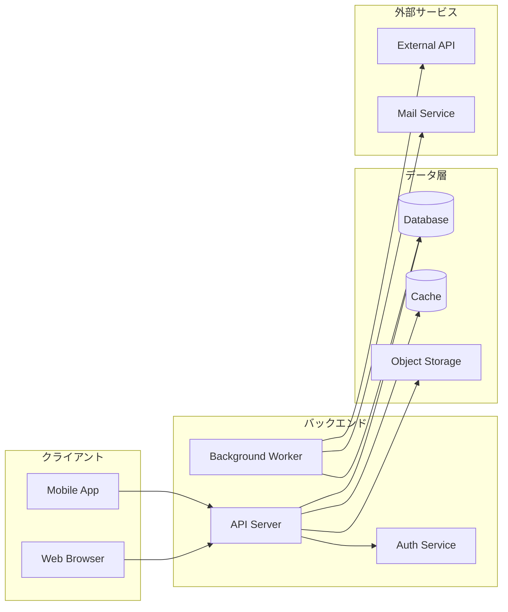
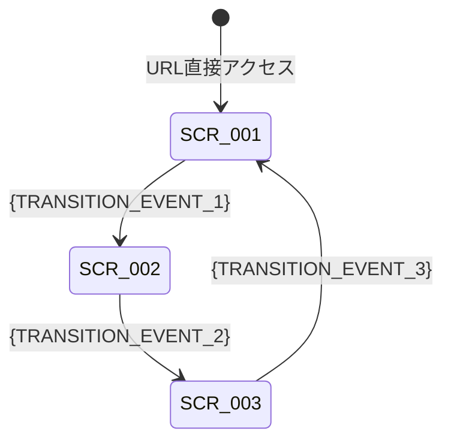
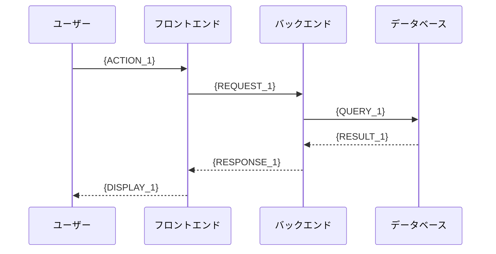

# {PROJECT_NAME} 技術仕様書

---

## 1. 文書情報

| 項目 | 内容 |
|------|------|
| ドキュメントID | {DOC_ID} |
| バージョン | {VERSION} |
| 作成日 | {CREATED_DATE} |
| 最終更新日 | {UPDATED_DATE} |
| 作成者 | {AUTHOR} |
| 承認者 | {APPROVER} |
| ステータス | Draft / Under Review / Approved |

### 変更履歴

| バージョン | 日付 | 変更者 | 変更箇所 | 変更内容 |
|-----------|------|--------|---------|---------|
| 0.1 | {CREATED_DATE} | {AUTHOR} | 全体 | 初版作成 |

---

## 2. はじめに

### 2.1 目的

本文書は、{PROJECT_NAME} の技術仕様を定義する。要件定義書（{BRD_REF}）に基づき、画面設計、API設計、データベース設計、およびシステム間連携フローを記述する。

### 2.2 スコープ

**対象範囲:**

- {SCOPE_IN_1}
- {SCOPE_IN_2}
- {SCOPE_IN_3}

**対象外:**

- {SCOPE_OUT_1}
- {SCOPE_OUT_2}

### 2.3 用語定義

| 用語 | 定義 | 備考 |
|------|------|------|
| {TERM_1} | {DEFINITION_1} | {NOTE_1} |
| {TERM_2} | {DEFINITION_2} | {NOTE_2} |
| {TERM_3} | {DEFINITION_3} | {NOTE_3} |

### 2.4 参照文書

| 文書名 | バージョン | 概要 |
|--------|-----------|------|
| {BRD_REF} | {BRD_VERSION} | 要件定義書 |
| {REF_DOC_2} | {REF_VERSION_2} | {REF_DESC_2} |

---

## 3. システム概要

### 3.1 アーキテクチャ概要図



### 3.2 技術スタック

| レイヤー | 技術 | バージョン | 備考 |
|---------|------|-----------|------|
| フロントエンド | {FE_TECH} | {FE_VERSION} | {FE_NOTE} |
| バックエンド | {BE_TECH} | {BE_VERSION} | {BE_NOTE} |
| データベース | {DB_TECH} | {DB_VERSION} | {DB_NOTE} |
| キャッシュ | {CACHE_TECH} | {CACHE_VERSION} | {CACHE_NOTE} |
| インフラ | {INFRA_TECH} | {INFRA_VERSION} | {INFRA_NOTE} |

---

## 4. 画面設計

### 4.1 画面一覧

| 画面ID | 画面名 | パス | 概要 | 対応REQ |
|--------|--------|------|------|---------|
| SCR-001 | {SCREEN_NAME_1} | {SCREEN_PATH_1} | {SCREEN_DESC_1} | {REQ_ID_1} |
| SCR-002 | {SCREEN_NAME_2} | {SCREEN_PATH_2} | {SCREEN_DESC_2} | {REQ_ID_2} |
| SCR-003 | {SCREEN_NAME_3} | {SCREEN_PATH_3} | {SCREEN_DESC_3} | {REQ_ID_3} |

### 4.2 画面遷移図



### 4.3 画面詳細: {SCREEN_NAME_1}（SCR-001）

#### 画面概要

- **画面ID**: SCR-001
- **画面名**: {SCREEN_NAME_1}
- **パス**: {SCREEN_PATH_1}
- **概要**: {SCREEN_DESC_1}
- **対応要件**: {REQ_ID_1}

#### UI要素一覧

| 要素ID | 種別 | ラベル | バリデーション | デフォルト値 | 備考 |
|--------|------|--------|--------------|------------|------|
| SCR-001-E01 | text | {LABEL_1} | {VALIDATION_1} | {DEFAULT_1} | {NOTE_1} |
| SCR-001-E02 | select | {LABEL_2} | {VALIDATION_2} | {DEFAULT_2} | {NOTE_2} |
| SCR-001-E03 | button | {LABEL_3} | — | — | {NOTE_3} |

#### イベント一覧

| イベントID | トリガー要素 | イベント種別 | アクション | 遷移先 |
|-----------|------------|------------|----------|--------|
| SCR-001-EV01 | SCR-001-E03 | click | {ACTION_1} | {TARGET_1} |

#### レスポンシブ対応

| ブレークポイント | レイアウト変更 |
|----------------|--------------|
| モバイル（~375px） | {MOBILE_LAYOUT} |
| タブレット（~768px） | {TABLET_LAYOUT} |
| デスクトップ（1024px~） | {DESKTOP_LAYOUT} |

---

## 5. API設計

### 5.1 API一覧

| API ID | メソッド | パス | 概要 | 認証 | 対応REQ |
|--------|---------|------|------|------|---------|
| API-001 | {METHOD_1} | {PATH_1} | {DESC_1} | {AUTH_1} | {REQ_ID_1} |
| API-002 | {METHOD_2} | {PATH_2} | {DESC_2} | {AUTH_2} | {REQ_ID_2} |
| API-003 | {METHOD_3} | {PATH_3} | {DESC_3} | {AUTH_3} | {REQ_ID_3} |

### 5.2 共通仕様

#### ベースURL

```
{BASE_URL}/api/v1
```

#### 認証方式

```
Authorization: Bearer {JWT_TOKEN}
```

#### 共通エラーレスポンス形式

```json
{
  "error": {
    "code": "ERR_XXX",
    "message": "エラーメッセージ",
    "details": [
      {
        "field": "フィールド名",
        "code": "ERR_XXX",
        "message": "詳細メッセージ"
      }
    ]
  }
}
```

#### 共通エラーコード

| HTTPステータス | エラーコード | 説明 |
|--------------|------------|------|
| 400 | ERR_VALIDATION_FAILED | バリデーションエラー |
| 401 | ERR_AUTH_TOKEN_EXPIRED | 認証トークン期限切れ |
| 401 | ERR_AUTH_TOKEN_INVALID | 認証トークン不正 |
| 403 | ERR_AUTHZ_INSUFFICIENT_ROLE | 権限不足 |
| 404 | ERR_RESOURCE_NOT_FOUND | リソース未存在 |
| 409 | ERR_RESOURCE_CONFLICT | リソース競合 |
| 429 | ERR_RATE_LIMIT_EXCEEDED | レート制限超過 |
| 500 | ERR_SYS_INTERNAL | システム内部エラー |

### 5.3 API詳細: {DESC_1}（API-001）

- **API ID**: API-001
- **メソッド**: {METHOD_1}
- **パス**: `{PATH_1}`
- **概要**: {DESC_1}
- **認証**: {AUTH_1}
- **必要権限**: {PERMISSION_1}

#### リクエスト

**パスパラメータ:**

| パラメータ | 型 | 必須 | 説明 |
|-----------|------|------|------|
| {PARAM_NAME} | {PARAM_TYPE} | {REQUIRED} | {PARAM_DESC} |

**クエリパラメータ:**

| パラメータ | 型 | 必須 | デフォルト | 説明 |
|-----------|------|------|-----------|------|
| {QUERY_NAME} | {QUERY_TYPE} | {REQUIRED} | {DEFAULT} | {QUERY_DESC} |

**リクエストボディ:**

```json
{
  "{FIELD_1}": "{VALUE_1}",
  "{FIELD_2}": "{VALUE_2}"
}
```

#### レスポンス

**成功時（{SUCCESS_STATUS}）:**

```json
{
  "data": {
    "id": 1,
    "{FIELD_1}": "{VALUE_1}",
    "{FIELD_2}": "{VALUE_2}",
    "created_at": "2025-01-01T00:00:00Z",
    "updated_at": "2025-01-01T00:00:00Z"
  }
}
```

**エラー時:**

| HTTPステータス | エラーコード | 条件 |
|--------------|------------|------|
| {ERR_STATUS_1} | {ERR_CODE_1} | {ERR_CONDITION_1} |
| {ERR_STATUS_2} | {ERR_CODE_2} | {ERR_CONDITION_2} |

---

## 6. データベース設計

### 6.1 テーブル一覧

| テーブルID | テーブル名 | 概要 | 対応REQ |
|-----------|-----------|------|---------|
| TBL-001 | {TABLE_NAME_1} | {TABLE_DESC_1} | {REQ_ID_1} |
| TBL-002 | {TABLE_NAME_2} | {TABLE_DESC_2} | {REQ_ID_2} |
| TBL-003 | {TABLE_NAME_3} | {TABLE_DESC_3} | {REQ_ID_3} |

### 6.2 ER図

```mermaid
erDiagram
    {TABLE_NAME_1} {
        bigint id PK
        varchar name
        timestamp created_at
        timestamp updated_at
        varchar created_by
        varchar updated_by
    }

    {TABLE_NAME_2} {
        bigint id PK
        bigint {TABLE_NAME_1}_id FK
        varchar status
        timestamp created_at
        timestamp updated_at
        varchar created_by
        varchar updated_by
    }

    {TABLE_NAME_1} ||--o{ {TABLE_NAME_2} : "has"
```

### 6.3 テーブル詳細: {TABLE_NAME_1}（TBL-001）

- **テーブルID**: TBL-001
- **テーブル名**: `{TABLE_NAME_1}`
- **概要**: {TABLE_DESC_1}

#### カラム定義

| カラム名 | データ型 | NULL許可 | デフォルト | 説明 | 制約 |
|---------|---------|---------|-----------|------|------|
| id | BIGINT | NO | AUTO_INCREMENT | 主キー | PK |
| {COL_NAME_1} | {COL_TYPE_1} | {NULLABLE_1} | {DEFAULT_1} | {COL_DESC_1} | {CONSTRAINT_1} |
| {COL_NAME_2} | {COL_TYPE_2} | {NULLABLE_2} | {DEFAULT_2} | {COL_DESC_2} | {CONSTRAINT_2} |
| created_at | TIMESTAMP WITH TIME ZONE | NO | CURRENT_TIMESTAMP | 作成日時 | — |
| updated_at | TIMESTAMP WITH TIME ZONE | NO | CURRENT_TIMESTAMP | 更新日時 | — |
| created_by | VARCHAR(100) | NO | — | 作成者 | — |
| updated_by | VARCHAR(100) | NO | — | 更新者 | — |

#### インデックス

| インデックス名 | カラム | 種別 | 備考 |
|--------------|--------|------|------|
| pk_{TABLE_NAME_1} | id | PRIMARY | — |
| {INDEX_NAME_1} | {INDEX_COLS_1} | {INDEX_TYPE_1} | {INDEX_NOTE_1} |

---

## 7. シーケンス図

### 7.1 {SEQUENCE_NAME_1}（SEQ-001）



---

## 8. 状態遷移図

### 8.1 {ENTITY_NAME} 状態遷移（STS-001）

#### 状態一覧

| 状態ID | 状態名 | 説明 | 入口条件 | 出口条件 |
|--------|--------|------|---------|---------|
| STS-001-S01 | {STATE_1} | {STATE_DESC_1} | {ENTRY_1} | {EXIT_1} |
| STS-001-S02 | {STATE_2} | {STATE_DESC_2} | {ENTRY_2} | {EXIT_2} |

#### 遷移条件

| 遷移元 | イベント/トリガー | ガード条件 | アクション | 遷移先 |
|--------|----------------|-----------|----------|--------|
| {STATE_1} | {EVENT_1} | {GUARD_1} | {ACTION_1} | {STATE_2} |
| {STATE_2} | {EVENT_2} | {GUARD_2} | {ACTION_2} | {STATE_1} |

#### 状態遷移図

```mermaid
stateDiagram-v2
    [*] --> {STATE_1}: {INIT_EVENT}
    {STATE_1} --> {STATE_2}: {EVENT_1}
    {STATE_2} --> {STATE_1}: {EVENT_2}
    {STATE_2} --> [*]: {TERMINAL_EVENT}
```

---

## 9. 非機能要件

### 9.1 性能要件

| 項目 | 要件 | 備考 |
|------|------|------|
| 画面レスポンス時間 | {RESPONSE_TIME} 以内 | 95パーセンタイル |
| API レスポンス時間 | {API_RESPONSE_TIME} 以内 | 95パーセンタイル |
| 同時接続ユーザー数 | {CONCURRENT_USERS} | ピーク時 |
| データベース応答時間 | {DB_RESPONSE_TIME} 以内 | 単純クエリ |

### 9.2 セキュリティ要件

| 項目 | 要件 | 実装方式 |
|------|------|---------|
| 認証 | {AUTH_REQUIREMENT} | {AUTH_IMPL} |
| 認可 | {AUTHZ_REQUIREMENT} | {AUTHZ_IMPL} |
| データ暗号化 | {ENCRYPTION_REQUIREMENT} | {ENCRYPTION_IMPL} |
| 監査ログ | {AUDIT_REQUIREMENT} | {AUDIT_IMPL} |

### 9.3 可用性要件

| 項目 | 要件 | 備考 |
|------|------|------|
| 稼働率 | {AVAILABILITY}% | {AVAILABILITY_NOTE} |
| メンテナンスウィンドウ | {MAINTENANCE_WINDOW} | {MAINTENANCE_NOTE} |
| バックアップ | {BACKUP_POLICY} | {BACKUP_NOTE} |
| 障害復旧時間（RTO） | {RTO} | {RTO_NOTE} |
| 復旧ポイント（RPO） | {RPO} | {RPO_NOTE} |

---

## 10. 付録

### 10.1 トレーサビリティマトリクス

| REQ ID | 要件概要 | 画面ID | API ID | テーブルID | テストケースID | ステータス |
|--------|---------|--------|--------|-----------|-------------|----------|
| {REQ_ID_1} | {REQ_DESC_1} | {SCR_IDS_1} | {API_IDS_1} | {TBL_IDS_1} | {TC_IDS_1} | {STATUS_1} |
| {REQ_ID_2} | {REQ_DESC_2} | {SCR_IDS_2} | {API_IDS_2} | {TBL_IDS_2} | {TC_IDS_2} | {STATUS_2} |

### 10.2 未決事項

| # | 事項 | 起票日 | 担当者 | 期限 | ステータス |
|---|------|--------|--------|------|----------|
| 1 | {OPEN_ISSUE_1} | {ISSUE_DATE_1} | {ASSIGNEE_1} | {DUE_DATE_1} | Open |

### 10.3 前提条件

- {ASSUMPTION_1}
- {ASSUMPTION_2}

### 10.4 制約条件

- {CONSTRAINT_1}
- {CONSTRAINT_2}
